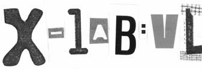

**Friday 22nd February**

A multi-layered fantasy journey with sound, light and interaction to add and distract along the way

VJs, DJs, live bands and interactive installation art

“Quite simply – like nothing else out there”

DJ Marc Reck – uplifting breakbeat (Mr Elephant/Rockfall)

Rich Batsford – meditative piano and instrumental epics

Arcade – quirky electronic dissemblage

VJ Chromatouch – painting with light

Object X – interactive installations

Shana Tova – alterno rawk!

Koala Grip – spiky punk

With many more playing a part - an unforgettable night

Dress creative, leave your expectations at the door … and enjoy

[info@projectxpresents.com](mailto:info@projectxpresents.com)

[www.projectxpresents.com](http://www.projectxpresents.com)

“Project X Presents’ event makes most nights out look as adventurous as a trip to the Post Office” – The Metro

“The craziest night we’ve been to in ages” - Ten 4 magazine

"...with a disturbing, lurching assault on the senses, Project X Presents is an intelligent and unique show destabilising the established role of the "spectator" in performance theatre and drawing you into an impressively eclectic and complex mix of art forms" - Birmingham Post

£5 on the door

9pm – 4am

 (formerly The Boiler Room)The Big Peg 120 Vyse Street Jewellery Quarter Birmingham B18 6NF

(0121) 212 9280

_Supported by The Arts Council of England_
