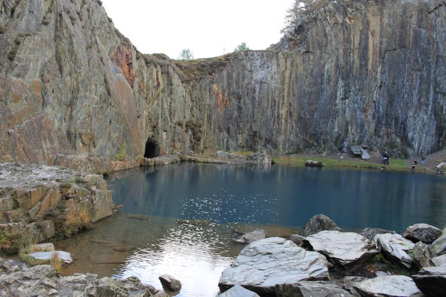
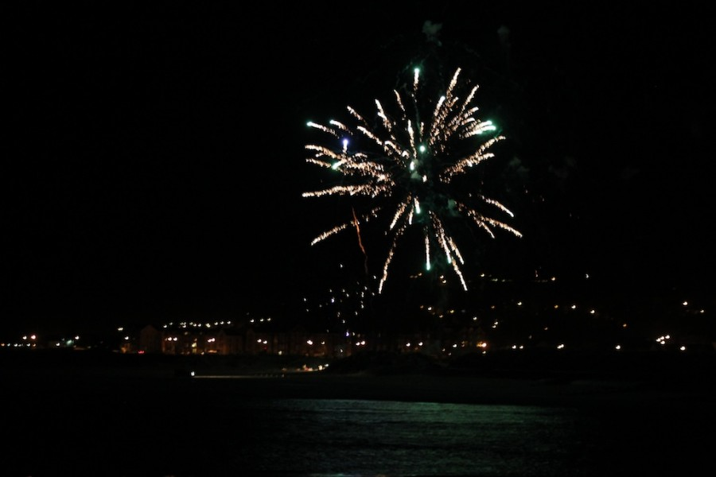
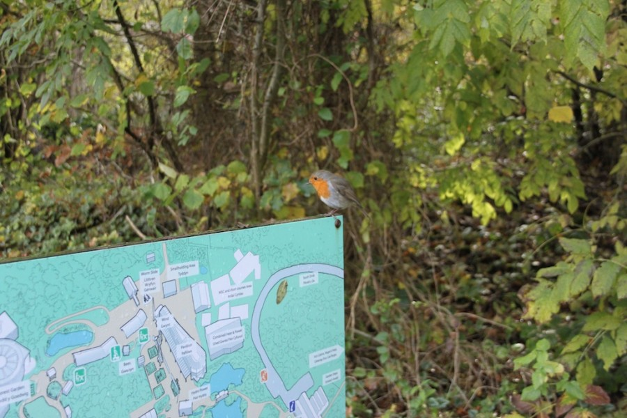

With the afternoon sun shining on a lovely (3pm finish) Friday afternoon my good lady Bob picked me up in our lovely little car and we zoomed off for a weekend in Wales.  I'm not the greatest passenger in the world, but I had my iPod hooked up to the stereo and hit shuffle, the somewhat random tunes helped ease the way as we traveled through the traffic.

First stop was a comfort break at the little chief in Shrewsbury. Well There I was when I suddenly realised that the sound of trickling water wasn't a tap left on and their clearly wasn't a bird house outside when sheep started bleating. Slowly I looked towards the ceiling to find a countryside scene painted on the tiles. The noises courtesy of some sort of recording, I did the only sensible thing finished my business and ran.

Back in car we headed onward arriving at Welshpool, where fish and chips were consumed thankfully without the soundtrack of recorded nature. Feeling less hungry we drove on towards our destination Tyn-Y-Groes Hotel near Dolgellau. We got to our hotel wandered into our room and fell asleep and about 7.30pm (I think we are getting old early).

Saturday morning we tramped down to the breakfast room to see what their was to eat. A reasonable offering was presented, cereal, toast (no brown boo), full english including fried bread and coffee from a filter machine. Not too bad, I had been hoping for some sneaky croissants but what was their was ok.

After breakfast we headed out to Fairbourne to scope out a spot to watch the fireworks later. The seaside is lovely but the wind was properly blowing.

Bob had been telling me about a blue lake and how their was a steep climb to get to it, so after working out where to park the car we walked up the road and onto a footpath into an old slate quarry. Our route involved walking up a stream and through a tunnel flowing with water into which Bob dropped her hat. On reaching the end of the tunnel I could soon see why she wanted to bring me here, it was lovely, with the old excavation full of deep blue water.

Lunch was taken at the Cross Foxes, which I liked because of the name. I'm not surprised the foxes were cross the service took ages but the food was nice. In the afternoon we visited Barmouth to see where the fireworks were being launched from and if their was a better spot there. It was nice but we decided to watch from the dunes across the bay.

After a quick shower and a change into warm clothes we headed out to watch the Fireworks. Desipite a few worrying moments when they got blown straight into the sea rather than flying into the sky the Fireworks where ace. I took loads of photos mostly out of focus mind you. After the last rocket had gone up we hurried back to the car just as the rain started.

Sunday morning saw us pack up and leave the hotel. On the way home our plan was to visit the Centre for Alternative Technology a place dedicated to finding ways to save and use energy in more efficient ways.  I've wanted to visit for years, since I was a boy in fact so this was properly exciting. They have wind turbines, min hydro electric plants, solar panels everywhere, cool hand made buildings all set into an abandoned Slate quarry. They also had a resident Robin which kept following us around and posing for pictures.

Leaving the 'CAT' we headed home via a scenic route. It's always sad to leave the beautiful mountains behind, but first I had to stop at the toilets with the bleating sheep.
