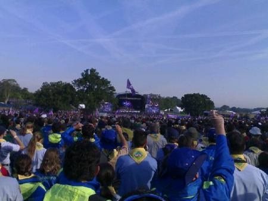

Today was the official birthday of Scouting, So the Jamboree was closed to day visitors.

The sunrise ceremony was much better than the opening and I may have been slightly emotional.

We were handed yellow neckers to get our new Jamboree friends to sign, the challenge was to get 100 people but by taking ours to work most of us in facilities have filled ours.
