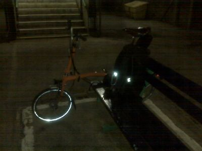

A lot of people tell me that they envy the fact that I'm single and how nice it must be to be able to do whatever I like when I want. I think that's great when you have lots of single friends but I'm reaching the age where they are getting into relationships or not so keen on going out anymore. I think this must be the reason why I can spend an entire weekend not talking to a single person and I've really got to do something about that. And the picture? Well I'm sat on an empty platform waiting for probably empty train back to an empty house.
