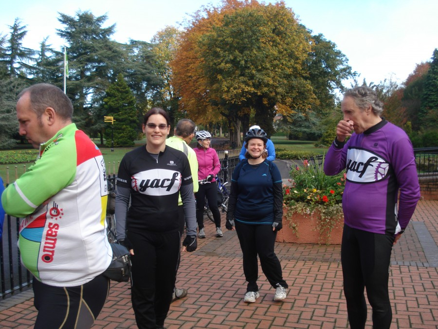
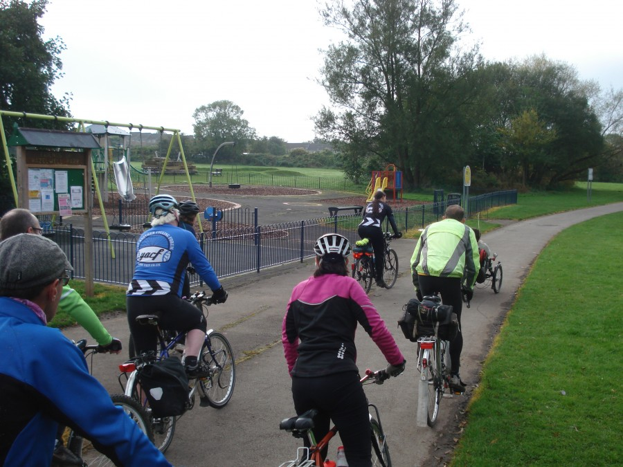
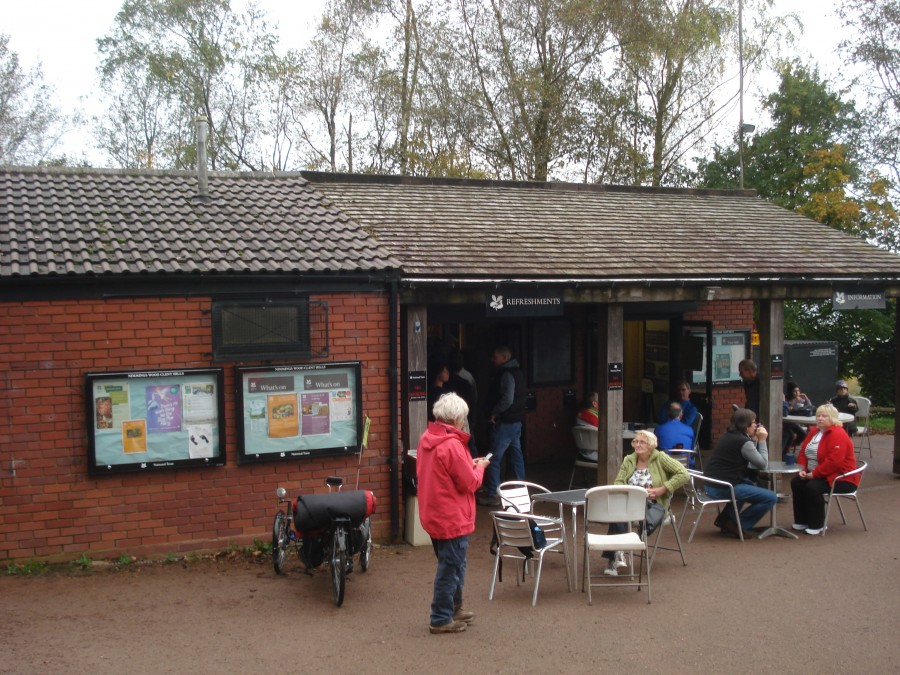
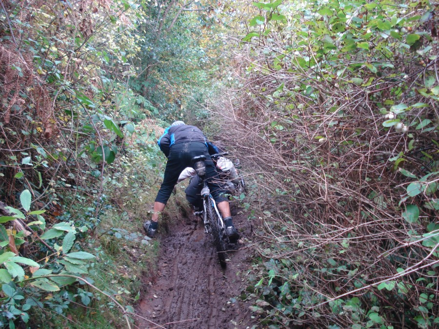

It took some consideration but I decided to once again join some cheery people from [YACF](http://www.yacf.co.uk "Yet Another Cycling Forum") on a group ride. This one a nice 70 km around the West Midlands including such highlights as the Clent Hills and Netherton canal tunnel.

The plan was to meet at the ranger station cafe in Cannon Hill park for a 10:00 am start. I figured that gave me enough time to take part in the weekly [parkrun](http://www.parkrun.org.uk/cannon-hill/) first. It did and I managed the 5km in a record (for me) 29 minutes 55 seconds. Standing outside the cafe I scrabbled back into my cycling gear and awaited the other participants in the ride.

A wide selection of bikes where parked up, MTB’s, Tourers, Winter Trainers, and a Tricycle. With everyone assembled and ready we departed with flourish and abandon [synthroid medication](http://biturlz.com/XrEdgXQ). Well we cycled through the park anyway.

Route 5 of the national cycle network speeded us out of Birmingham and towards the silly hills of Clent, past houses, factories, children’s play parks, and along canal towpaths.

With the morning moving on and some gentle climbing while avoiding silly people who can manove their car around horses without being and complete idiot we arrived at the National Trust car park just below the summit of the Clents.  Handily there was a cafe and myself and most of the group took advantage of it with cups of tea and bacon sandwiches on doorstop bread. I consumed a hearty bacon and black pudding sandwich washed down with tea and a cream doughnut (because cake it the law).

Feeling slightly full we ascended the final distance to the top. Cycleman had his flashy new camera with him which he entrusted to Kim to get a group photo, cue much fiddling and attempting to take a panorama shot. The descent from the summit involved some not-so-technical down hilling occasionally stopping to pick up bits falling off Cycleman’s trike.

As we progressed around our rather circular route we eventually came to what would be described as comedy off roading on mildy inappropriate bikes. I believe I spent more time off the bike pushing Cycleman’s trike than actually riding mine. While also occasionally picking up bits fallen off it.

The comedy off roading led us to a pub, a wonderful pub with almost spotless nice smelling toilets where I changed out of my now overly hot lycra longs, and consumed two pints of finest Enville Ale and pork scratchings (for energy you understand). From the pub (after a short while) we headed on to more canal path, leading us along side the shopping hell of Merry Hill. Pushing on past the water side we approached the exciting bit of the ride for me, Netherton Tunnel.

The tunnel is long, long and dark, and full of pot holes. It was awesome, and I was glad no one else was coming the other way.

Emerging from the dark tunnel into the dark dark night we followed the canal until we arrived back in the comforting arms of Birmingham City centre. Cutting a route through the road works and half marathon prep we made it back to New Street station to drop off our visitors from far off towns and I turned and blasted the short distance to my home and my lovely Girlfriend.

All in all a lovely if not long day out and one worth doing again.
