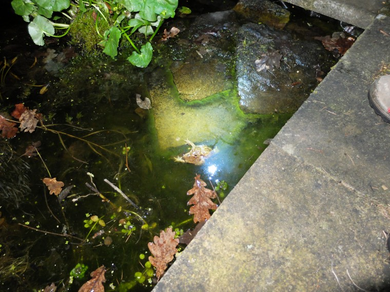

After the great vole adventure whereby Pauline had insisted that something be done about the voles eating the flowers and a single vole had been trapped we returned from some very lovely noodles to find two toads mating on the slabs.  While I took pictures Mary rushed inside to fetch her mother and the toads where moved to the pond. And then we did some newt spotting... in the dark.

===

