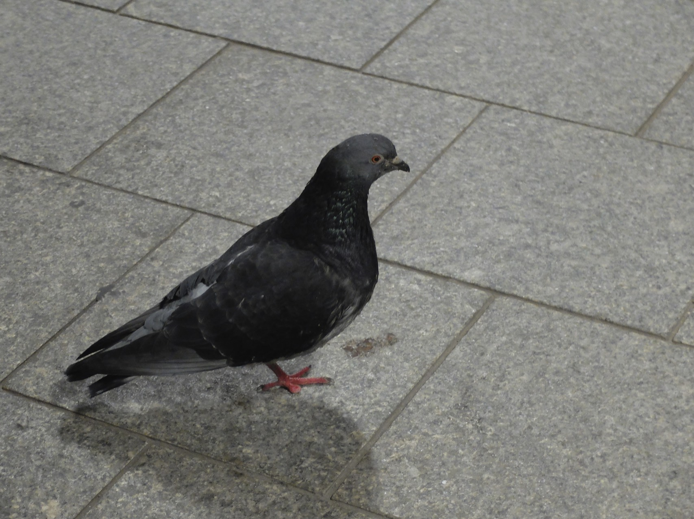

This week I had the joy of finishing a day early. alas that joy was spoiled by the fact it was easter and so had everyone else. It also seemed that they’d all decided to take the train to somewhere, anywhere really it seemed as long as it involved the train I was on.

===

The advantage of the days getting lighter in the evening is now I can work out where I am as the train twists it’s way out of the city, I just wish the windows would open so I could breathe in the heady scent of chocolate as we pass Bournville and the Cadbury’s factory.

And so it was that the refreshments trolley took from Birmingham to Cheltenham to cover the distance of one carriage, and no sooner had I got my cup of tea but I had to get off the train and stand on a platform. The upside being of course that I had a cup of tea which is always good.

As the second train of the night pulled me into my home station I took comfort in the 4 day weekend ahead and that well that special feeling you get when you get home after being away.
