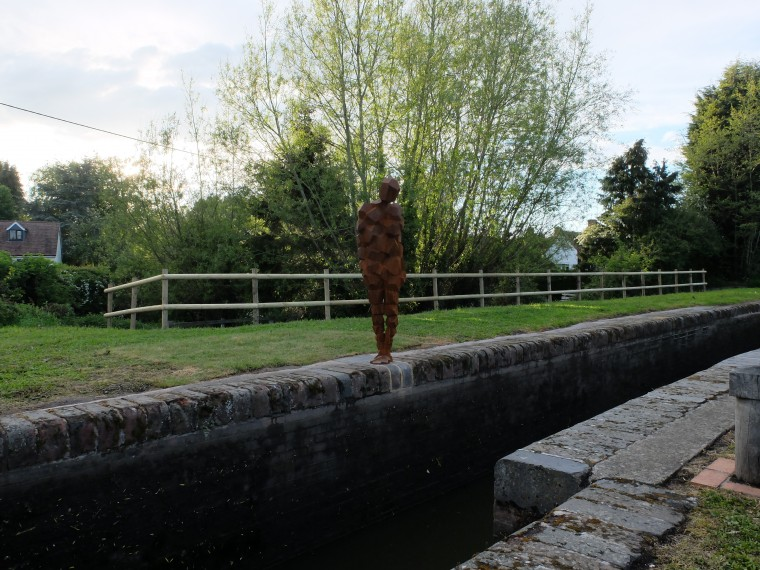

Tim from [#yacf](http://www.yacf.co.uk) was visiting Coventry with work this week so a meeting and ride of forum members from the West Midlands was arranged. In attendance was myself, Tim Hall, Kim, Basil, and AWL.  Meeting up at Berkwell station we prepared to head off to see the [Anthony Gormley](http://www.landmarktrust.org.uk/news-and-events/50th-anniversary/land/) statue in Lowsonford, very quickly a route was concocted and we were off.

===

It's a bit up and down around Warwickshire so I was wondering the sense of bringing the single speed but as it's the only bike I've got in Birmingham at the moment it'll do. Remarkably pedalling up and down Brays road every day seems to have improved my hill climbing ability so all was good in the end.

The roads laid bare before us, seriously very little traffic and no rain led to us descending on our destination in next to no time, despite arriving in Lowsonford from the wrong end apparently and we dismounted to take a look at the sculpture. I imagine the residents of the [Landmark trust's](http://www.landmarktrust.org.uk/) house outside which the piece stands where not terribly impressed with us outside their front room, but as their front room sits on the tow path they have to get used to it I would imagine.

 

Having been suitably cultured we returned along the road a little to arrive at the door of the [Fleur De Lys](http://www.fleurdelys-lowsonford.com/) public house which serves remarkably lovely pies, however before we arrived in the bar much talk was made of were to put the bikes, who has a lock, and what is that ticking noise from the back of Kims Brompton. Eventually moving inside we hit the bar, I ordered a "Moo & Blu" pie from the menu and had a pint of Hopback T.E.A a rather fine pale ale.

Strava put us at a friendly 16 or so kilometres to the pub.

\[ride id=308138501\]

Talk of adventures, mechanicals, and work was quickly begun along with the demolition of a number of pies and a sausage and mash. AWL headed home directly from the pub leaving us remaining 4 to find our way back to Berkswell with the use of his borrowed map. In the end we didn't really need it very much and I seemed to find the hills flying by (probably powered by the lovely carbohydrate pie). As we pushed into the station we arrived 7 minutes before our train.

I bailed at Marston Green to tackle Sheldon country park in the dark, leaving Kim and Basil to deal with the dark place that is [Mordor Central](http://www.networkrail.co.uk/birmingham-new-street-station/facilities/). All in all a very pleasant evening's cycling and nice to stretch the legs for once as I've not got out on many [#yacf](http://www.yacf.co.uk) rides this last year owing to life.
