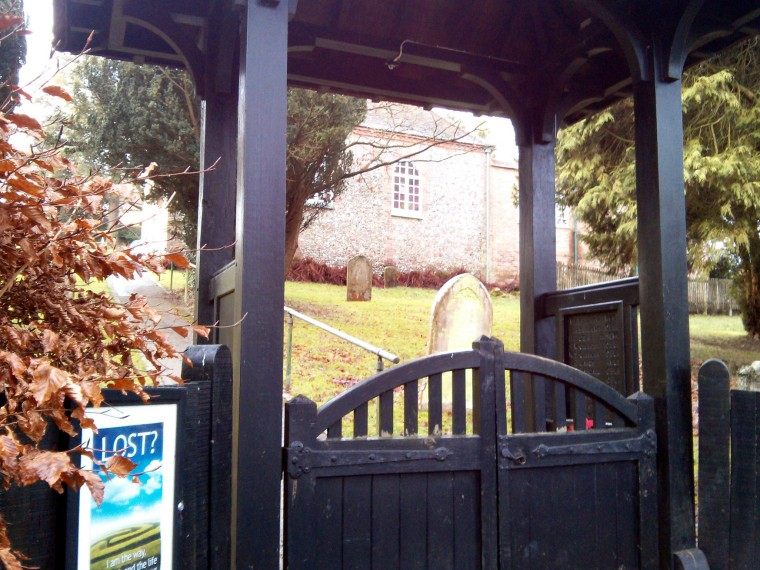
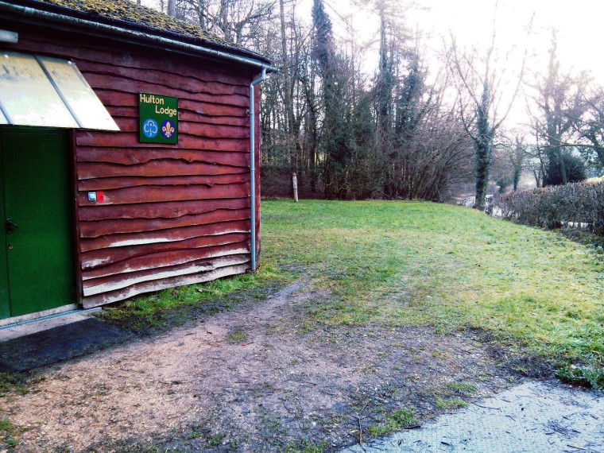

It's been just a little less than a month since I got down on one knee in a muddy puddle and asked Mary if she would marry me, and plans for our wedding have been steaming along nicely.  We are both originally from the country, me from Gloucestershire and Mary from Buckinghamshire so we wanted a wedding that reflected our origins.  Another important factor was that Mary wanted to be married from home which has been making things a lot easier.

Speen Church is a baptist chapel built by the village and is a small and vibrant community. After some problems with emails we managed to contact the deacons and they met with us over lunch after Sundays's service. There was a lot of chat about how we met and what we wanted and how things worked. The important bit being we can have the wedding on the date we wanted.

We are fortunate that for guests who are travelling to be with us we have the use of the Scout hut for camping, which is handily placed across the road from the chapel.

All in all a good day for completing things on the to do list.
