_This was my first attempt at a mass participation ride, and my first completion of a long distance ride (the other attempt was a badly thought out attempt to ride to Aberystwyth from Birmingham on an overloaded Brompton overnight)_

Having bought a lovely Thorn touring bike with the sole purpose of doing something very silly on it I decided that after failing to make time for this Dunwich ride I’d been hearing all about I probably could have a go. I mentioned this to my partner who before I had a chance to change my mind, booked accomodation and train tickets from said accomodation into London.

There was no backing out, I was flipping well doing it.

===

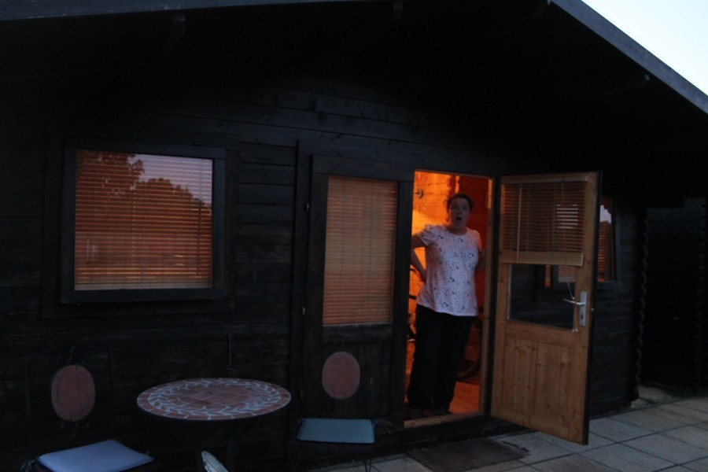

It was on a mild Saturday afternoon that I was taken from some really lovely accomodation, (in really posh sheds) at the Lion Inn at Theberton and deposited onto a train at Saxmundham with tickets, supplies, tools and a bike. So it appeared had quite a few people. I panic’d slightly about getting on, the conductor did not, over the short run to Ipswitch he put bikes in almost every space on the train.

At Ipswitch the conductor stepped out of the train and opened the doors to something magnificent unseen on sections of railway passing through Birmingham, a luggage van! Already full of bikes it took the dozen or so on the platform with ease and whisked us (or rather me as everyone else stayed on till Liverpool Street) to Stratford.

The plan at this point was to take my partners Oyster card and deposit myself onto a London Overground train on which bicycles are according to their own website allowed. According to the railway staff they are not, Olympics innit (apparently). I am at Stratford and have now found a Canadian chap called Mike who is going the same way as me and also has not a clue which way to go, we agree to join forces and fight the system that is roads in London. Being all shiny and new we expect to step outside the station concourse and find signs pointing everywhere you could wish to go, except there isn’t.

The only sign is the one proclaiming that the newly built car park at the Olympic railway station is…

Shut for the Olympics.

So we blag it a bit, follow cyclepaths that lead to bridges not finished and eventually follow some hipsters who seem to know were they are going. I have not even started the dun run yet and I am already having an adventure, Whoop.

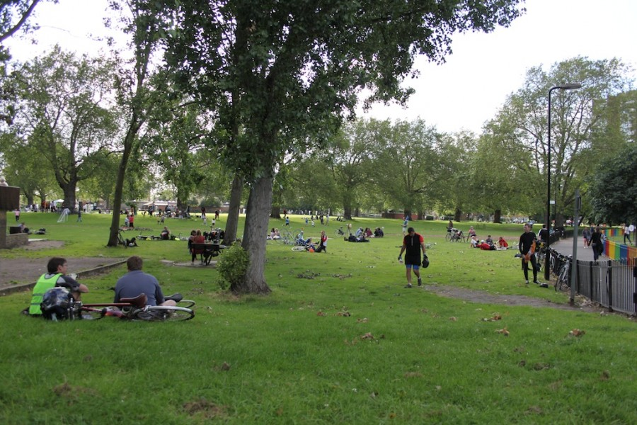

Mike and I part company, him to look for his group me to find some yacf’ers. Except I’ve no idea what them look like, except a vauge idea of wowbaggers desciption from his profile pic and his bike. I hoped that someone would be wearing a yacf jersey which would make things simple. It’s half past five so I have a sandwich and take a few pictures of the cyclists gathering in the park, it’s mean to laugh at roadies sliding down the slopeing path I’m sat near but road shoes seem to have less grip than a pair of worn out converse all-stars at an ice rink.

Eventually I decide to take some positive action, and spin round the park, until I see a flash of white beard and carefully attempting not to run the chap over ask “you must be wowbagger” while thinking “please almightly buddha let it be him not some random i’ve just confused” and it is I am relieved, and lean my bike up against the fence, more people start to arrive whose names allude me at the moment but were really quite smashing. Wowbagger suggests Chinese and me being a bit of a pig and not one to miss a fuelling opportunity agree, a few moments and a jolly good chat later I have chicken fried rice, a spork is deployed and the meal destroyed.

[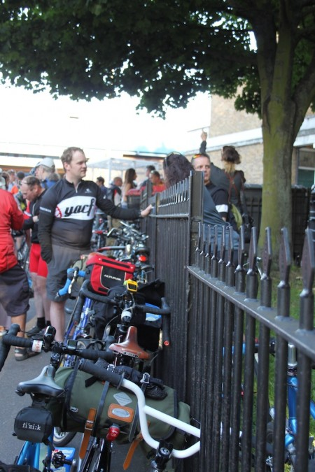](http://www.davelodwig.co.uk/2012/07/dunwich-dynamo-xx/2012-06-30-18-47-20/)

There is cake, this is enough to warrent a line in a ride report of it’s own.

After meeting more people and team moderate / steady depart the remainder of us decide to crack on with it an make an attempt at leaving yacf corner, There is so many people the first 100 metres are walked. But we are off, this as they say is a good thing.

The traffic through London was as I expected busy, but not as I expected hostile. There was some beeping which I responded to with my bell, this is childish I know but makes me feel smilely in my tummy so ftw.

As we escaped into Epping I realised I could probably use a wee stop, spotting a handy gap in the trees next to a lamppost I mounted the curb propped the bike up and nipped into the trees. Returning from the woods fumbling with my belt buckle in a slight suggestive manner I took the salute from a club all dressed in blue, I did not return it as is tradition as Epping probably doesn’t need to see my pants.

Moving off again I was passed by more pelotons of these blue shirted riders, surprisingly close as it happens, nice for them as they can clearly hold a straight line, I however wiggle a little bit. Lord knows how I managed not to take out Dulwich Paragons best before they got out of Epping I will never know. At last I arrive at a fairly overwhelmed garage forecort, where some of the others are waiting. I nip inside the shop and purchase two bottles of full fat coke, lend assistance to a chap repairing a girls bike light and share around some honey roasted sesame seed coated cashew nuts.

[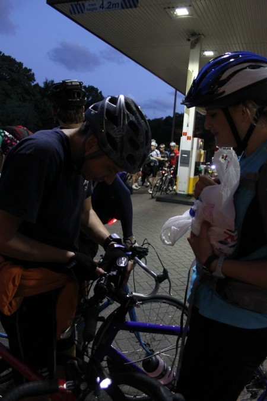](http://www.davelodwig.co.uk/2012/07/dunwich-dynamo-xx/2012-06-30-20-51-05/)

Moving on from the forecourt the ride began to thin out, I followed Wowbagger because

A: He seemed to know where he was going.  
B: He was riding a pace I could manage.  
C: Seemed to be a nice chap to ride with.

We progressed at a rather comfortable pace, passing a large number of unfortuates having minor mechanical problems, punctures rather seemed to be the order of the day from what I could tell. Their misfortune aside it felt a little nice to be passing the people who sped past me earlier. (No doubt they passed me again later on.)

[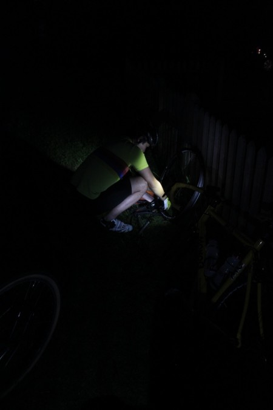](http://www.davelodwig.co.uk/2012/07/dunwich-dynamo-xx/2012-06-30-21-29-04/)

As we progressed we whoosed into Moreton, and befell a glorious sight, two pubs chocked to the gunnels with cyclists, so many that passing cars almost stood no chance of passing between them. A few moments later another glorious sight, AndrewC had arrived before us and had bought us some beer which was very much appreciated as was the pork pie.

[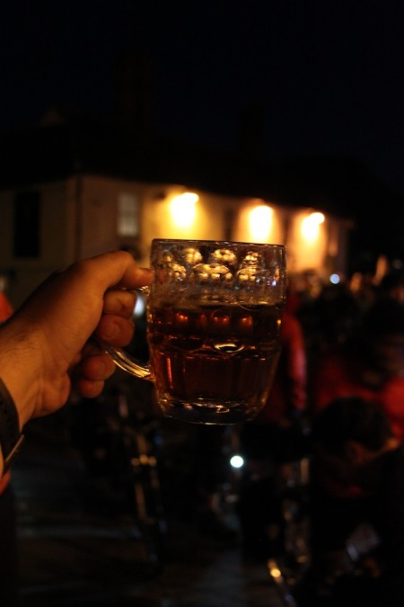](http://www.davelodwig.co.uk/2012/07/dunwich-dynamo-xx/2012-06-30-21-54-15/)

At this moment I recived a text message from my partner to tell me that she was following twitter and I was using the wrong hashtag. Suitably corrected I imeadietly tweeted something, I had not enough signal to send my tweet twitterwards.

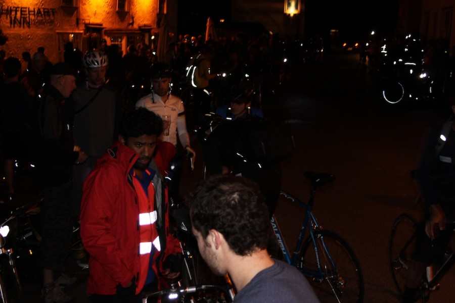

In Dunmow a stop was made, scoff was eaten and an exploritory trip down an side alley to see if the public toliet was open. It wasn’t it was padlocked (boo). Onward to Great Barfield where again the landlord had kept the place open so that we may use his facilities. and we did and so did everyone else based on the queue and the wet floor.

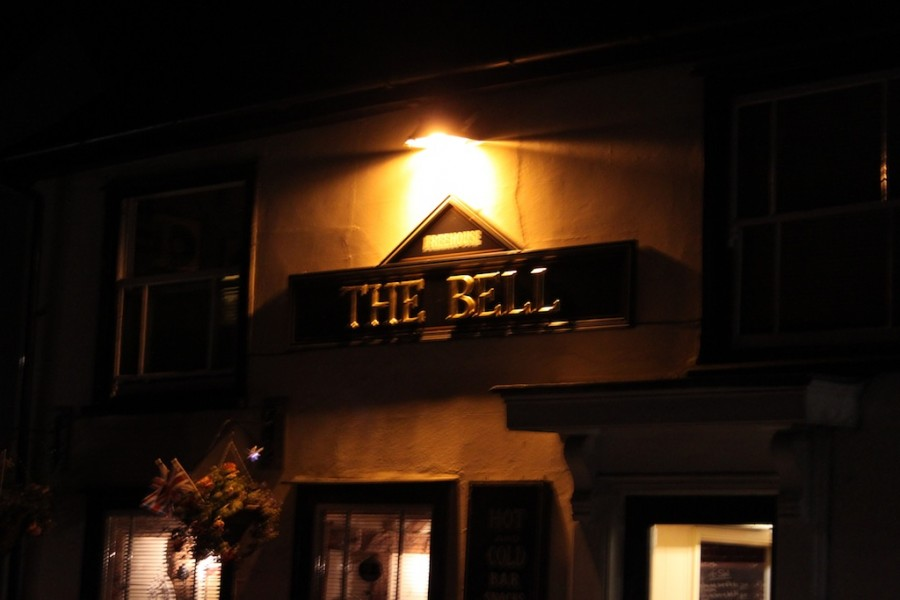

We headed further into the good night skipping the fox and taking on the ride’s “steepest” hill, I would like to say I was dissapointed it didn’t go on for longer but I’m not. a few moments after it was started it was done and the rest of the ride should go easily. Swooping into Sible Headingham we observed a large number of cyclists at the turning to the rest stop all clutching their route sheets. I of course wasn’t clutching a route sheet I was with Wowbagger who knew the way indeed at this stage I did not have a route sheet a foolish thing I should have done something about at the start.

We rolled into the carpark to meet team steady preparing to set off, and where reagailed with stories of massive queues and faulty tea urns. Being resourceful I had a flask and food as did my compainion so we wandered in a found a table. A few moments later Andrew arrived with soup and bread in hand. I spent a little bit of time sorting out the mess my bags had become, I dumped some of the rubbish I had accululated from wrappers into a handy recepticle and dipped into my jelly baby supply. Grabbing my Canon 500d from my bag to take a shot of the scence in front of me I realised that the warm air had misted up the lense and screen on the camera. boo.

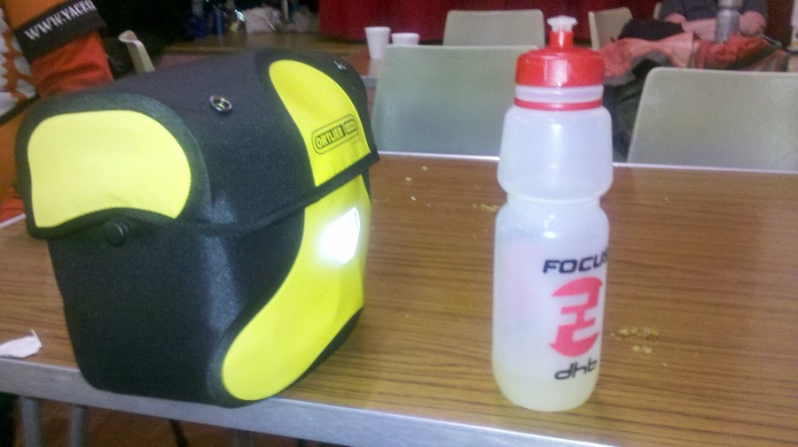

I proceeded to have a comfort break and fill my water bottles, and as luck would have it, noticed a pile of route sheets with the words help yourself emblazoned above them. So I did and folded one into my shirt pocket for safe keeping.

We pressed on and after some steady riding both Wow and Andrew upped the pace a bit and I dropped back [synthroid cost](http://biturlz.com/bubBvss). After some slower hill climbs than I would have liked I stopped and ate some cerial bars and drank a good quantity of squash. Problem solved I was mearly out of fuel. I gradully upped my speed until I arrived at a rather wonderful hotdog stall. It was wonderful because Wow was in the queue already and a simple exchange of food tokens placed my order.

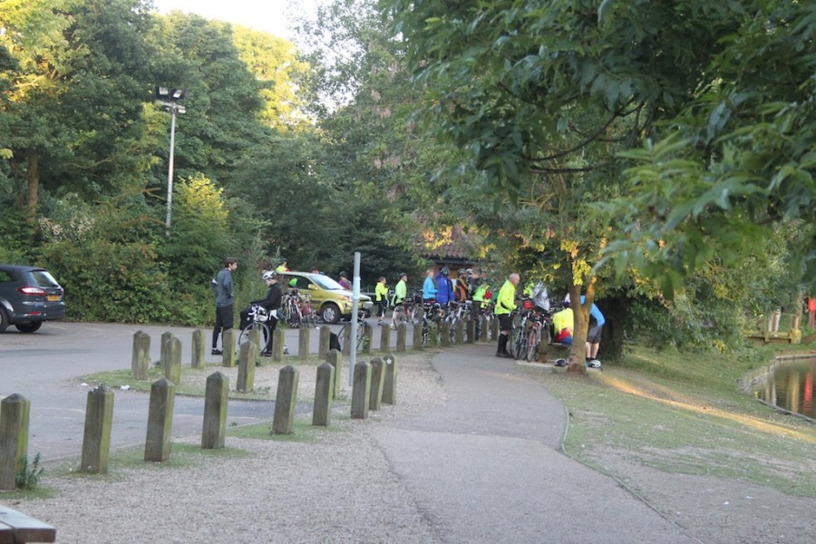

Andrew was just around the corner and so we retired to a bench where I performed some personal admin and took a couple of Ibroprofen to quell my aching knees. The food arrived and indeed the chilli sauce was on the edgy side. But very nice none the less.

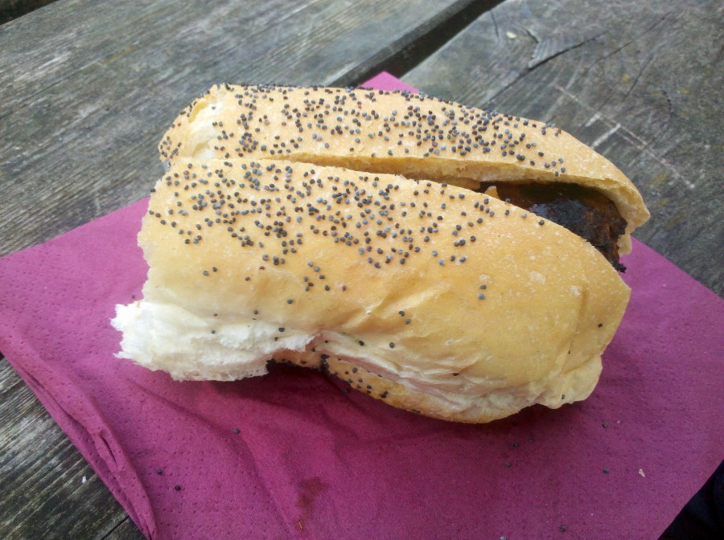

Leaving the lake we stayed together for a bit and eventually seperated, Wow took on an immense burst of speed and I decided that I would probably get in for 9 just bimbled along. I kept up with Andrew for a bit until again we also where seperated. A this stage my focus was just finishing the ride I no longer was interested in keeping up, just keep turning the bloody pedals I told myself.

I took a few scalps, riders alseep in verges and pushing bikes up hills are passed, usually racing past me a little later on. I swear I was passed by the same girl at least 30 times during the night, towards the end I passed her up every hill as she pushed her bike to the top only to have her race past me on the way down.

When I arrived at the sign proudly proclaiming Dunwich 7 miles I could have cried, I didnt’ because I’m a well hard Thorn riding mental cyclist, and because I was slightly dehydrated. 7 miles I thought that my son is a piece of piss. Yep it still took a stuffing hour to do though.

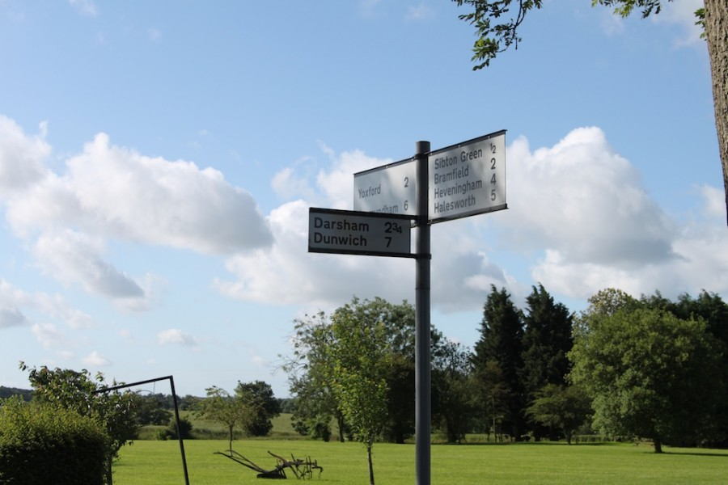

As I rolled on to the beach car park at just after nine on Sunday morning, my partner bless her was there to meet me, My first words being the incredibly romamtic “see I said I wouldn’t die”. Being the fantastic girl she is there was beer and cake and towels. Putting the bike on the car we lent a towel to Wow an I had an attempt at the sea, it was cold, too cold for me.

After sitting in the sun for a little while I was transported back to our acommodation where I prompty fell asleep, contented that I had survived the Dunwich Dynamo.  
A big thank you to everyone for being so nice on my first meeting with forum peeps, and especially to Wowbagger for showing me the way and keeping me company for alot of the route, and AndrewC for buying me a beer at Moreton. Thank you all.

I will return but probably not with 2.25″ knobbly tires.
