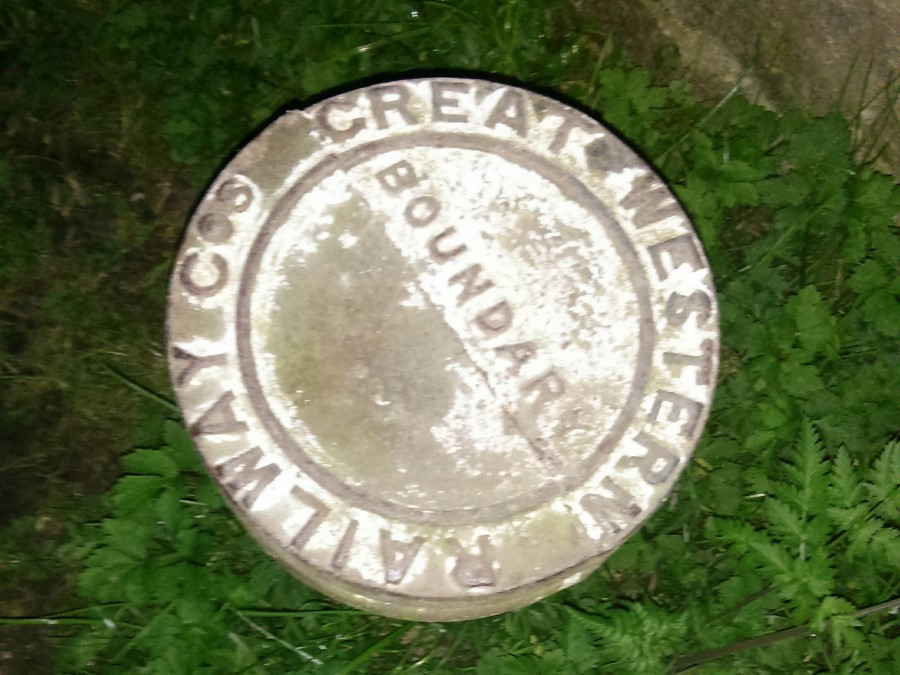
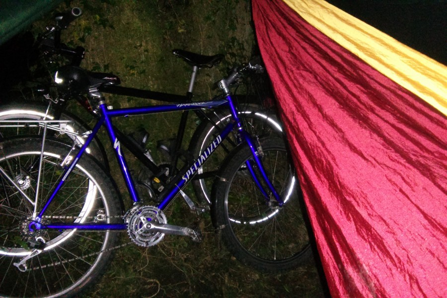
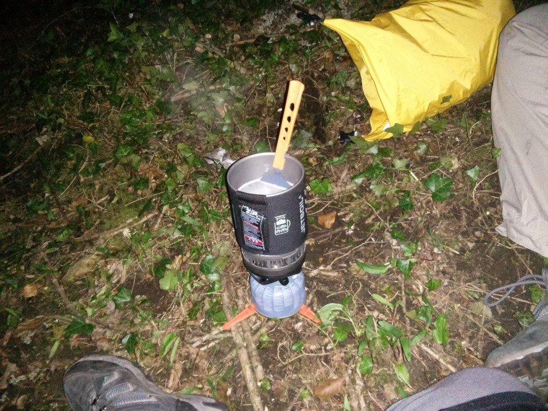
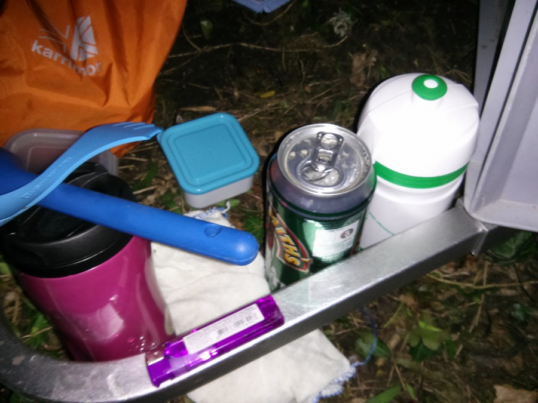
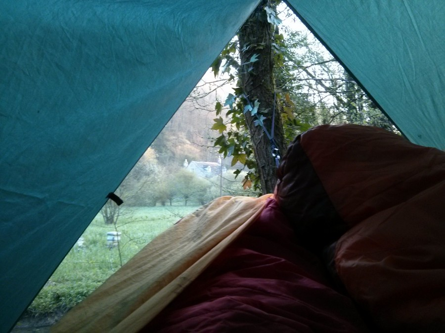
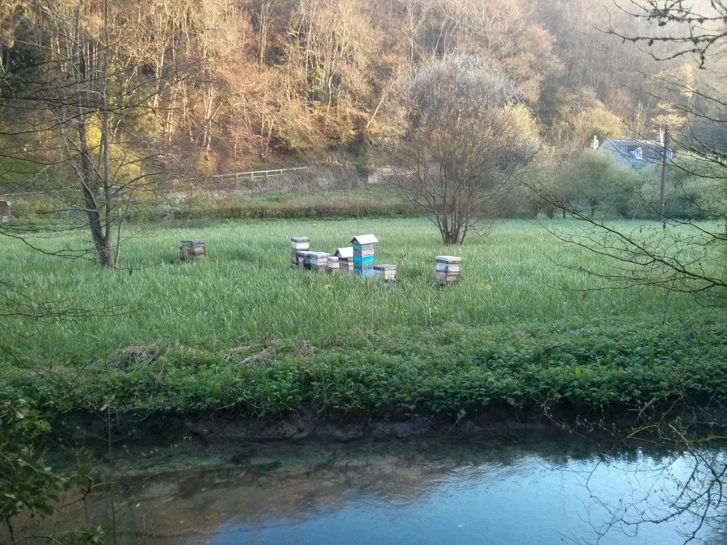
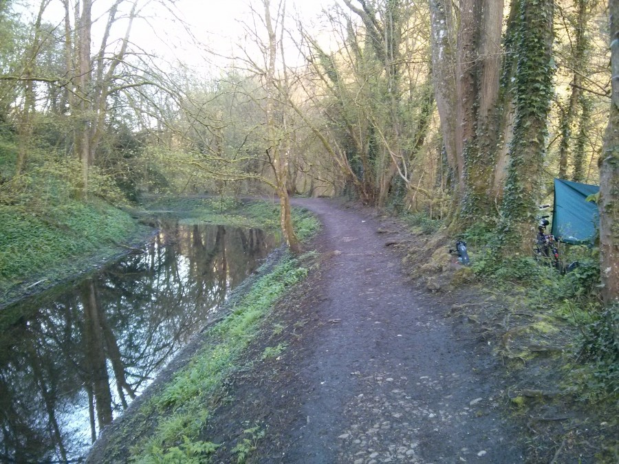
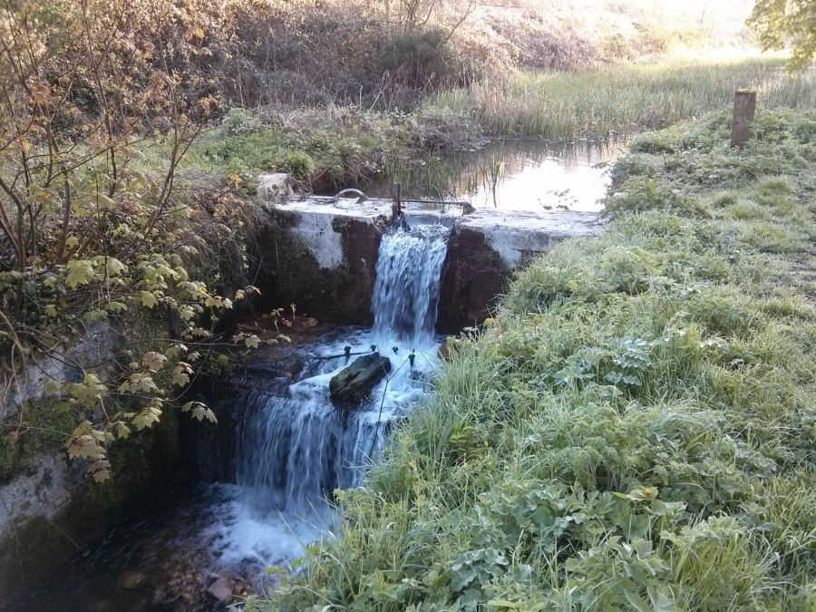
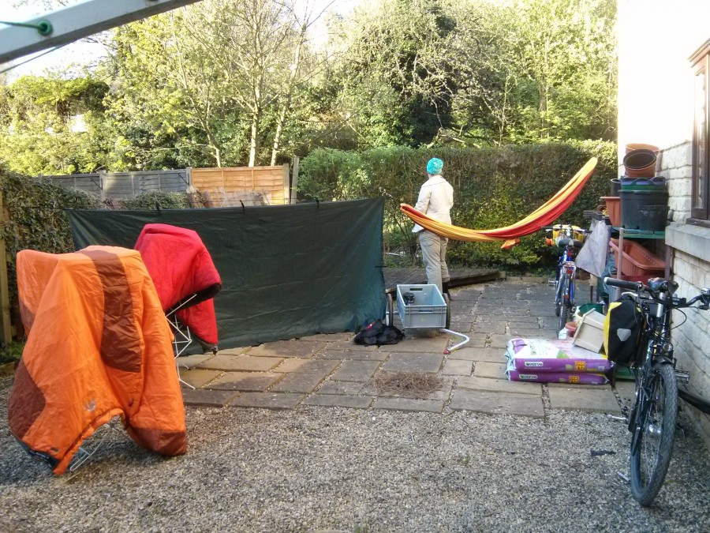

It had been awhile since we'd trundled off with hammocks and bicycles for a single night micro adventure under the stars and given that the weather forecast was looking good and the fact my roof rack complete with large desktop had launched itself from the roof of the car (while driving down the M5) on Friday night we decided a trip down the towpath was in order.

Gear was loaded and as the panniers seemed to be in the bottom box at the back of the storage cupboard behind a locked door labeled beware of the leopard we used the trailer. Keeping the amount of kit down is tricky especially when you have two sleeping bags, a double hammock, tarp, jetboil, water and some food. What was supposed to be a lightly packed trip starts looking like a full on tour.

Having packed and loaded up the bikes I realised I'd forgotten the single malt, and frankly the beer so a dash back inside the flat was required. Once these essential supplies had been stowed we were off.  The plan was simple ride until it was dark and we'd found somewhere to camp. Easy really except even out here in the sticks everywhere you might want to discreetly pitch up a hammock has houses or scraggy factories on it.

We kept riding along the towpath until we came across a tunnel under the railway that had flooded and despite probably being able to ride through it was dark, wet and smelly. I just didn't like the look of it. Unfortunately to get off the towpath there was stairs, really steep worn out ones with a wobbly handrail. After climbing the stairs with all the kit we received an award in the style of a old school man operated level crossing complete with friendly and helpful member of Network Rail staff.

We had to ride along the road for a bit now and hills came into the equation but after climbing through one village a turning revealed a wide path back onto the canal with a wide tree lined border suitable for hammocking.

Quickly a spot was found and the gear was assembled, at which point I discovered that one of the weight savings I'd made was by leaving the hammock hanging straps at home. Thankfully my kit contained some lengths of paracord apparently good up to 500 pounds of weight so I made up some hanging loops and got the hammock and tarp put up.

I should point out that this is a Journey to the Moon double hammock but in order for maximum comfort the hammock should be level. Which it wasn't or we wouldn't be able to get in. It was dark dammit.

The Jetboil was fired up and the pasta chucked in meanwhile Mary chopped up our elk sausages we'd bought in Ikea earlier to add to the dinner. I took care of far more important things and opened a beer.

After watching the Mountain bikers do loops on the trail we didn't know existed until their high powered lights (and voices) started whooshing around it was time for sleep. Now I know I spend a lot of time in the City of Birmingham but flipping owls, calling all night and then joined by his mates just to see if they can keep me awake.

Morning came far too early but not be met by a bunch of dogwalkers is often a plus on one of these things so at 7am we started boiling water for tea and dismantling camp.

The other side of the river from us was a set of bee hives.

With all the kit loaded we rode back the way we came actually able to have a look around hoping that somewhere selling bacon sandwiches might be open, flipping countryside apparently everything is shut on a Sunday morning. But the water falls on the disused canal look pretty so I guess that counts for something.

Pulling into the garden of the flat we unloaded the gear and hung everything out to air, quietly transforming the yard into a temporary outdoor equipment showroom. Surrounded by our stuff we stuffed scrambled eggs and toast in our faces pleased we avoided the normal and had an Adventure.

