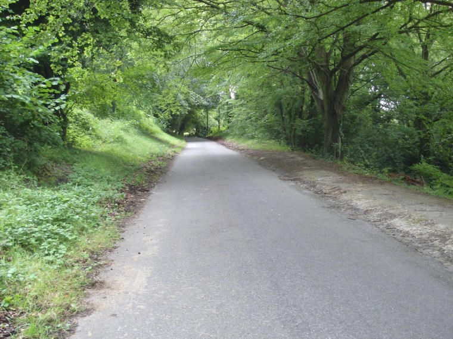
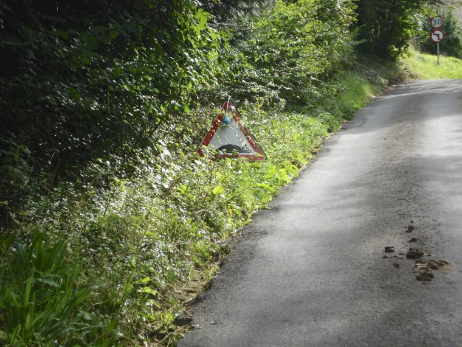
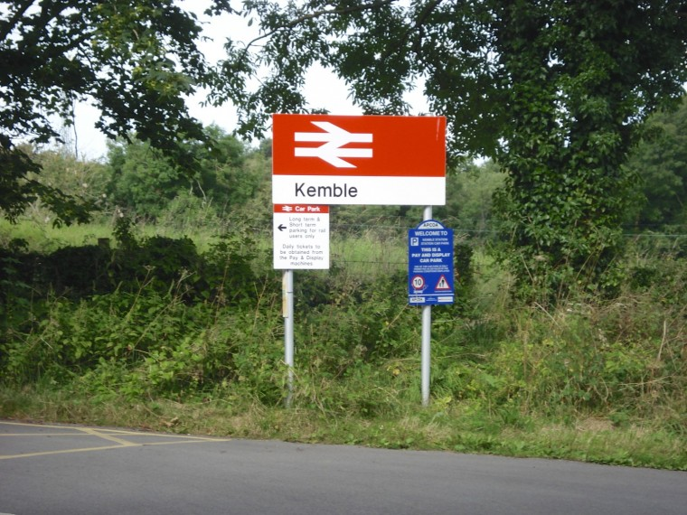
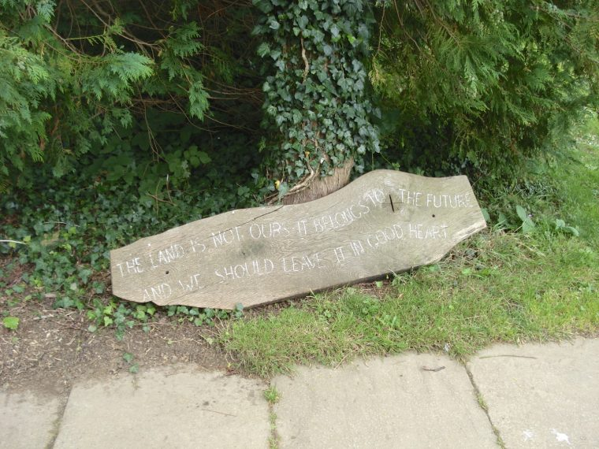
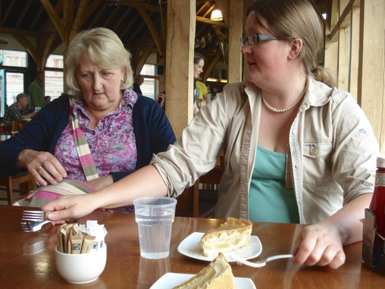

We had been planning on being staff at a [@girlguiding](https://twitter.com/Girlguiding) event called Wellies and Wristbands for a long time however we realised we'd forgotten to send off our forms and camp fees and had therefore accidentally cancelled our booking. This news left us with a free bank holiday weekend in which to entertain ourselves.

Mary's mum had suggested she might like to visit and buy Mary's birthday present which required a trip to Cotswold outdoor in South Cerney. We figured we could cycle to Cirencester and after about 10 minutes googling we found a number of campsites, most of them very caravan park(ish). Except one, [Abbey Home Farm](http://www.theorganicfarmshop.co.uk/) an organic farm that runs a cafe, shop, and campsite (they also have a yurt, and shepherds hut).

So at 8.30 on Sunday morning we trundled off towards route 45 of the national cycle network, and ultimately our campsite. I should point out that route 45 is quite good, for a start the off road parts are mostly tarmaced wide and fast they are however littered with stupid barriers that mean you have to get off the bike and in once place carry it down stairs. But half an hour after we departed we were through Nailsworth and onto the country roads.

===

There was a lot of climbing as we left Nailsworth as we winched ourselves up out of the valley towards Minchinhampton this was the only major summit though there was a lot of going up and down. Twisting up the hills at barely over walking pace I was thankful that I had replaced the chain the day before, soon enough I would be glad I had replaced the brake pads.

Soon we started ticking villages off the list, first to go was the imaginatively named Balls Green those of you of a smutty persuasion might snigger at that. I know we did. Heading onward we dragged ourselves into Minchinhampton holding up traffic as we did (narrow streets, no passing places) but it was quickly over as we turned out of the village following our course.

As we summited one hill I saw ahead a humpback bridge sign, thinking what sort of git puts a hump back bridge at the summit of a hill we've had to grind up I realised that some joker from the locale must have placed it there, it was adorned with very tired looking feather duster which did nothing to improve it's look I must say.

The weather was going our way and we pushed on through Cherington and Tarlton. Soon enough we had pulled into Kemble which is where aid from the UK departs to it's destinations around the world. Rolling past the station I realised that should it all have gone badly wrong we could have got a train here back home with the bike or if I picked the wrong station into London. At least I would be able to get a cup of coffee.

As we rolled past the station we decided this was a great place to stop and devour the doughnuts I had accidentally rescued from Waitrose. Parking the bike up we sprawled out on a verge or it could have been some well to do's driveway, mostly I didn't care though because I had a doughnut.

As we rolled out of Kemble and onwards it wasn't until we crossed the bottom of Cirencester I realised we had covered more ground than I thought and we would soon be at the campsite. Turning through Siddington we noted the village shop and headed onwards finally turning into the driveway of the farm.

The farm had a magnificent shop, and we purchased some supplies and checked in while we waited to meet Mary's mum. I was particularly taken with their sale of Milk in returnable stainless steel churns, you put a £10 deposit on the churn and you return it for a full one for the price of the milk. Providing the Churn is kept in good condition you can hand it back and get the £10 back.  We picked up a few things for supper and breakfast, and some chocolate to nom.

The camp site was a short ride from the shop but now we had shopping and a brazier and a bag of wood to carry. Thankfully it was at this moment that Mary's mum arrived and we were able to use the car to transport them while I rode the bike through the woodland path to the camping field.

Once the tent was sorted and the bike unloaded we headed off to South Cerney for a little retail therapy and lunch, being a bank holiday of course everywhere was busy but we managed to get some venison burgers at the Royal Oak which I washed down with some Tribute ale. Once In Cotswold we left Mary with the boot fitters and I mooched about a bit and decided to pick up the coffee press attachment for the Jetboil, I considered picking up some extra gas but didn't as we had plenty with us.

Having consumed lunch but no pudding the only rational thing to do post shopping was to consume some cake I try my best to justify this by the amount of cycling performed, or at least I make my best effort. Full and happy we head back to camp for the evening wishing Pauline a fond farewell and pondering is it time for supper yet.
