Not long after we had gotten together Mary and I put together a bucket list of activities we’d like to do together, simple things like have a microadventure, more camping, and places to visit. One of the things we decided we wanted to do was to visit Lundy island, and when I asked Mary to marry me, we knew straight away where we wanted to go on honeymoon.

Lundy is a granite rock with the Bristol channel on one side and the Atlantic on the other about 11 miles off the coast of Devon, it’s been home to pirates, smugglers, wealthy landowners, lighthouse keepers, and more recently farmers,the National Trust and the Landmark Trust.

The Landmark Trust, have renovated 23 properties as self catering accommodation, as well as the tavern, the shop, and quarters for the staff and farmers. Transport to the island is either by boat or by helicopter and everything arrives or leaves by one of these two methods. We decided we’d very much like to spend a few days on the island where peak population is about 90 people, the power goes off at midnight, and mobile phone signal is unheard of.

===

### Monday

Having packed the night before we caught a lift with Jeremy into Princes Risborough to catch a train to London, the platform was packed as the proceeding train was running late. Rather than wait for ours we jumped on when it arrived and found a space amongst the bustle.

Emerging into the crowds at London Marylebone we decided to walk to Paddington for the next stage of our journey. Paddington is the home of the First Great Western First Class lounge and as luck would have it we happened to be travelling First Class. The lounge is a little oasis, with refreshments, snacks, and comfy seats to while away the time until our train departed.

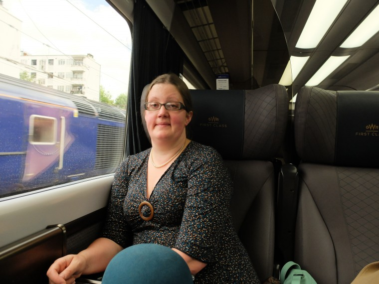

First Class on a FGW HST is something else, with plush seats and a Pullman car for fine dining it’s like being on a train from an Agatha Christie book only with less murdering. We opted to eat in the Pullman car which was amazing, I had Steak and Mary had the Fish Stew. We opted not to have pudding in case we missed our stop.

Hopping off the train at Exeter St Davids, we had only a short wait till the service to Barnstaple arrived, it was a little crowded but we found ourselves discussing public transportation options with another passenger who was a fellow Brompton owner.

At Barnstaple we swapped to a bus for the last leg into Ilfracombe, before walking up and then down the high street to locate our B&B for the night the Olive Tree. The room was very plush and comfy but we didn’t hang around and instead headed out for a look around the town.

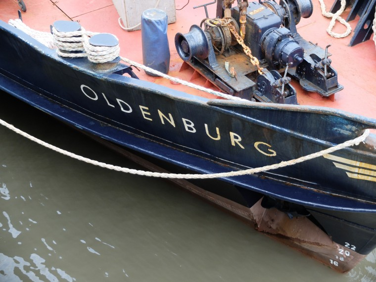

First stop was the docks to check out our transportation for  the morning, the Lundy supply ship MS Oldenburg. The sheep trailer lashed to the deck signifying that this boat was the Island’s main form of connection with the mainland, everything had to arrive and depart from lundy aboard her. Walking back from the docks we stopped for Fish and Chips, our first meal out as a married couple.

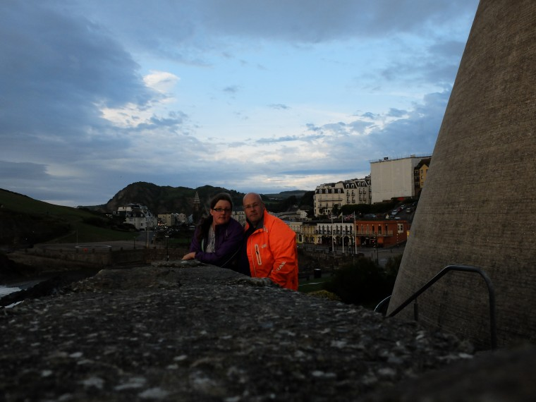

Ilfracombe is everything you might expect from a seaside town in the summer, ice cream stalls open till late, and penny arcades. Alas I was unable to relive my youth as the arcades had started to shut before we managed to visit. As we walked back towards the town and our B&B we encountered a summer school group from Spain, not enjoying the British summer weather as the rain moved in from the sea.

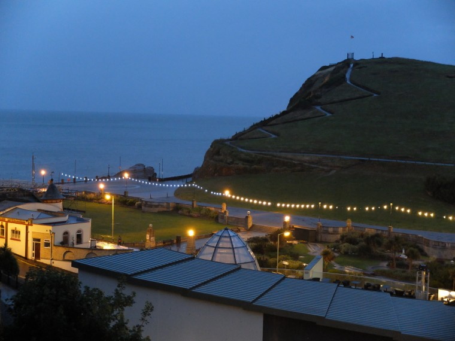

Back in our room I took a couple of photos from the window before the light was totally lost and the cloud moved in. An early start was order of the day for the morning as we had a boat to catch.

### Tuesday

I had packed the bags ready for the departure on Monday night and we headed down for breakfast as early as we could. I was pleased to see my favourite eggs benidict on the menu so we both ordered that. I was nervous about being late so I rushed mine something that might not have been the best idea ahead of a sea crossing.

Arriving at the Lundy shore office we discovered that the day trips had been cancelled but we would be taken as we would be staying on the island. The reason being the weather was getting worse later on and the ship’s master wanted to return as soon as possible which would make visiting for the day a very short visit to the harbour on the island.

As the Oldenburg pulled out of Ilfracombe the loudspeaker announced that the conditions for the crossing were moderate/rough.

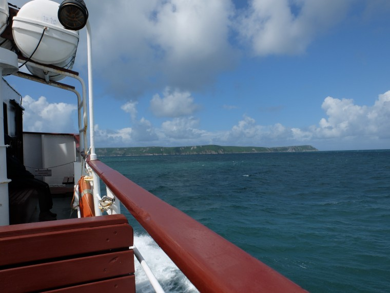

Soon enough the Oldenburg began to sway leaving possibly myself and the crew as the only people not being sick. I acted selflessly fetching water and sick bags for Mary. Alas while I was doing this Mary saw a pod Dolphins swimming alongside the ship.

Fortunately the journey came to a close and the Oldenburg began to steady as she pulled into the harbour at Lundy, as the ship came alongside the jetty a collective sigh of relief came across the passengers that dry, steady land awaited.

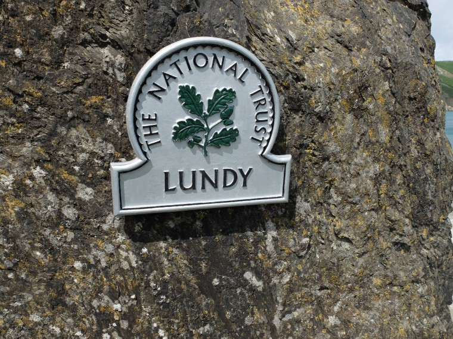

Disembarking the Oldenburg, we visited the small information point attached to the dive school building, it had some boards about the exclusion zones and wildlife that could be seen on the island. However the long walk to the village was ahead of us and like the other guests we began our trek up the hill.

The village on Lundy is where most of the action happens. It’s where the shop, tavern and most of the accommodation is situated. We popped into the office to ask if our cottage was ready but unfortunately the housekeepers hadn’t got to it yet so we popped next door into the tavern for some lunch.

With no day trippers the tavern was quiet, so we ordered some food. Mary had a Lamb pasty and I had a Lamb burger both made with Lamb from the island, I tried the landmark ale but it was a bit too dark for my tastes.

Suitably refreshed we popped into the shop to have a look at what was on offer and picked up a pack of clues for the Lundy Letterboxes, these are like geocaches but without GPS coordinates. Leaving the shop we had a look around a little museum that had been set up in the rocket rescue shed, before resting our feet on a bench in the sunshine.

One of the things you notice about lundy is the wildlife, as we sat on our bench house sparrows flitted around us gathering food for the young in the nests under the eaves of the buildings.

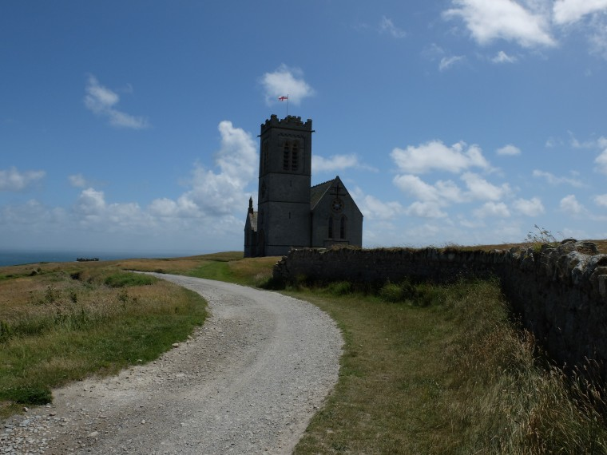

One of the first letterboxes is in St Helenas church so we headed there to have a look around and to get started in collecting our stamps. St Helenas was built by Reverend Hudson Grosset Heaven. While the church is not part of any diocese and no regular services take place a sign in the church invites any lay readers or visiting vicars to contact the office if they wish to hold a service.

The first letterbox was located under one of the pews and contained a notebook, stamp, & inkpad. We stamped our book and added our details to the notebook.

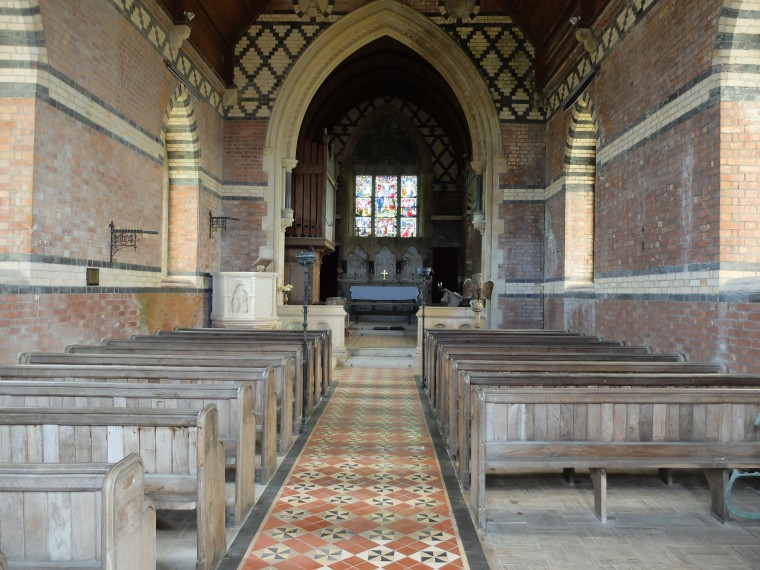

Leaving the church we headed towards our cottage via the village. The walk to what would be our home for the next few days involved walking away from the village past the staff quarters and the black barn.

As we walked round through the gate onto the western side of the island the old light loomed into view as we got closer to Stoneycroft an old cottage built by Trinity House for visiting lighthouse inspectors.

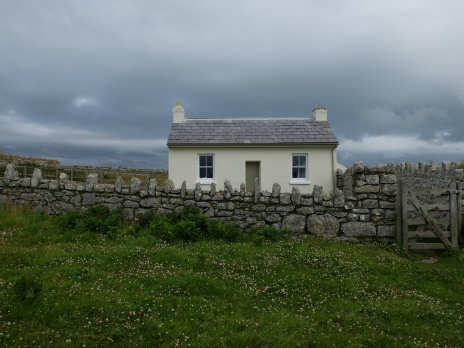

Stoneycroft is set away from the village in it’s own small paddock where only one sheep was kept, we named her Ethel the lonely sheep and she became a constant companion whenever we passed through from or to our cottage.

After a long day travelling and finding our feet on Lundy we cooked a dinner of pasta and headed to bed for an early night and before the power went off at midnight.

### Wednesday

As the sun rose on our first full day on Lundy we awoke to find it blowing a gale from the Atlantic. not wanted to waste any time we breakfasted on bread and jam and headed to our first destination of the day, the Old Light. It’s quite a few steps to the top and the Landmark Trust have helpfully placed some deckchairs where the light once stood.

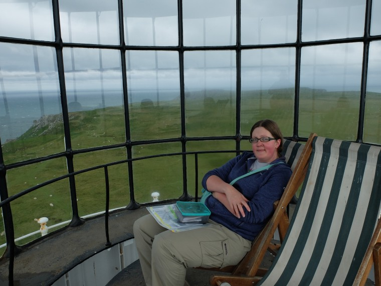

The top of the Old Light also contained another letterbox, so while we looked out on the Atlantic we added another stamp to our pad. The rabbit of Lundy a special stamp that moves from box to box had been here recently.

Descending the Old Light we headed along the coast to find more letterboxes. We easily picked up one behind the remains of a crashed Heinkel, and one tucked away by the path to a former rocket warning station.

We moved on to Jennys cove hoping to find another letterbox but being completely stumped decided to see if we could find some puffins instead. After much scanning of the cliffs we spotted the tell tale orange feet of a puffin and soon were rewarded with a sighting of a couple of adults in and out of their burrows.

Moving on from Jenny’s cove we headed towards the quarter wall to look for further letterboxes but as the sun beat down on us we realised we had forgotten to bring any lunch or drinks with us.

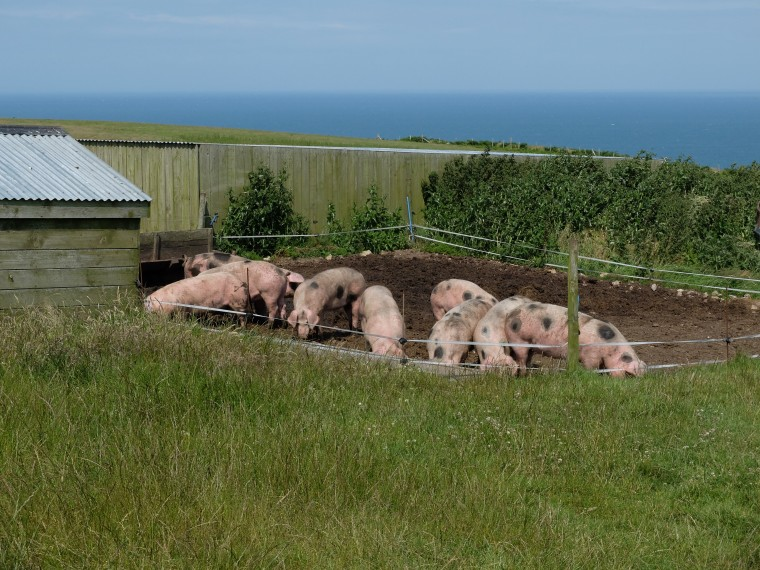

Heading back towards the village to pick up some lunch we passed a variety of enclosures connected with the farm including the pigs and some highland cows.  All along the dry stone walls rock pipits tweeted and fluttered about without a care in the world.

With a simple lunch of crackers, cheese, and salami inside us we headed back out to see if we could find another couple of letterboxes at the Felix Gade hut and Quarry Beach.

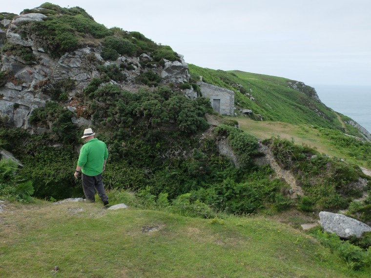

The quarry pond for some reason contains fish, gold fish. I’m sure at some point someone thought it was a funny thing to do but they seem to be flourishing quite well and have grown to quite a size.

After walking all the way down to quarry beach to find a letterbox hidden in the rock face we climbed all the way up and then walked back into the village for supper in the tavern. Finding a table on the balcony I ordered the Exmoor beef pie and Mary had the Soay Lamb in gravy.

We wandered home to Stoneycroft as the sun disappeared over the horizon, hoping that we got back before it went dark, neither of us having brought a torch with us.

### Thursday

Today we decided to investigate the south end of the island, in order to prevent a repeat of Wednesday’s lunch calamity we packed sandwiches into our bag and headed out. First along we picked up the letterboxes at Benjamin’s Chair, the rocket pole pond, and Pilots Quay before heading to take a look at the Anthony Gormley statue on the island as part of the LAND exhibition marking 50 years of Landmark Trust. The statue on the island is linked with the one visited earlier in Warwickshire and is like that one based upon a self portrait of the artist.

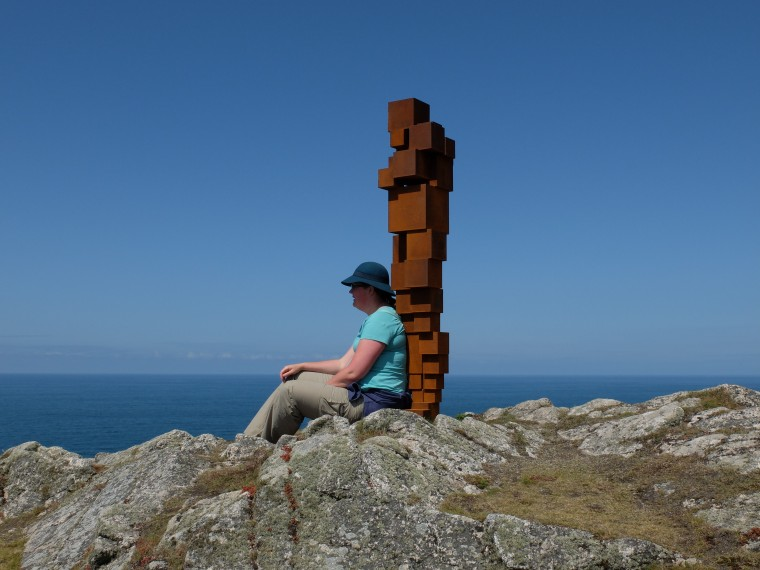

It was from the paths to the statue that we saw our first seals basking off the coast in the shallows. We bumbled along the coast path and back towards our little cottage for an afternoon nap.

Suitably replenished we headed out to collect the letterboxes around the harbour, first up Rat Island. This was tricky and in the end a failure, in order to reach the letterbox you need to climb up the cliffs on the south end of the island from standing in a rock pool. Unable to ascend without slipping we retreated to the harbourside having to paddle out through a series of rock pools.

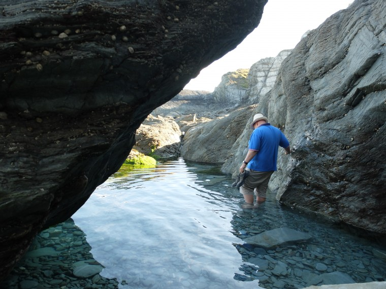

We collected the easy letterbox by the dive school, and then began to ascend the steps to the South light where another letterbox awaited us.  From the South light we climbed down to the road and then up passed Hamners and to Marisco castle. From the letterbox at the castle we descended to our last letterbox of the day Bensons Cave which had a decidedly sheepy smell about it.

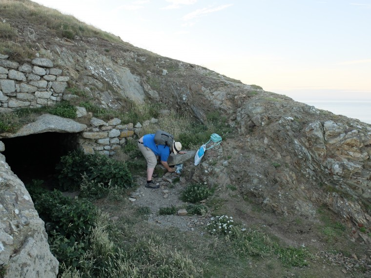

Looking out from Bensons cave across the South light the sun, we stopped to take in the view for a little while realising how lucky we really where to be here far far away from the madding crowd.

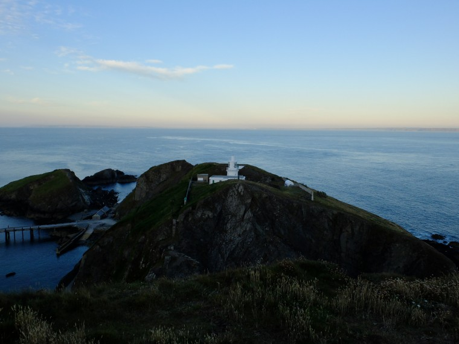

### Friday

Friday was our last full day on the island and we intended to make good use of it by heading to the North end of the island. Mary headed to the shop before breakfast to collect supplies for our trip and soon we had a lunch of sandwiches and scones and jam.

We decided to give Jennys cove one last try but after a good couple of hours we were unable to find the letterbox and so continued north up the coast path. Once past the halfway wall the flocks of Soay sheep become more apparent and the grass becomes a little less lush.

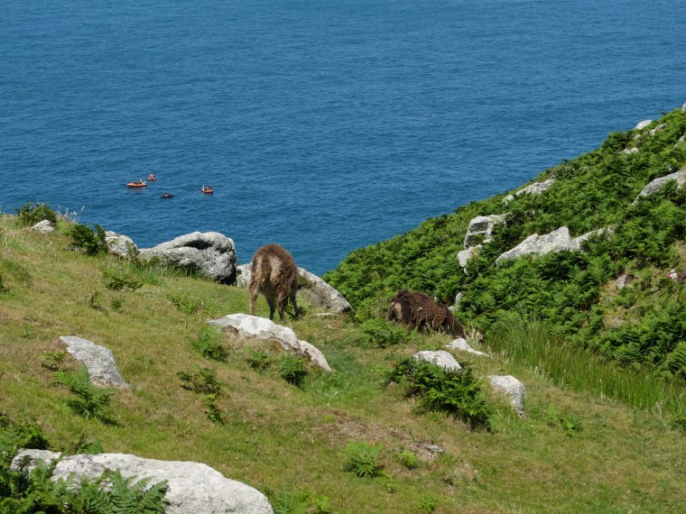

The North light still has the remnants of when it was a manned station including a light railway track for moving supplies from boats a little further along the coast, Trinity House of course use helicopters for those jobs these days and the lighthouses are automated anyway.

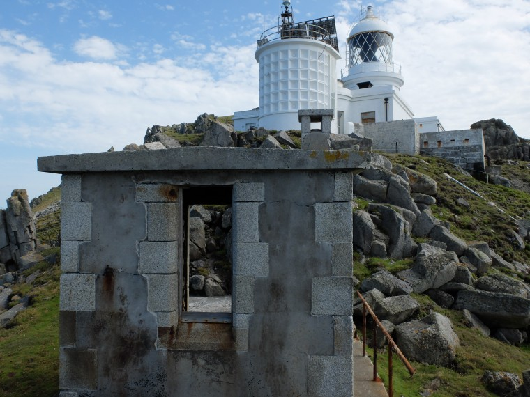

From the North light we headed to John O’Groats cabin but were unable to find the letterbox there so we headed along what could be described as the main road towards the village and our cottage.

Stopping briefly we picked up carcassonne and headed to the tavern for our supper. We found ourselves so dehydrated we both drank whole pints of pop as well as our beers. I had the Venison and Sticky Toffee pudding.

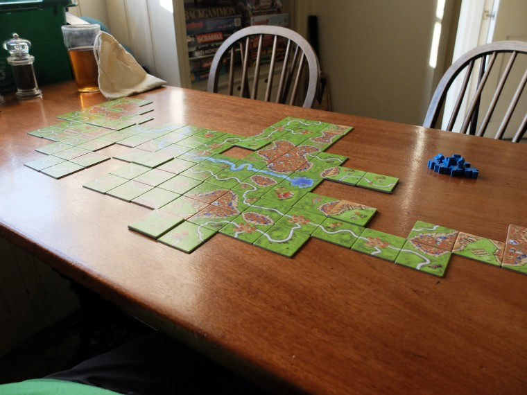

In what was quite a surprise I found myself winning at the game a fact we put down to Mary being so tired from all the walking she wasn’t playing her best.

### Saturday

As the sun rose on our last day on the island we packed up our bags and cleaned up Stoneycroft before heading out to spend our last day relaxing. First we visited the shop to pick up some souvenirs and gifts and settle the tab we had accumulated during our stay. We then headed over to the tavern for some light reading and hot chocolate as well as settling our tab there. After a while we found ourselves surrounded by the influx of day trippers so headed down the island towards the harbour.

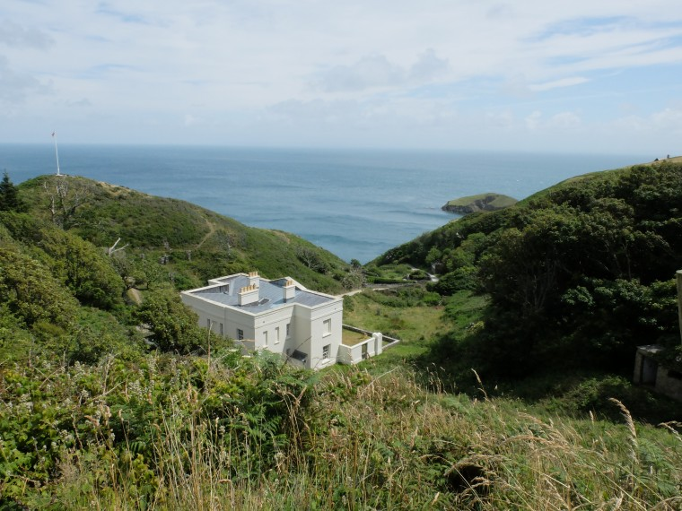

Passing by Millcombe house the former residence of the Heaven family we made our way down the road to the harbour and a bit of paddling, gin and tonic, and seal watching in the shallows.

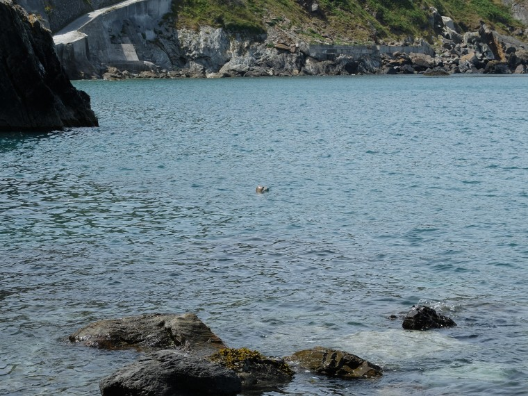

Not before long the queue on the jetty for the return journey aboard the Oldenburg began to form and eager to get a seat on the deck we joined it. While queuing more seals entertained the waiting visitors.

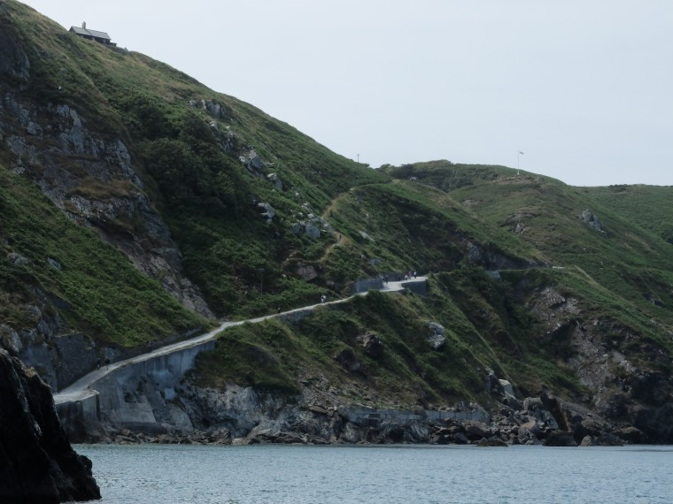

As we pulled out of the harbour the last look at the island vowing to return as soon as we can, relieved to hear that the crossing would be calm. As I disappeared below decks to fetch tea and beer, Mary yet again sighted dolphins.

Arriving into Ilfracombe the bags got unloaded on to the dock side and we headed off to our bus stop, hoping the timing would work out for us, it did and we managed to get to Barnstaple in time for the train back to Exeter St Davids.

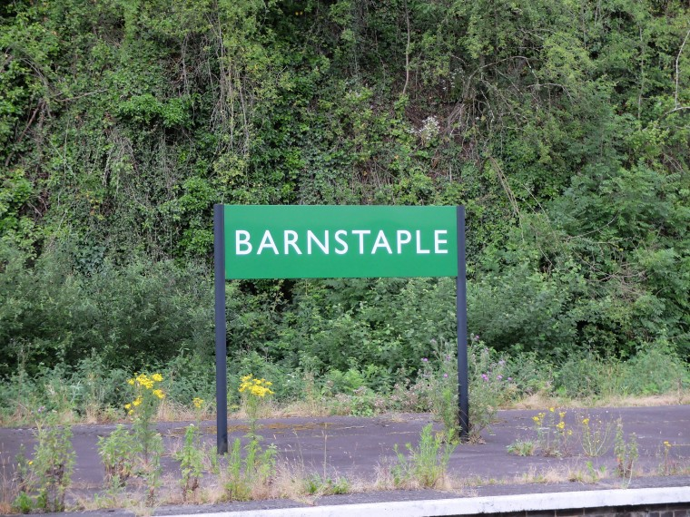

Arriving in Exeter we had miscalculated how long it would take to walk to the hotel and missed our evening meal but the restaurant manager convinced one of the chiefs to sort something out for us in our room to which we were very grateful.

It felt very strange to be in a town with background noise and light pollution after a week on Lundy where the only noise was the sounds of wildlife and when it went dark all you saw was the starry sky.

### Sunday

After breakfast in the hotel we headed back to Exeter St Davids to catch our train back to London. Instead of the FGW service we had tickets for the South West trains journey via pretty much everywhere to London Waterloo.

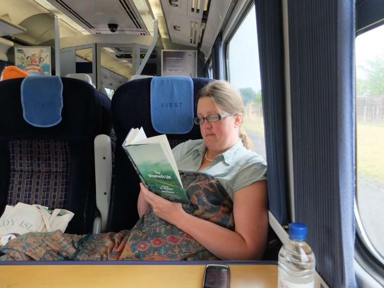

First Class was a little more cramped owing to the fact you could upgrade for £5 at weekends but the extra legroom and table was very much worthwhile on the 3 1/2 hour journey. While South West don’t have a pullman they do have a trolley service and tea was obtained to provide sustenance.

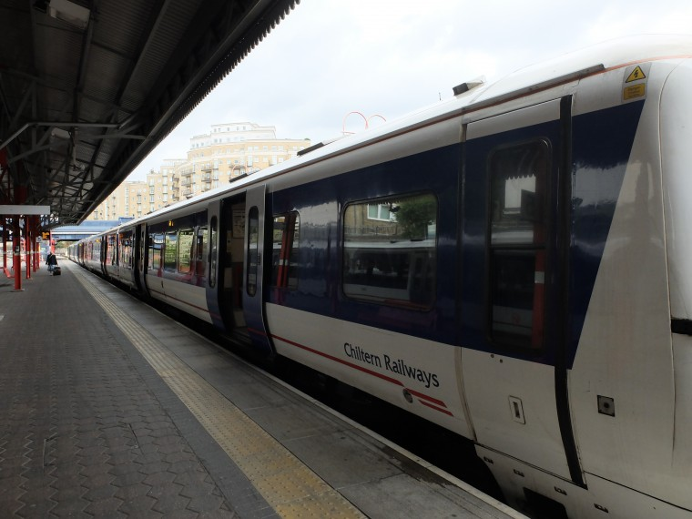

From Waterloo we took the tube to Marylebone to catch our final train of the trip back to Princes Risborough. We were met at the station by Marys mum who returned us to Bryn Cottage where someone had decorated the inside of the Micra with confetti.

After an exhilarating two weeks away from home we headed back to Stroud a married couple to see what adventures come next.
