> It took me a really long time (almost a year) to finish this post. I'm not sure why but because of that I'm sure i've missed off some of the details. However if you get the chance you should visit San Francisco it's a really beautiful place.

Our friend Charlie lives in San Francisco, and they had very kindly extended a welcome and a place to stay to us should we wish to fly transatlantic and visit them. So we made plans to fly to San Francisco and then return overland using trains and exciting visits to places all over America. Eventually we realised we didn't have enough holiday so after some deliberation decided we'd fly out and spend a week in San Francisco with Charlie and I booked some plane tickets before we could change our minds. It's worth pointing out that I really don't like flying, as in would rather swim the atlantic but I'm told it's a long way so I hitched up my big boy pants and got on the plane.

===

## Day 1 - Thursday 3rd November 2016

Outside it's cold and dark, not helped by the fact we are at Mary's parents house where there is no streetlights whatsoever. This does have the advantage that we are half an hour from Heathrow and we have a lift arranged. Being close to Heathrow is important as it's already 4.30 in the morning and I didn't fancy being up any earlier. Our flight departs at 11.05 but we have to be checked in 3 hours in advance.

Heathrow is fairly standard for a weekday morning, busy but efficient. We get checked in and then head through security I zoom straight through and then have to wait for Mary who seemingly needed further inspection. Air side is the usual array of retail opportunities loved by travelers with nothing else to do, and apparently very rich ones who feel the need to spend thousands on tat. We opt for breakfast at Giraffe instead, I have the full English to try and calm my preflight butterflies. It works remarkably well. In an effort to escape the retail madness we head to the gate and from our seats we can see our chariot waiting, a old but serviceable Boeing 777. I watch the amazing machines loading our luggage until we are called to board.

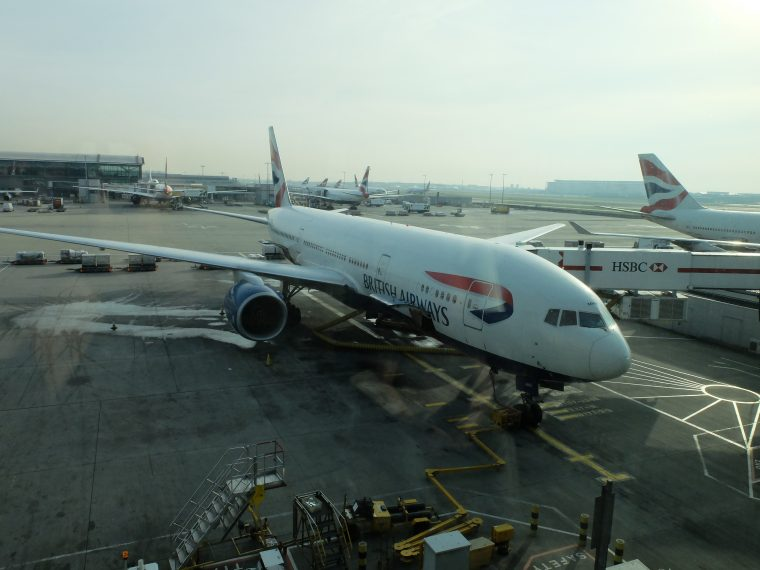

We had chosen seats in advance, namely so we had two togther and a window. We are seated at the back of the aircraft which I was skeptical about but proves a winner as we have slightly more legroom and are close to the galley and loo. As soon as we are in the air food starts arriving, which is nice because I've worried my breakfast off and am now hungry. The flight progresses much as you might imagine, I'm disappointed the martian isn't on the entertainment system as I wanted to watch that but console myself with my kindle and taking pictures out the window.

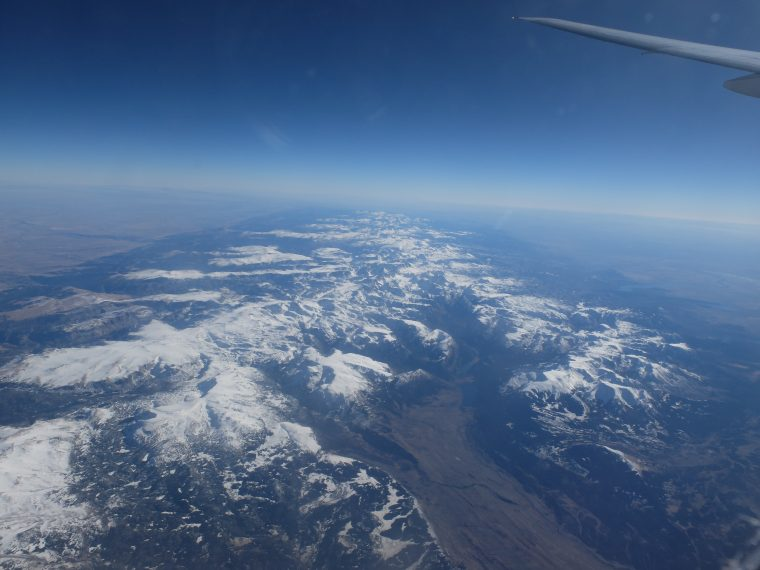

The Rocky mountains are particularly breathtaking. If only someone had cleaned my window before the flight though.

We arrived into San Franciso about 3pm local time, and 10pm UK time. I'm tired but quite excited but first we have to clear immigration and the border staff of USA. We expect them to be grumpy and difficult instead he is helpful, friendly and quick, even though it takes some time to explain who Mary works for. We grab our bags and head for arrivals where we meet Charlie who whisks us to her home in their car. Dinner follows, my third of the day and then I'm asleep by 8pm local (pretty much whether I wanted to or not).

## Day 2 - Friday 4th November 2016

Our first full day in San Francisco and we have no real idea of what we want to do. I wake as does mary sometime around 3am owing to the fact my body clock and internal systems still think they are in the UK after some forcing myself to sleep I get up officially about 7am to be met by Robert in the kitchen with coffee. To say i was grateful would be an understatement.

We decide to be a bit touristy and head down to Fisherman's Wharf and have a nice easy day given I'm still running on UK time it seems. One of the big attractions here is the sea lions who moved in in such numbers that the port moved the boats out of this bit to accommodate them.

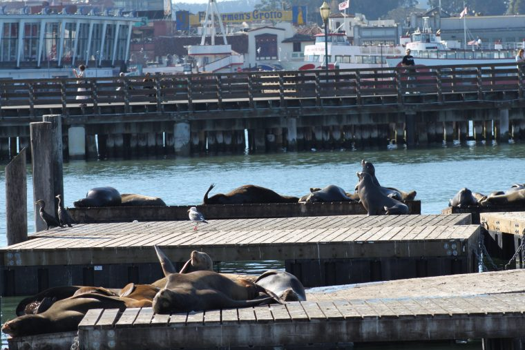

There's a huge range of tourist shops and attractions here, as well as fishing trips and the pier for Alcatraz which we discover is sailing still after thinking the visits had stopped before we arrived. We grab a leaflet and head back along the harbour. One of the slightly odd amusements is a pier warehouse containing a museum of arcade machines, everything from pacman to some more modern machines, to some really old pre computer entertainments.

We change a bunch of money into quarters and roam, I play a few games of pinball and have a go on a couple of the more unusual machines.

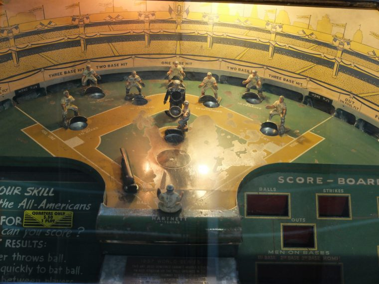

We move on looking for something to eat, admittedly this isn't hard there is food places everywhere on the wharf but I didn't fly for 11 hours to eat McDonalds. So we keep going until we find Boudin's which is apparently a big deal in soda bread and soda bread related products. They have a cafe and a restaurant so go for the cafe and manage to negotiate ordering food in America. I have the Chilli in a breadbowl, Mary has Clam Chowder in a bread bowl. The servings are immense, also the soda pop is labelled as containing sugar so you can tell which ones have the high fructose corn syrup in.

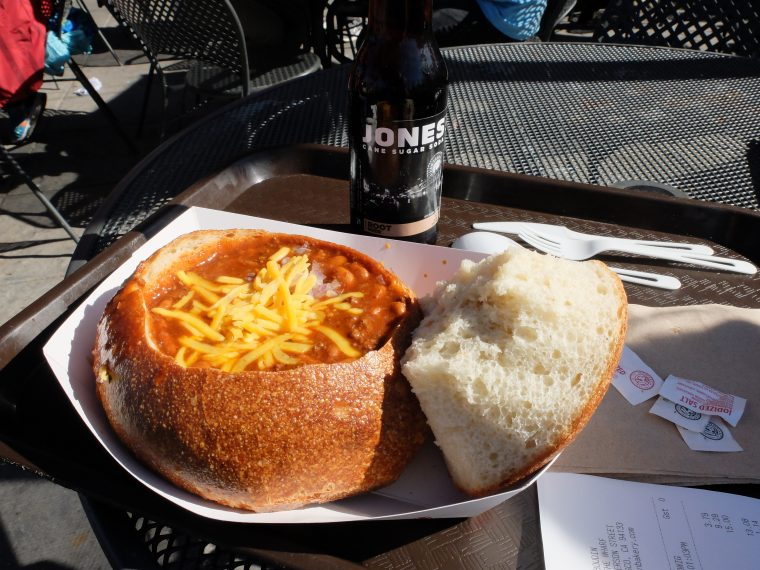

Feeling full (really quite full) we head off to catch a cable car to China Town. The cable cars look a bit like old trams and have a device they clamp onto a cable running under the road. so using two levers the driver can control the speed of the car. As well as sitting on the benches you can hang off the sides. These are mostly for the tourists now though some (well off I presume) commuters use them.

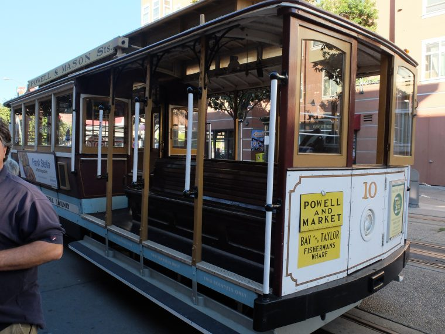

China town is pretty amazing, as well as a million grocery stores selling almost everything there is bazaars and shops selling all sorts of weird and wonderful nik naks, you need a dinner service with scenes from the Kama Sutra, this is the place to find it. Mixed in is buildings in a homage to traditional chinese style with brightly painted facades. In amongst all this is the museum to the chinese second world war efforts against the Japanese. It's a low key affair but you realise they were one of the less talked about allies of the war and took quite a bashing.

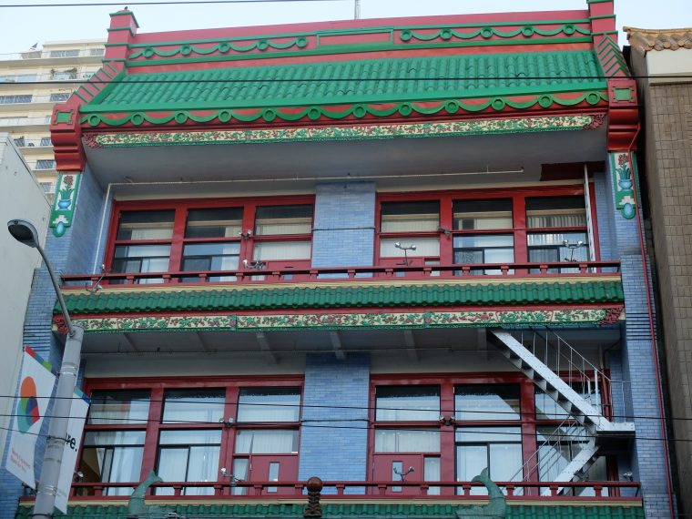

Back to Charlie and Roberts our feet throbbing slightly after all the walking for supper. Still on a different time zone I'm falling asleep on the sofa again.

## Day 3 - Saturday 5th November 2016

Having made a plan about what to do on each day now we head off for brunch at a local place. Brunch in SF is a Saturday tradition and we decide on pancakes from Hazels Kitchen and coffee from Farley's next door. Pancakes in the US is an odd affair I mean bacon with sweet things but it works and is an exciting slice of Americana. Down the street people are queuing for pancakes at a more trendy establishment, queuing for brunch is also a SF tradition, one I'm not joining in with.

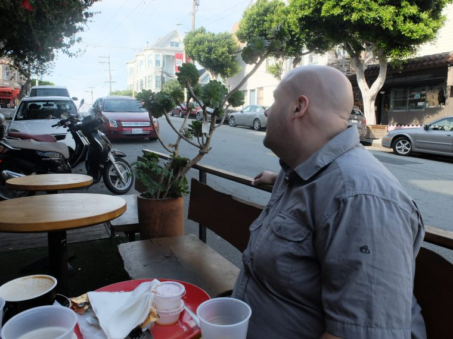

On the way back from pancakes we pop in to a local bookshop where we pick up some gifts and I get an exciting book full of different types of graph paper. It's so exciting I've not dared to write in it yet as that would spoil it. Near to Charlies house is a community garden which unlike UK allotments you can wander around to have a look, this one has an infestation of chickens who seemed to be having a jolly time digging dirt baths about the place. They did seem to just roam about the plots as if they owned the place maybe they belonged to the whole garden rather than one plot or maybe they were escape artists.

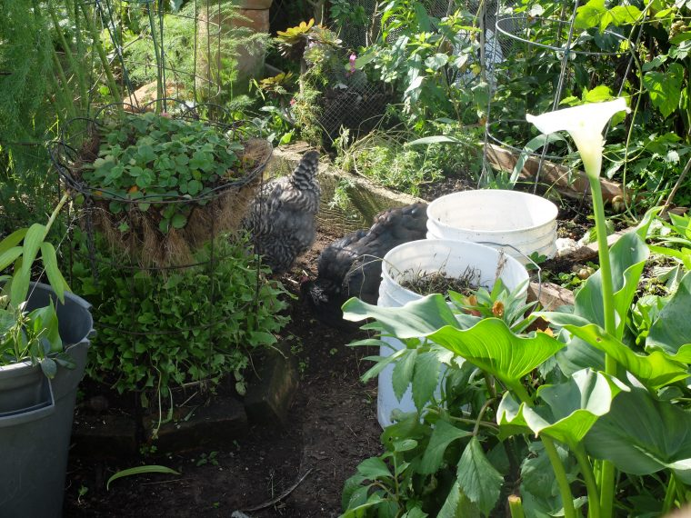

In the afternoon we headed over to Golden Gate Park and the Japanese tea garden, entry to the garden is cheaper for San Francisco residents so Charlie and Robert had a hunt for ID to prove they live here. We headed for the tea rooms first where Robert treated us to tea and Japanese biscuits.

The gardens themselves are very pretty but by this point my jet lag was kicking in and I was struggling to stay awake a little bit.

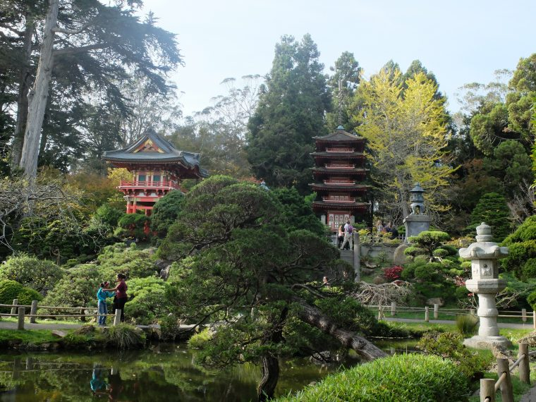

From the Japanese gardens we headed to the band stand in the park, it wasn't your ordinary band stand resembling more of a giant stone stadium stage in the park. I know they have more space here but they don't do things by half.

With the day ticking on we headed to the beach, ocean beach. Charlie and Robert had kites in the car so we took them and spent some time flying kites, talking, trying to photograph the mist and attempting to identify the small birds hopping about in the swell.

The sea air woke me up a bit and cleared out the fug clouding my brain and I like flying kites with Mary especially at the seaside.

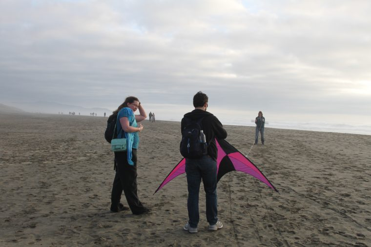

Despite the beach being a bit like Burnham on Sea, as in no arcades or shops just a strip of sand at the end of the land quite a few people seemed to be using it to walk the dog, run, hang out or just people watch. I was perhaps expecting many retail opportunities.

We headed back inland to find some food before dancing in the evening which we did in Outer Sunset. I had fish and chips which was surprisingly nice and came with chips that resembled chips not fries. Mary had a chickensalad which also looked pretty good. Robert headed home and Charlie took us to meet some of her dancing friends atBalance the Bay.

We joined in with the introductory lesson which was handy and had a go dancing in the first session but by the break I was falling asleep standing up, I had a delightful chat with an older couple whose names I can't remember while trying not to drift off in front of them. Mary on the other hand seemed to be getting her second wind. I'm not to embarrassed to say I had a little doze on the chair.

## Day 4 - Sunday 6th November 2016

On Sunday morning we headed off across the Golden Gate bridge to see some nature, the Marin headlands are immensely pretty and offer some pretty stunning views back across the bay to San Francisco. We stopped off at the side of the road as do a lot of people to take in the views and take pictures. I must have spent 30 minutes trying to take one I liked of the bridge.

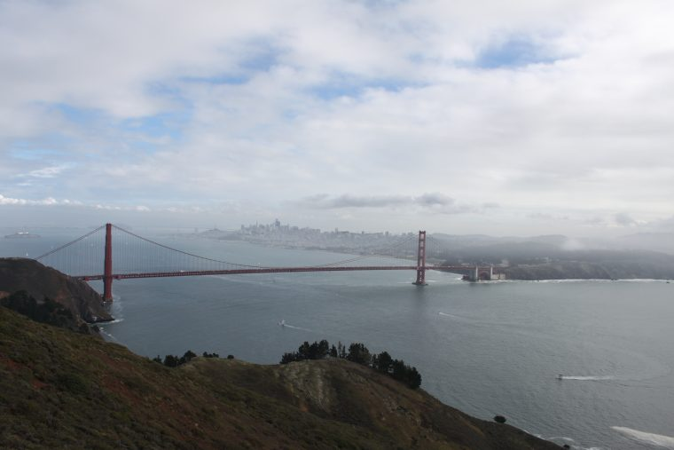

We followed the road around the headlands and stopped I had some fun taking a panoramic photo of the scenery. There is all sorts of former military defenses on the headland from various eras.

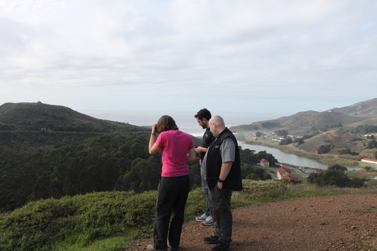

From the headlands we headed to Muir Woods, instead of going to the visitor centre car park we parked up at the top of the hill and walked down through the woods. Apparently a lot of people will park in the visitor centre and then visit the cafe and shop, look briefly at the trees and get back in their cars.

Muir woods is a national monument, mostly because it was taken into care by the government before the national parks service had been established. Being part of the parks service meant that I found a walking stick mount, and badges, something we have struggled to find on other holidays.

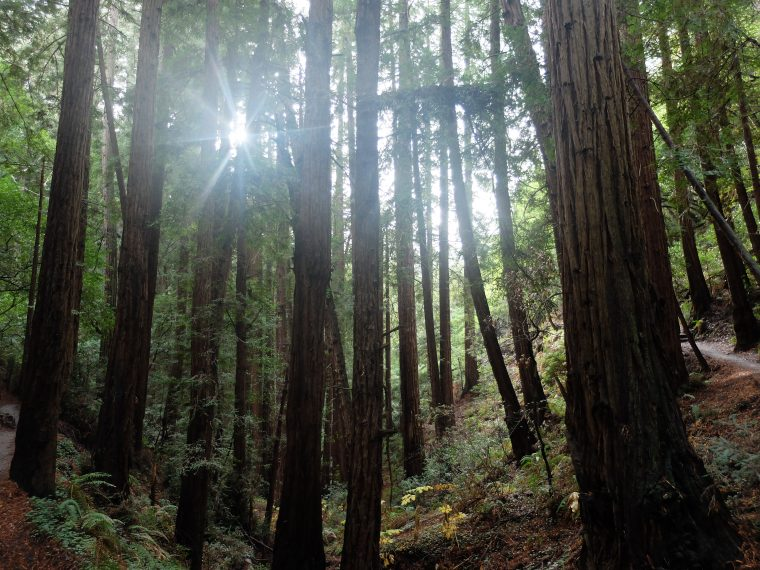

On our way home we drove past Sausalito, the home of the fictional character BJ Hunnicut from MASH one of my favourite TV shows.

## Day 5 - Monday 7th November 2016

Charlie needed to do some grocery shopping so we tagged along to Food's Co. Well I know British supermarkets can be a bit like a warehouse but I think this was an actual warehouse. Just to see what was on offer I popped into the soft drinks Aisle, some of the pop on sale you would need a pair of sunglasses to pour because they verged on the neon in colour.

Another thing I found is peanut butter covered things. Literally anything that could be coated in peanut butter is so I bought a box of pretzels. I'm slightly relieved I don't live in the US as I probably would end up having a heart attack what with my sweet tooth.

Once we'd dropped off the groceries we hopped on a bus and headed into the centre to meet Robert for lunch at the Google San Francisco office. Googlers get passes to invite friends and family to lunch in the canteen, so while we couldn't mooch around the offices we could visit the roof top patio. The food on offer in the canteen makes anything I've had in UK offices seem poor and it was all free. After eating we went upstairs to the roof where coffee, snacks, and cold drinks are available if you are still hungry, and also this view.

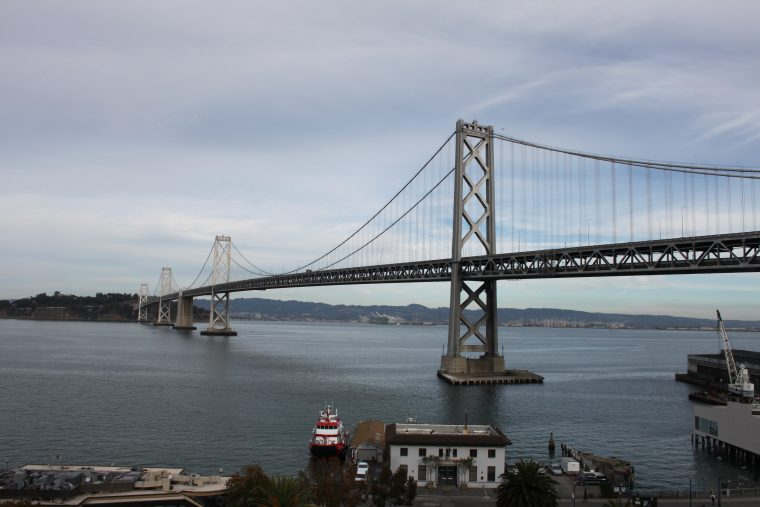

From Google we caught a bus and headed towards the Golden Gate bridge. It's a long bus ride but their is a park service shop, toilets, cafe, and lookout point leading to the path that leads you across the bridge. A lot of people visit to walk or ride bikes across the bridge or just to the middle. The view was stunning as the sun descended in the sky covering the orange bridge with brilliant orange light.

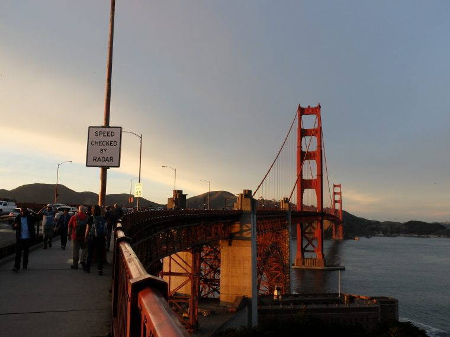

When we got back to the bus stop, their were some trash pandas going through the bins. As cute as they look they are a menace, but that didn't stop me and others crowding round to take pictures of them.

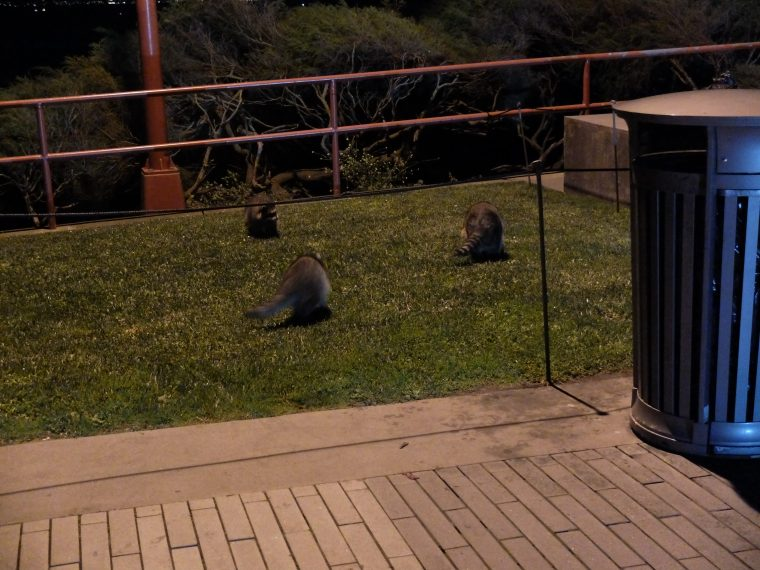

## Day 6 - Tuesday 8th November

Today we headed to Alcatraz, as we had to travel along the wharf we jumped in an F car which are old street cars, brought from around the world and refurbished for service in San Francisco. We hopped off at the dock and joined the queue for our allotted crossing time to the prison island. The park service have a well organised machine for tourists to the island and you can roam fairly freely around.

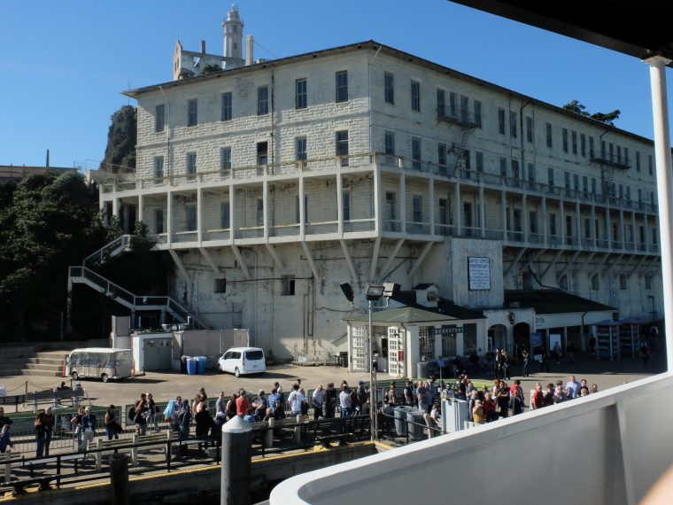

Before heading into the main building we visited the industrial building where prisoners would have worked on prison industries. It's now being used for exhibition space and while we were there they had an artwork exploring pi.

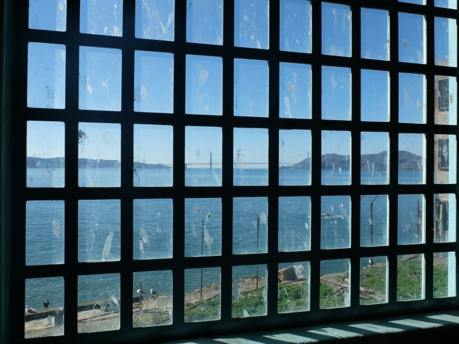
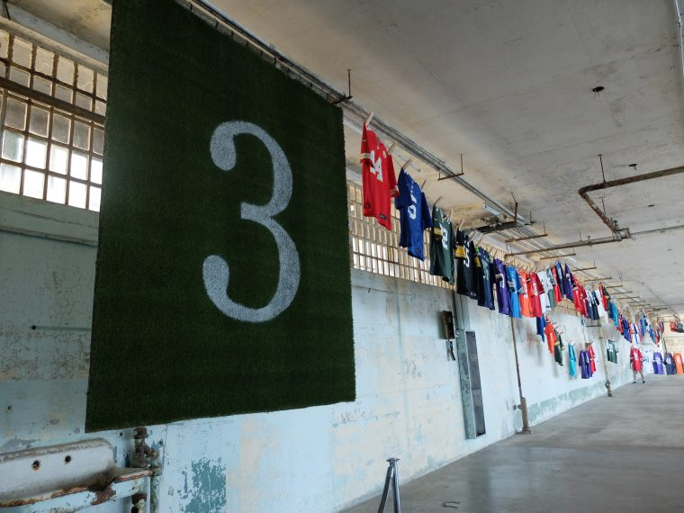

From the industrial building we headed to the main prison where you get given an audio tour to listen too as you walk around it's fairy intense stuff so I'll leave you with the photos.

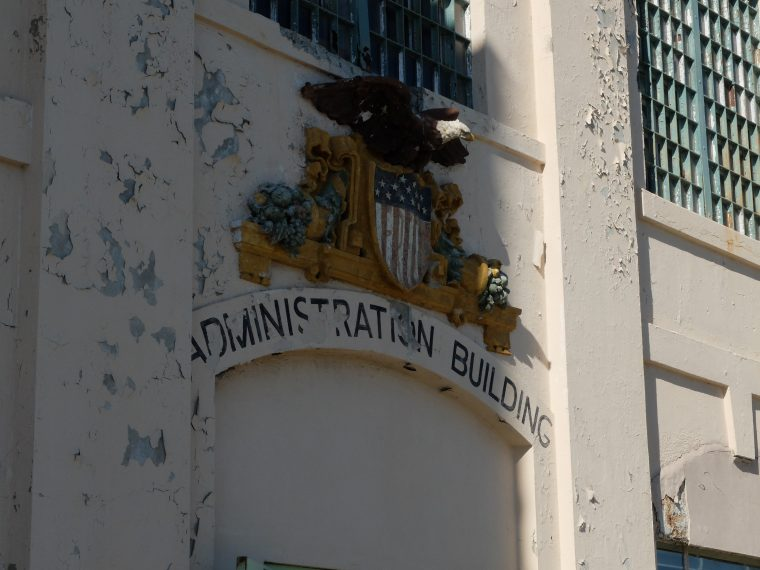
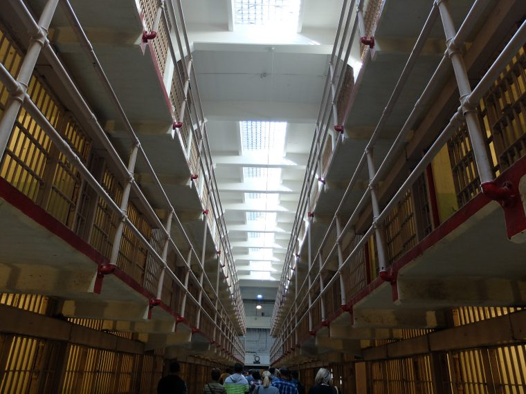

We left the island on the last ferry having explored every inch. Alcatraz is slowly falling down thanks to the effect of the salty air on the steel reinforced concrete but the parks service is doing stirling work keeping it together and restoring blocks so future generations can continue to visit and learn about it's history.

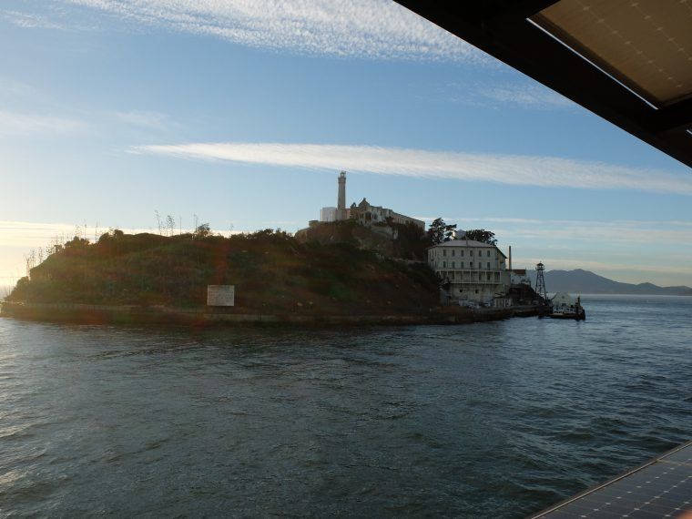

Back on the main land we went for Ice cream at Gotts Roadside in the ferry building. I Managed to induldge one of my favourite treats with a root beer from the soda fountain. I had mint confetti ice cream with cookies and cream, and Mary had chocolate ice cream with cookies and cream and oreo bits.

Back at Charlie and Roberts we drank some beer confident that the election was going the way we thought and Hillary Clinton would be president elect in the morning, that didn't turn out so well and we had to go and get some haribo and more beer, the city seemed subdued somehow. However it wouldn't last long.

## Day 7 - Wednesday 9th November 2016

Charlie was going to do some work from home today so Mary and I headed into the city on our own. First stop was the farmers market at the civic centre, well we got off the bus and the farmers market happened to be there so we had some samosas and lassi from one of the stalls and headed down to the wharf for our actual destination.

So being a massive geek I wanted to visit the hands on Science museum the exploratorium. Founded by Frank Oppenheimer, (the brother of Robert Oppenheimer) after his time in Europe visiting our science museums.

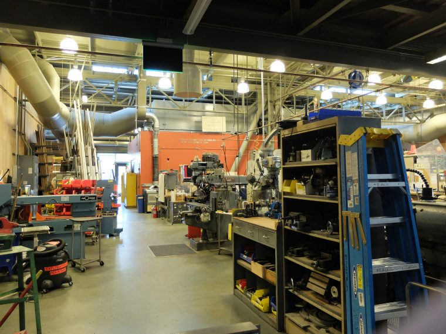

I had workshop envy, they make most of their exhibits and this is the amazing space they do it in. In full view of the public. Opposite the workshop is a giant clock by Tim Hunkin the chap who put together the secret life of machines tv programmes and usually is found building amusements for his pier in Southwold.

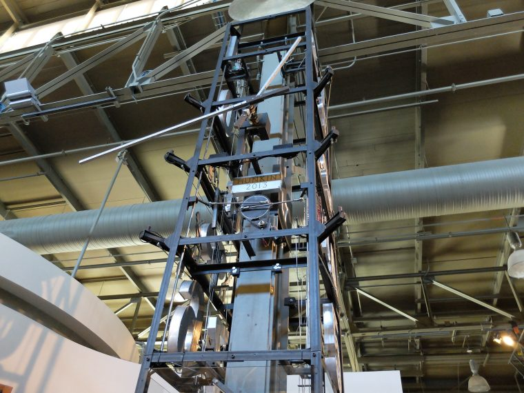

At the far end of the museum is a room with windows all around looking out over the bay, and it's full of maps of San Francisco. I left Mary here for a little bit while she geeked out and had a play with the telescopes.

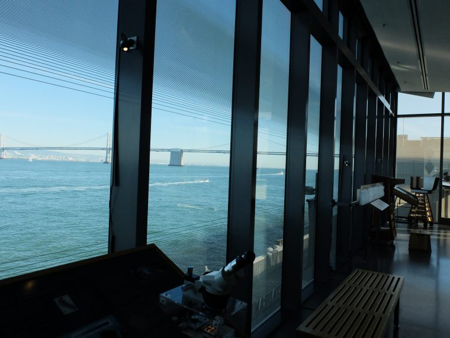

We'd been in the museum quite a while and the school groups had now all left leaving it strangely quiet, it did mean we could now have a go on the exhibits that had been busier early. Also these guys had emerged to have a play now they weren't being stared at.

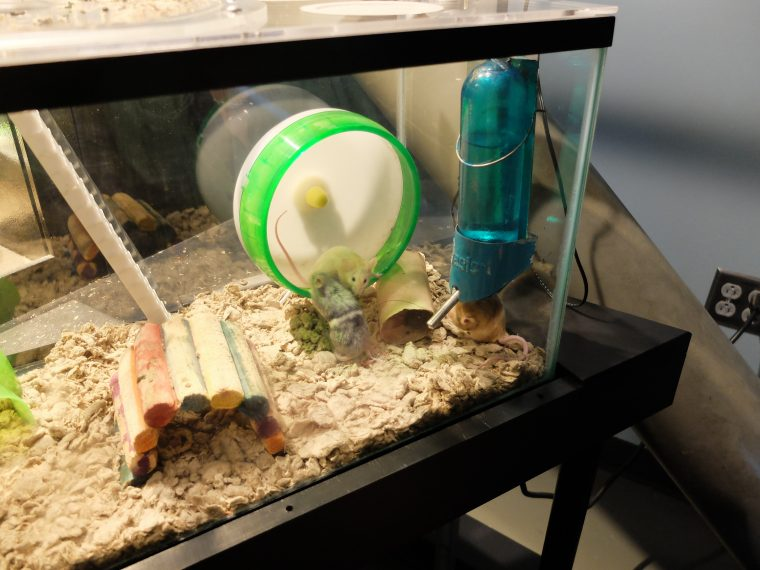
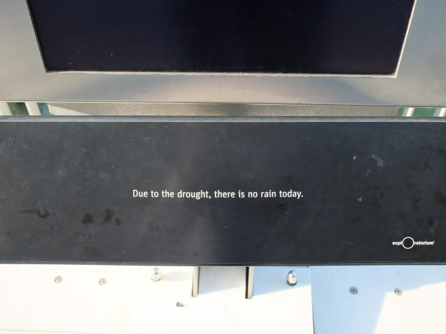

After a trip through the gift shop we emerged, tired, but happy and hungry so having eaten fairly healthily so far on the trip we fancied some junk food. We headed into the Gotts again and got burgers and chilli fries (and root beer).

We walked up Market as I wanted to go in a Levis shop and get some Jeans, however they had nothing in a size other than skinny hipster so we went in a Walgreens and picked up gifts for our families, mostly bags of sweets. On the way to the bus stop we came across a rally against the election of Donald Trump. The folks protesting where mostly latino and other groups he had spoken against during his campaign and they were worried they would be persecuted by his administration. The police stopped the busses so the march could take place and apart from the large presence took place without any violence on either side.

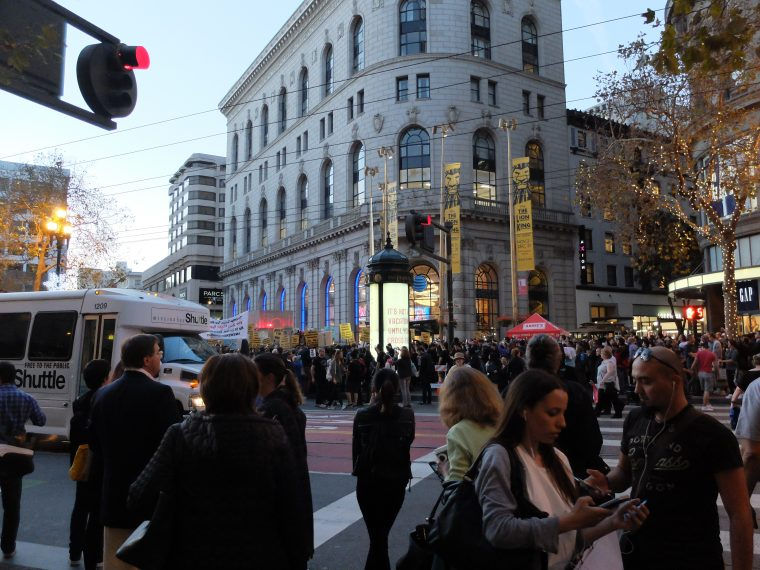
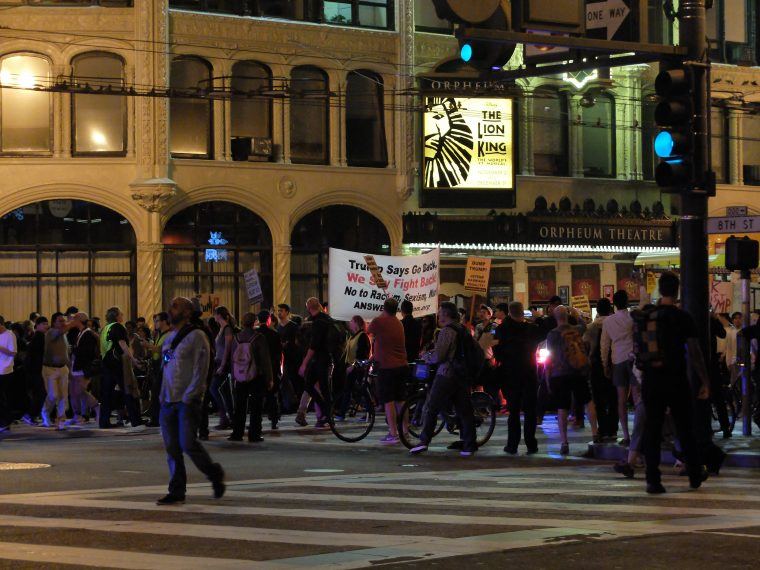

We had to walk down to Market and 8th to catch a bus so we watched along with our fellow passengers before catching a ride back home to Charlie and Roberts.

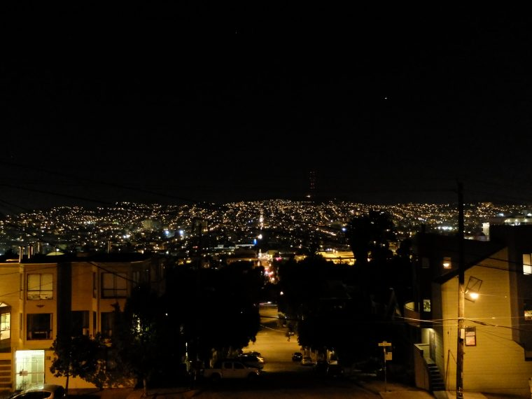

## Day 8 - Thursday 10th November 2016

Our last day in San Francisco, so having packed we jumped in the car with Charlie and headed across the bay to Oakland, Berkeley and the University of California.

We stopped at the University Botanical Gardens which are amazing, and despite the fact we are technically in a dessert in a drought quite green. And full of wildlife like this lizard who managed to stand still long enough to get a photo.

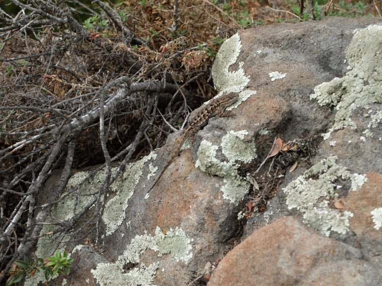
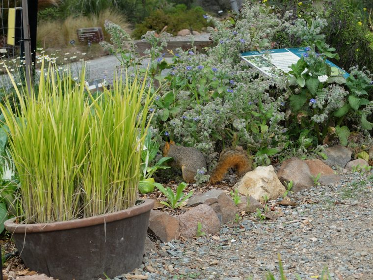
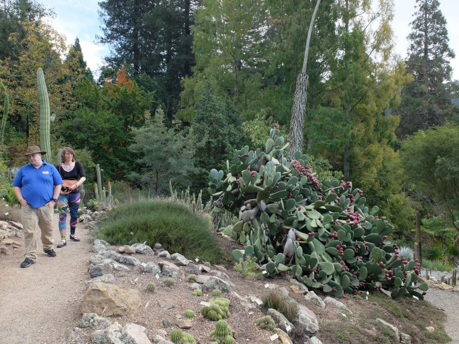
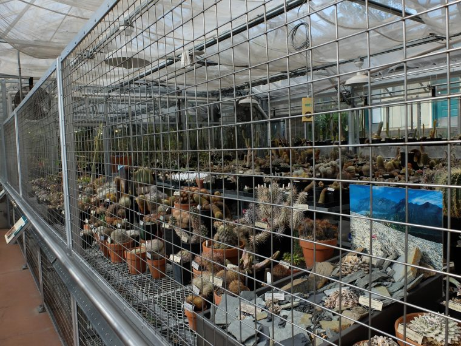

From the botanical gardens we headed in Berkeley for pizza at the Famous cheeseboard pizza. Cheeseboard only do one pizza option a day and it's vegetarian so you just order a slice, a half or a pizza. You get an extra slice for each half you order so we ended up with a pizza and two slices. The pizza was gorgeous and really quick as they just hand you the order straight away. From cheeseboard we headed to Philz coffee. Philz do pour over coffee rather than espresso and where the first place Mary had got a decent cup of tea the entire time of our visit, she was excited and so were the staff at having their tea making skills validated by an english person.

As time was running out we quickly headed into Berkeley games where I bought a copy of the firefly board game and Mary bought some comic books before a quick spin around a whole foods and jumping into the car to fetch our bags.

Charlie drove us over the bridge and towards the airport. as the sun started to set it was sad to be leaving such an amazing place but the flip side was a trip in the new Airbus A380.

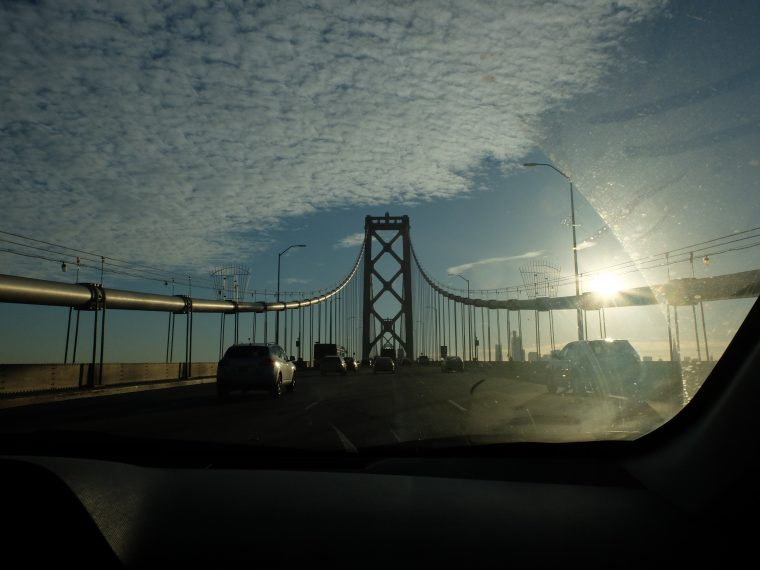

San Francisco airport is tiny, unlike Heathrow where we had started our journey so we grabbed some food and spent our last few dollars in the gift shop before settling down in the departure lounge to wait. The plane unsurprisingly was late but once on board very comfortable. However unlike the smooth old Boeing we bounced around a bit on the way home, mind you I finally managed to watch the Star Trek film all the way through.

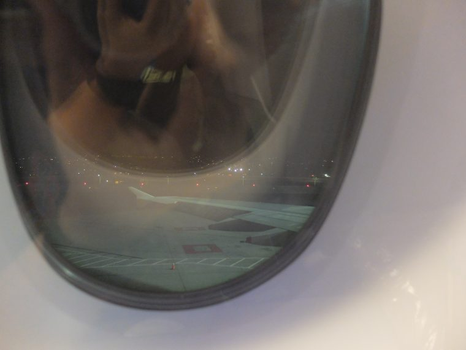

Back at Heathrow 11 hours later we collected our bags and met Marys dad who had come to pick us up. Back at Marys Parents house I fell asleep on the sofa at 3pm in the afternoon.

Fin.