## Friday 29th June 2018

In order to leave Ellie the spaniel with relatives, and make the UK part of the journey shorter we had arrived with Mary's parents the evening before. Unfortunatly due to road closures in Swindon that arrival was somewhere around midnight rather than the gentler early evening we had planned.

Mary's mum gave us a lift to Great Miserden railway station which formed the first of many train journeys on this trip and we caught a commuter service into London Marylebone, we must have looked a little out of place with our rucksacks and walking gear on.

I broke one of my golden rules and we caught a taxi from Marylebone to St Pancreas in order to avoid getting crammed in on the tube. Thankfully the small talk was kept to the destination and not the local politics of the day. At St Pancreas we bought some supplies from M&S to avoid availing ourselves of the probably quite expensive trolley service on the Eurostar.

Getting through passport control and onto the train was plain sailing apart from the security guards concern over Mary's pocket knife in the bottom of her rucksack which was allowed through by his supervisor. The train departed on time and soon we were speeding under the channel and into Paris.

## Paris

From the Gare De Nord we had to catch a RER service to the Gare de Lyon which was the nearest station to our hotel. I had booked that hotel because it made the walk to the departure station for the early morning train to Switzerland shorter, although in the summer heat of Paris (they were giving out water in the station) I somewhat regretted it.

After checking in we headed out to have a look around the local area, just down the street from us was the Jardin des Plantes.

<figure>

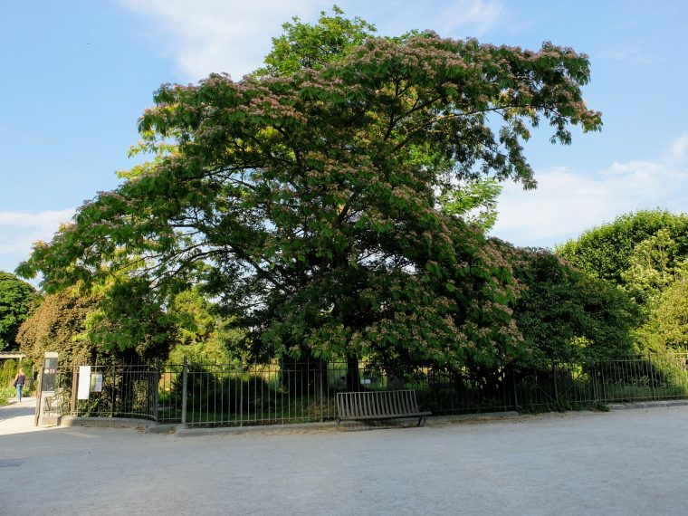

<figcaption>

A welcome shady tree at the Jardin des Plantes

</figcaption>

</figure>

If we had arrived in the morning then the Gardens boasted a Zoo and a glass house, but in the heat of the early evening we enjoyed a stroll while my sandals started to rub leaving me regretting not bringing trainers.

<figure>

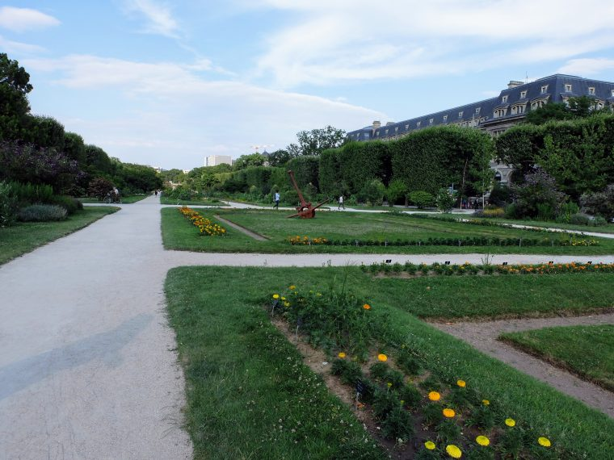

<figcaption>

The formal gardens looking a bit tired in the heat.

</figcaption>

</figure>

Despite the many cafe's and restaurants around the hotel we visited the local Carrefour and enjoyed a picnic supper in the hotel, largely featuring ice cream.

## Saturday 30th June 2018

We had planned for an early start to get to Versailles today but alas travelling the day before had taken it's toll. We did however manage to make it to breakfast downstairs in the hotel. While we ate I was delighted to see that my usual tactic of pinching things from the breakfast buffet for lunch is an almost universal action regardless of nationality. We did however collect a standard lunch of bread, cheese, and salami from the Carrefour on the way to the railway station.

Having managed to get the right tickets to get to Versaille at Notre Damme we finally managed to catch a hot, airless double decker train that would fill up almost to the brim as we approached our destination.

Versailles was hot, hot enough to fry an egg on the pavement. Thankfully the palace pretty much dominates the area so is not hard to find. As we approached many outlets and "tourist information" places offered to sell us tickets, none of which matched what we had read online or even cost the same amounts. They also delighted in telling us it would take hours to enter the courtyard because of security unless we had their tickets. Being brave adventurers we decided to risk it and the security check took less than 3 minutes.

Once inside the grounds I bought tickets from a machine (to avoid the queue which gave us access to the entire estate and palace for half the price as advertised in the "tourist information" place.

<figure>

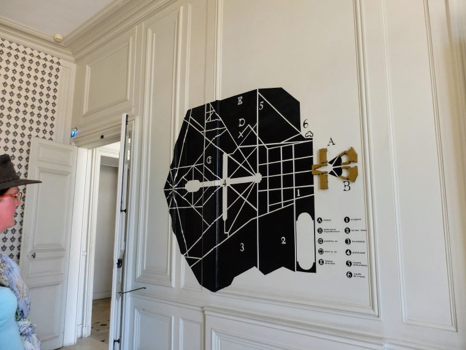

<figcaption>

Mary eyes up some visitor experience.

</figcaption>

</figure>

Being good tourists we visited the gift shop first and bought a Christmas decoration... in July. Spotting the queue for the palace we decided to look around the gardens and estate first, despite being told that was the wrong order to do it in, never let it be said that we are not trailblazers.

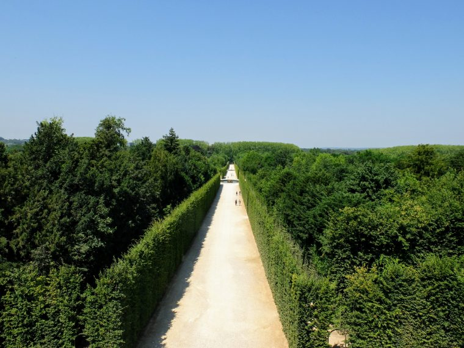

The gardens are immense, in fact the word immense might not be immense enough to describe them. Some areas where fenced off for an evening show and it still left we so much garden we probably needed an extra day to look around them all.

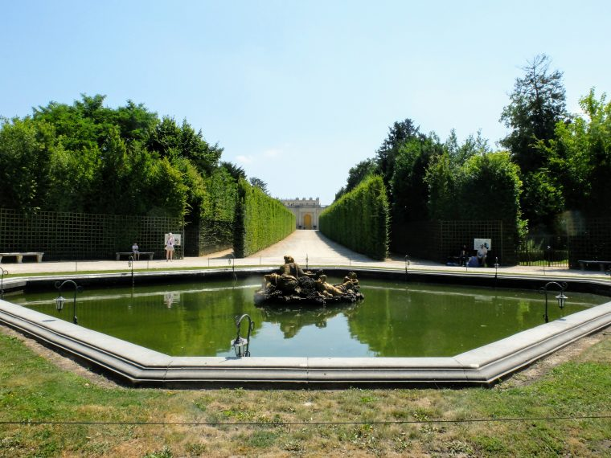

There are many fountains in the gardens, so many in fact it caused a water shortage, so they have to be scheduled to operate. In the morning a lot of the fountains are sequenced to music. Given it was lunch time by now we largely had the gardens and some fountains to ourselves which after the hustle and bustle of the morning was really nice.

After lunch we headed to Grand Trianon which was the palace used by the Queen of Belgium and latterly Napoleon. While the rooms now largely have furniture from the correct period a lot of the items that would have filled the palace were sold during the revolution and therefore are therefore lost.

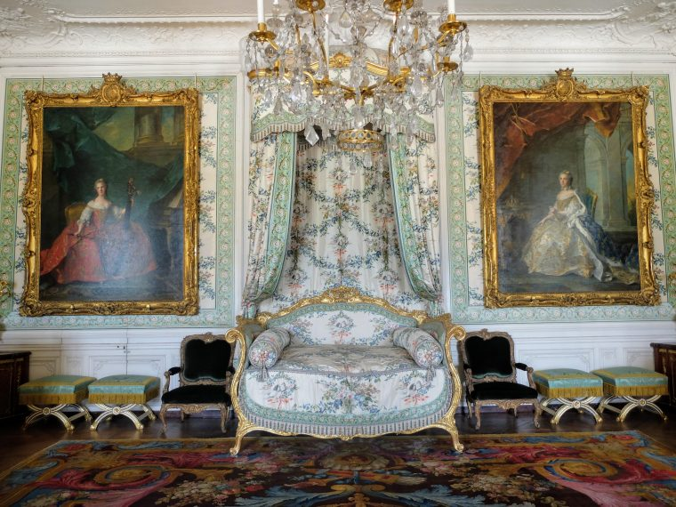

After heading back through the garden and into the courtyard we found ourselves at the entrance to the palace with no queue, so we seized the moment and headed inside.

The interior of the palace is incredibly grand, but modified by successive monarchs and much of the original work is hidden behind wooden panelling. The rooms are sized based on your importance and are pretty large or at least you think they are until you arrive in the Kings apartments.

The main room of the apartments is bigger than most Chateau's and has a painted ceiling depicting Greek gods, and backing up his divine rights as King.

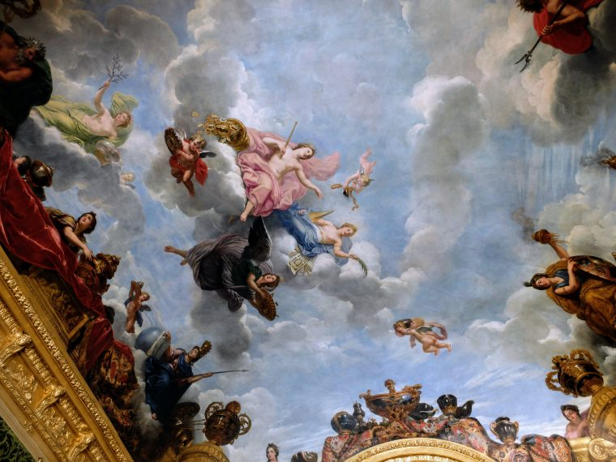

From the royal suites you end up in the Hall of Mirrors, in which mirrors on the walls match up with the windows to make the room much brighter than it otherwise might be. Alas the hall is plagued by insta-tourists trying to get the perfect shot and so even just looking around you find yourself constant asked to move along out of their photos.

From the hall of mirrors we passed through some rooms under restoration which I suspect interested Mary a lot more than me and then emerged into the bright sunshine of the courtyard. After visiting the gift shop one more time we headed back to the station and caught an uncomfortably hot train back to Paris and the hotel.

## Sunday 1st July 2018

Instead of having breakfast at the hotel we picked up some supplies at a local supermarket and then caught the metro to the Louvre which alas deposits you into a shopping centre.

Escaping the retail hell that is a shopping centre on a hot Paris day, we skipped the queue for gallery tickets and headed outside to the Tuileries gardens, where we enjoyed a picnic breakfast. As ever on our travels the French like Americans cannot do Tea properly and supplied hot milk with it.

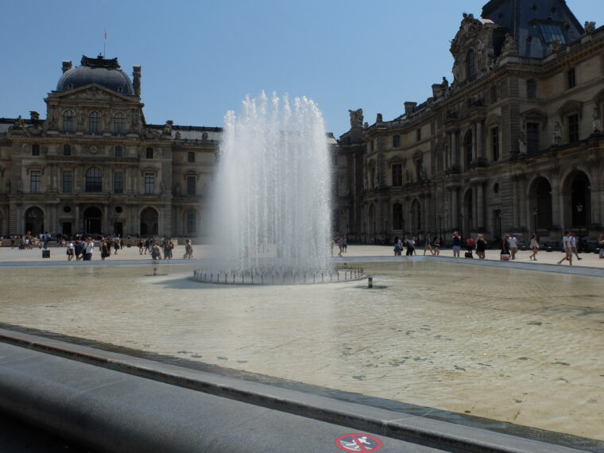

The Louvre courtyard is decorated which sculptures of famous French philosophers and scientists. The enticing fountain was marked to encourage people to keep out, something entirely ignored by the local populace.

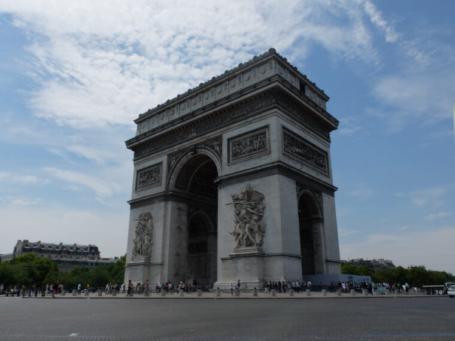

We hopped on the metro and did some gift shopping among the boutiques in small alleys, before heading to the arc-de-triomphe which is right in the middle of a busy roundabout. It took a long time to get a photo without any traffic in it, but worth it in the end. The subway that crosses underneath the arch, has a ticket office; 12 euros to stand in the middle of a roundabout so we carried on to look for a park to have lunch.

Leaving the shade of a tree in a roadside park we caught an RER and headed towards the Trocadero and the Eiffel tower

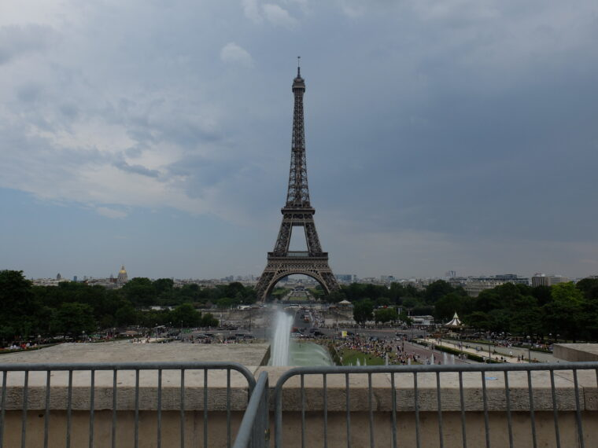

It was a hot summer day so the Trocadero was packed with Parisians enjoying the water, certainly the do not swim in the fountain signs were being ignored.

Building works and lengthy queuing meant we gave ascending the Eiffel tower a miss and continued to walk alongside the river eventually ending up at the Notre Damme. Again lengthy queues to look inside meant we kept on walking along the river heading closer to our hotel.

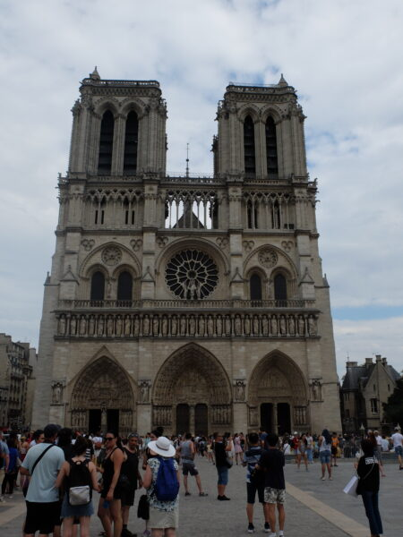

Finally back at the hotel we recovered in the air conditioning of our room before heading out for supper in a local café. I opted for steak frites for the second time, Mary however feeling adventurous chose perhaps unwisely.

## Monday 2nd July 2018

An early start at the Gare Du Lyon to catch the TGV into Basel this morning. Despite it being 6am the station is busy and plenty of people are catching the same train.

We attempt to buy some stamps for our postcards, but alas the station shop or tabac have any so we wait for the train to start boarding, and then discover our coach is at the other end of the train and have to walk the full length of the platform.

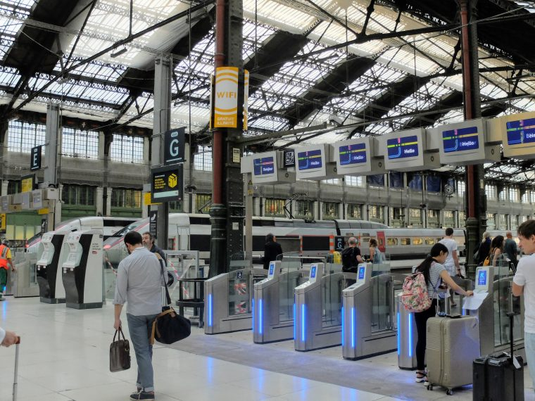

We board the comfortable TGV, discovering that I'd failed to book a table and soon are speeding through the French countryside, Mary heads off to the buffet car and returns with some breakfast for us, I'm getting quite used to the diet of bread and cheese. We eat and read as the train takes us towards Switzerland. Mostly the views are of the countryside speeding by, except this one nun just out for a walk.

## Switzerland

The train pulls into Basel 20 minutes late so a mad dash to change trains is required, Mary does some top quality commuter grade barging to get us on the train which turns out to be a double decker. We don't have reserved seats on the train to Bern so we claim a sofa on the top deck.

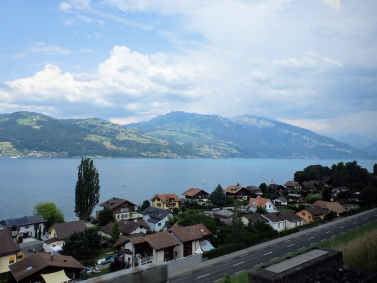

The train to Bern arrives on schedule, which is good because I promptly get lost navigating our way to the left luggage lockers. Having found them, stashed our bags, we found the tourist information office where we not only acquired a map of Bern but stamps to finally send our postcards.

<figure>

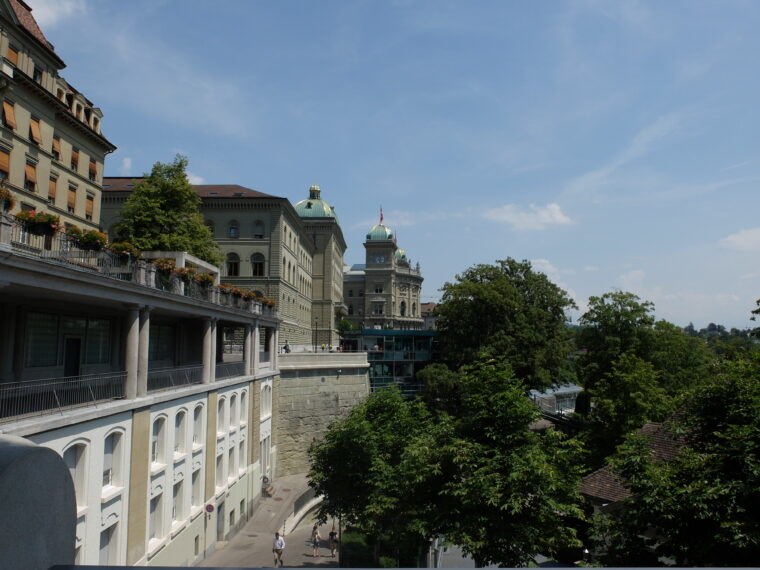

<figcaption>

Bern is very old world Switzerland compared to Basel or Zurich.

</figcaption>

</figure>

We only have a couple of hours in Bern so we go in search of food, settling on a creperie down a side street. Swiss prices being what they are they are expensive but nice crepes. We both have pulled pork savoury and I have mint choc chip, Nutella, and tiramisu ice-cream and Mary has chocolate, caramel, and lemon.

Eventually via a shop where Mary obtains a floaty summer dress, we reach the swiss parliament building which if it wasn't for the sign you'd mistake it for something else as it's not very big, or at least not as big as you think it ought to be. Outside the parliament building is a fountain with 26 jets one for each of the 26 cantons that make up the republic.

We returned to the station, collected our bags from the super efficient left luggage, and attempted to find our train. After some confusion a train pulled into the station marked Kandersteg, so we got on.

The Lotchberg express runs from Bern up through the mountains to Kandersteg and beyond, through some pretty breath-taking scenery. I will admit a lot of it was in fog or mist as we travelled through it however.

The bus was waiting at the station as we arrived so we jumped on and took the short service up to the Scout centre rather than carry our bags. We checked in at reception and where allocated the Australian room at the front of the old chalet with views of the Kander.

Supper at the centre was the International friendship / messengers of peace BBQ which was pretty standard, the high point being that they had tea, served with cold milk.

After supper we went for a walk towards the cable car station but the mist turned to rain and so we headed back to our room for the night after a tiring day of travel.

## Tuesday 3rd July 2018

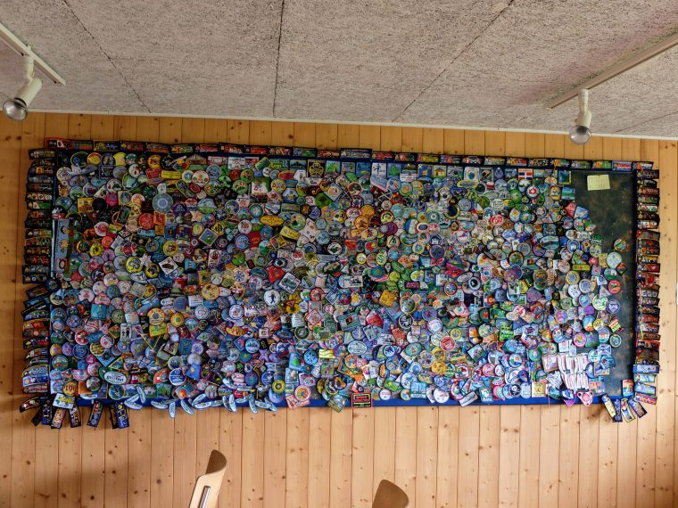

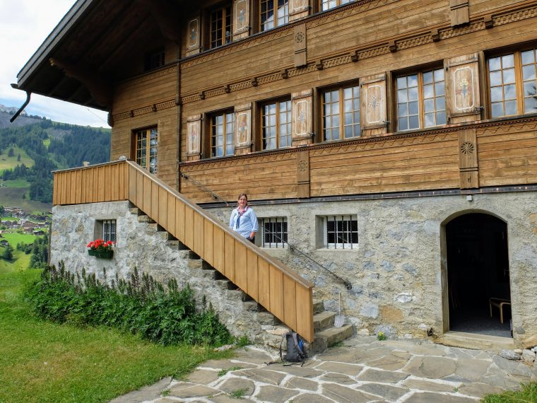

## Wednesday 4th July 2018

Ocensea

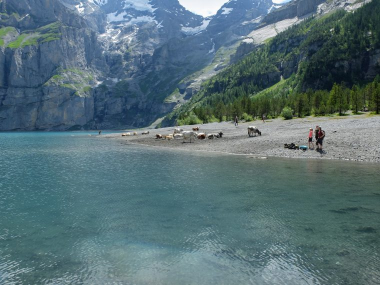

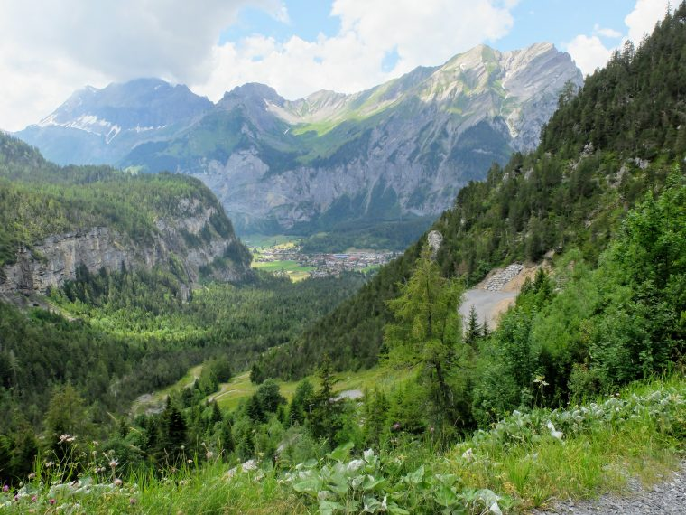

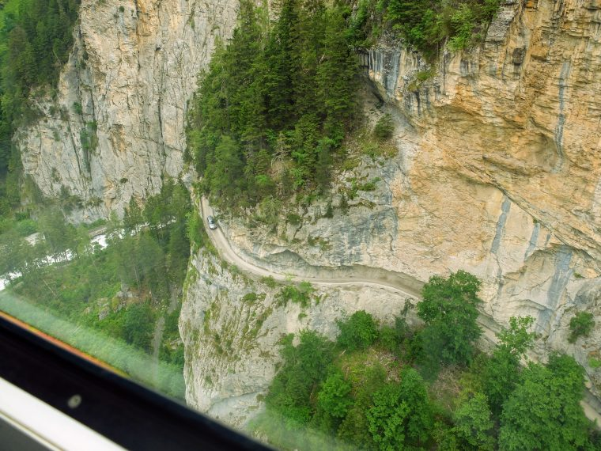

## Thursday 5th July 2018

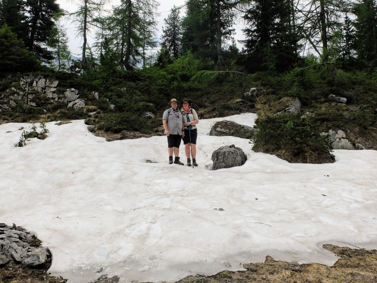

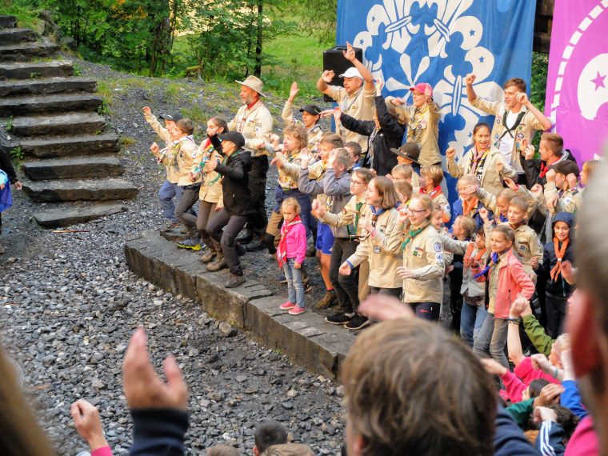

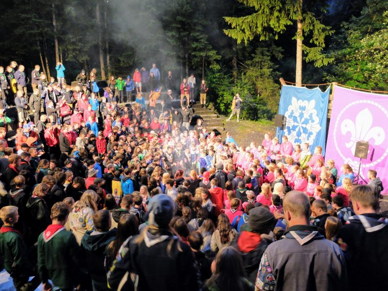

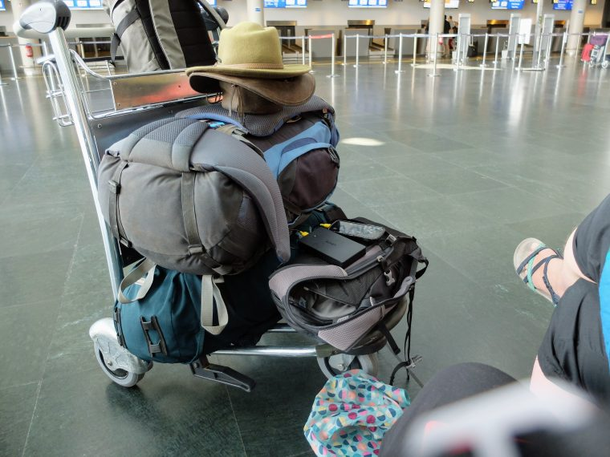
