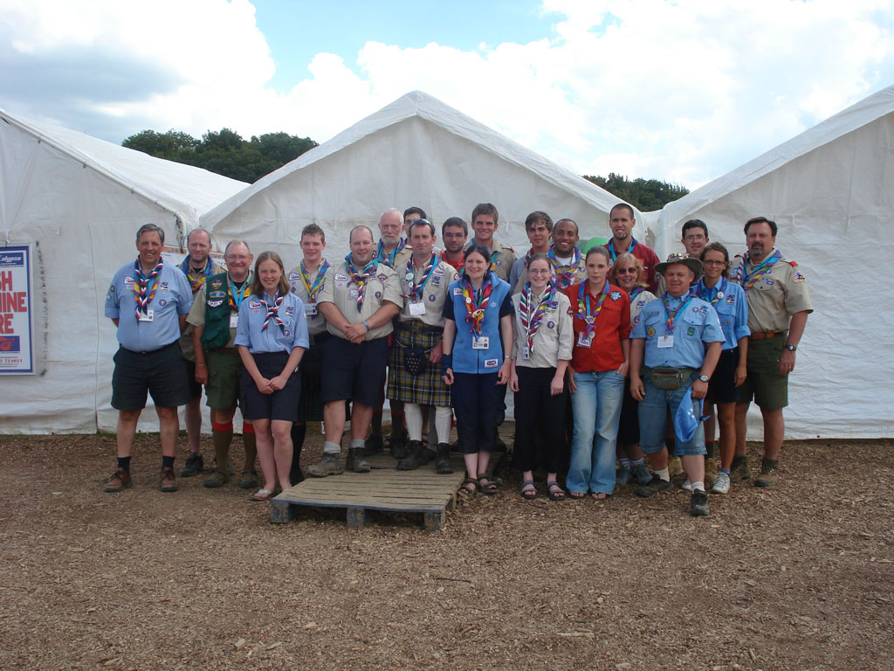

Well it's officially over, I took my Jamboree neckerchief off for the last time last night and it's now sitting next to me on my desk. I read the section in the IST handbook whilst there on the Post Jamboree Blues and thought that I would probably be OK, but I am starting to feel a little disappointed that it's all over now.

The people I spent the sixteen days working with in that cramped set of little white tents held together with ratchet straps where we shifted 10's of thousands of little blue tokens, sold stamps, sorted post, helped people with mobile phones, phone cards and Internet time, and sorted some really smelly lost property came from all over and turned out to be the best guys and girls I've had the pleasure to work with.

I'm going to miss you all, well at least until the reunion.
