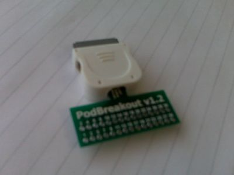

When I picked up my iPod classic the friday before gangshow the first thing I thought after unboxing it and loading it with tunage is what a fab dock the box would make. Today this widget arrived from sparkfun which means I can access every pin in the dock connector.
