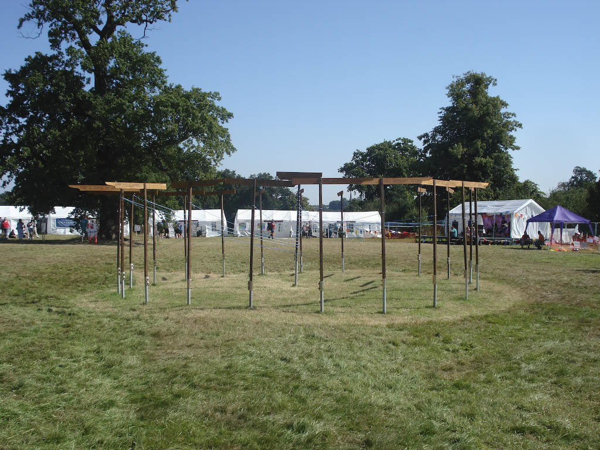
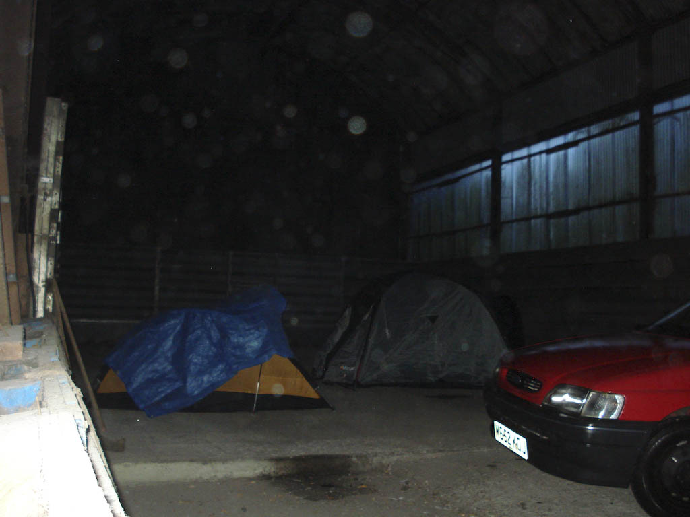

On the 1st of August 1907 at 8am when Robert Baden-Powell blew his Kudu horn 3 times to open his experimental camp on Brownsea Island, I wonder if he had any idea of what his ideas would turn into. I certainly don't think as a 6 year old Beaver I had any idea of what I was becoming a part of, how far it would take me, and how it would support me through life.

As the centenary year approached I was convinced to put my hand in my pocket and write a very large cheque to attend the one thing I had never managed to do as a Scout, Jamboree. And so with a cheque for £550 sent to the Scout Association I was a fully signed up member of the International Service Team at the 21st World Scout Jamboree at Hylands Park in Essex. Looking back most of the non scouting and some of the scouting friends I told that Ive just paid to live in a tent and work for 3 weeks and I'm only going to Essex thought I was mad. But then it was one of those chances that only come once every lifetime, to be at Jamboree on the the centenary of scouting to reaffirm my promise with 40,000 scouts from 154 countries. And hell or high water I was going, for this was the event the UK had been planning for 12 years, that singular moment that would make the regular population of the world sit up and take notice. But first I had to get there and survive.

I made a number of posts in the lead up to and during the Jamboree which can be found [here](http://www.davelodwig.co.uk/topics/archived-topics/jamboree-2007/ "Posts from 2007 Jamboree") I'm going to link the posts from the days at the Jamboree into each entry in this report. The photos I took during the event on my camera can be found in the photo gallery [here](http://www.davelodwig.co.uk/photos/album/72157602590141853/2007-jamboree.html).

## Day -4 (Friday 20th July)

[View Blog Post](http://www.davelodwig.co.uk/2007/07/bags/)

Tonight we should have been heading out to Blackwell Court to celebrate the birthday of one of our friends. However because the rain is coming down so hard the tents are swimming and travel is pretty much impossible. The plan is now to have a spaghetti dinner and some board games at the 144th Scout HQ and head over to Blackwell tomorrow. The extra time does give me a chance to check through my gear another time and satisify myself that I have everything.

The party itself was a good laugh and ended with a girls vs boys quiz game, needless to say the boys won.

## Day -3 (Saturday 21st July)

[View Blog Post](http://www.davelodwig.co.uk/2007/07/bad-weather-birthday-parties-and-board-games/)

Woke up reasonably late today and stumbled around the house, unfortunately I have absolutely nothing to eat as I wasn't expecting to be here so breakfast consisted of a cup of tea and some slightly stale toast. I repacked my wash kit as I had to break it out in order to make myself clean and nice. By early afternoon I had received word from Fitz that we had secured the Manor house at Blackwell as the group of Brownies using it had had to return home due to their leaders house being underwater. A short while after speaking to Fitz, Steph called and suggested that I might travel with them as Fitz could be faffing around all afternoon in Worcester visiting his parents.  
Once at Blackwell we picked our rooms and grabbed an altar fire to use for the BBQ we were going to have that evening. Quite a few people turned up and much hilarity ensued as most people stayed over in the empty rooms of the house. I bit of a poker game took place and ended fairly quickly as people struggled to concentrate with so much going on.

I was a nervous as ever at this point on what to expect when I arrived at the Jamboree site, still not knowing what job I had been allocated.

## Day -2(Sunday 22nd July)

Invented a new game this morning, it is to be called Blackwell balloon ball. It came about when myself and Andrew bored and looking for something to do started batting a ballon around trying to keep it off the floor. All it took was for one of us to tap it through the middle of the light fitting and we ended up trying to score goals against each other. Everyone else seemed to be happy reading Harry Potter.

Laura arrived this morning ready for the journey up to the Jamboree tomorrow and didn't seem that impressed by the new game we had invented however she did have a copy of the last Harry Potter book. By early afternoon most people had left including Fitz and Steph who had sloped off to some ceremony for the Explorer Scouts attending the Jamboree. Just left at Blackwell was me, Laura, Mat, Becky, and Beth. So some of us headed down to the closest supermarket to grab a bit of food before we started eating the cubs camping close by.

Beth left for work and Mat and Becky headed home leaving myself and Laura all alone. Of course being a gentleman I sat around looking bored until I decided to have a nap instead. Later on the others returned and we mucked about outside the house ending in a Poi session that caused to many injuries and some tasty pizza provided by Steph.

## Day -1 (Monday 23rd July)

[View Blog Post 1](http://www.davelodwig.co.uk/2007/07/food-trading/)  
[View Blog Post 2](http://www.davelodwig.co.uk/2007/07/barn-camping/)

Today we head out to Essex for the Jamboree, or at least to Billericay where Fitz has some family who have offered to let us camp in their garden so we can get to check in Nice and Early. We had some breakfast and Fitz got a haircut, and we found out what we would be doing for the next 3 weeks, I was allocated to food and trading a prospect that didn't exactly fill me with joy I tell you now. But it was all to late and by 11am we had loaded the car and where pulling away from Blackwell, with a last shout of Essex or bust from me we were off.

The journey was fairly straightforward apart from the fact we were heading via my parents house. Tewkesbury where my parents live was flooded, although mum and dad were OK and their house wasn't underwater I just wanted to say hi and see how they were before heading off to the Jamboree. I navigated our way off the M25 in such a fashion as to drive past the check in centre at North Weald airport and the main Jamboree site at Hylands park. It was however raining so I had no intention of getting out to take any pictures. We headed to Billericay where we were staying the night and a hot meal was waiting.

Fitz's relatives treated us really well and provided a cracking evening meal several cups of tea, a barn to escape the bad weather in and biscuits in the morning. We couldn't have asked for more really. We got shown their millennium stone which I imagined as a small marker about the size of a tombstone, but when we arrived it was in fact a 12 ton piece of pink granite neatly propped up on a slight bank with engraving marking the turn of the millennium. We all decided to take some pictures, an act spoilt by the fact we had all left them in the car. after a trip to the car and back we had our pictures.

The evening was finished off with a pint in the local public house and then to bed for we had an early start.

## Day 0 (Tuesday 24th July)

[View Blog Post](http://www.davelodwig.co.uk/2007/07/day-zero/)

We departed from Billericay and headed for North Weald, the plan was to check in at about 8.30 so we had plenty of time to set up at the Jamboree site and sort ourselves out. First we headed to a garage to pick up some fuel for the car and some snacks, mostly redbull. Then for some reason we headed to Tescos to see if we could buy a copy of Jambo the Jamboree song. Alas they didn't have it so we made do with ELO, and Status Quo.

We parked up sorted a long term parking pass and hauled our gear to the check in centre, did I really need all this stuff was the question running through my mind as we stumbled over the grass. Check in was quick and painless apart from the mad Scot operating the computer and the film camera stuffed in my face but exciting anyway. Once issued with my ID badge, IST necker and Jambo TAT starter kit we went to find a coach to Hylands park.

The coach took a really long time to get to the Jamboree a Journey in which Laura wrote in her diary and me and Fitz chattered like overexcited schoolboys. Oh the excitement!

On arrival we had to carry our kit from Gate 1 which is the absolute bottom of the site all the way up to the Island Hub where the IST live. Thankfully a number of people helped us to carry our gear and pointed out where to go to check in as a member of Food and Trading at this point I learned I was a member of team TK and that I had a briefing at 10.00 am on Wednesday. After finding my plot and setting up the tent I headed down to the hub to meet Fitz who told me he was working on the trash activities. Stupidly we both thought that volunteering to help out in the restaurant would be a good idea and even managed to drag someone along with us.

Our idea that we would be only needed for an hour or so vanished along with the guy who was supposed to be in charge of our section leaving us volunteers to work things out. We ended up working till 10.30 and hung out with some of the guys we had been working with afterwards. It's hard trying to teach the Finnish British jokes, sarcasm just doesn't translate well.

## Day 1 (Wednesday 25th July)

[View Blog Post](http://www.davelodwig.co.uk/2007/07/day-one/)

The queue for breakfast was huge this morning, at least 600 metres long and took at least 30 minutes to get served. So the first Jamboree breakfast was sausage, bacon, egg and hash browns. All perfectly agreeable I think, just ask me the same question in 8 days. Once out of the restaurant I found out that the meeting I needed to attend had been moved to 10.45 due to the restaurant being so busy this morning. So I wandered off and found a cup of tea.

10.45 came round and I headed off to the meeting with Laura who was also allocated to food and trading, we found some seats and listened to the generic IST training which included a "recorded" message from Peter Duncan and Bill the Jamboree Director. At this point the waiting was almost over and we where grouped into our teams. With some other guys I headed outside where an Austrian guy clutching a sign with TK written on it told us that we had a good job. For the next Sixteen days I was going to be working in the Island Hub Facilities Centre. Now it's time for a picnic.

Sitting on the grass in the sunshine we each offered our little insight into ourselves, before heading back into the Facilities tent we slowly learned what our mission was going to be keep the other IST supplied with beer tokens, stamps, phone cards, book the laundry in, handle mobile phone top ups and sell just about anything we could get our hands on. We were then asked who can work tonight, stupidly we all put our hands up.

I can report that it didn't stop all night, the place was heaving non stop with people after beer tokens for the IST party at 11.00pm we managed to escape into the night. My first real shift starts tomorrow at 2.00pm.

## Day 2 (Thursday 26th July)

[View Blog Post](http://www.davelodwig.co.uk/2007/07/day-two/)

Today we took a step closer to becoming a real Jamboree as the UK units arrived on site, they will spend Friday helping the rest of the world settle in to their subcamps.

After the soon to become usual breakfast I headed down to the cafe grabbed a cup of tea and proceeded to the main Jamboree site for a brisk look around. Not much was open yet as the build was still under way but enough to get a good look of how the site was shaping up.

I started work at 2.00pm and it wasn't as busy as the previous night but there were a lot of new sales as the unit leaders (identifiable by the green neckerchiefs) appeared at the bar. We didn't know it then but that was the way our evenings would be for the rest of the Jamboree. After work I stumbled back to my tent in an attempt to get some sleep. Apparently somewhere on site the UK contingent where having a party, one the IST weren't invited to.

## Day 3 (Friday 27th July)

[View Blog Post](http://www.davelodwig.co.uk/2007/07/day-three/)

The rest of the world arrived today, and the UK contingent where there greet them. We in the facilities tent prepared by selling beer tokens, stamps and phone cards.

After the scrum of the last two nights we decided to have a couple of people on the door to direct the punters to a register. Me and Kev stepped up and spent the evening cheerily directing members of the service team that may be worse for wear. Tomorrow I'm starting work at 7.00am then it's off to the opening ceremony.

Oh yes and I got paid by the Birmingham City Council today.

## Day 4 (Saturday 28th July)

First early start of the Jamboree, the showers were deserted at 5.00 in the morning but the mud made them a little interesting. The morning shift at Facilities is quiet, really quiet. Time to read the Jamboree paper and check your email.

Everyone from the facilities centre gathered together outside the tents in preperation to attend the ceremony as a group. This was the first occasion at the Jamboree to wear my uniform and wear it I did. We took a whole pile of pictures while we where waiting to leave, some of them from a stack of pallets we had inside the tent for a while.

The whole of the adult subcamp got paraded the long way to the arena so that we arrived after all of the participants. To say we were noisy is an understatement, the noise was fabulous, singing, chanting, chatter, it was great. When we got to the arena their was some sitting around and then the show began.

I had the afternoon off, so I spent it mooching around the site, and then to the bar for a refreshment or two for the first time since arriving at the Jamboree.

## Day 5 (Sunday 29th July)

[View Blog Post](http://www.davelodwig.co.uk/2007/07/day-five/)

I start work at 14.00 today, so as would become usual I woke resonably late to an almost empty site as most of the IST had work today with the participants taking part in the activities. I took a nice relaxed breakfast with a Canadian Scouter and the retired to the my usual perch outside the Cafe with a cup of tea to write in my journal. However my downfall came when I picked up a copy of the new Harry Potter book.

The mud is still grim and just well everywhere, added to the fact it's been raining again we may have to get some more woodchips. The beach which is supposed to be a feature of the Adult hub is currently underwater and some IST have been swimming, well paddling around in it.

Work this evening was as hectic as usual, I was back on the door trying to control the masses with Micheal from the USA. As always the crowds acted like a bunch of schoolchildren and needed sorting into careful lines to make sure they didn't wait two long.

## Day 6 (Monday 30th July)

[View Blog Post](http://www.davelodwig.co.uk/2007/07/day-six/)  
[View Blog Post](http://www.davelodwig.co.uk/2007/07/day-six-ii/)

Woke up to blue skies and sunshine, fantastic.

I start work at 14.45 today so I took a waltz down to the plaza. I hadn't been there long when my mobile started making noises telling me that Steph had arrived at the Jamboree. After some searching and trying to meetup, me and Fitz met up with Steph, Pete and Katie and headed to the Austrian foodhouse for a snack and a coffee. We gave them a bit of a tour around the site and then I had to head to work.

One place we visted was the One World garden which was built in memorial of the Jamboree as a permament feature of Hylands Park. This garden would become a minor refuge of sorts for me away from the noise of the adult hub. On my early shifts quite often I would have a nap here in the afternoon under a tree.

It was laundry day today so it was a bit mental at work, if it all works then in a few days these people should get clean, dry, pressed clothes.

## Day 7 (Tuesday 31st July)

I was on the early shift today and duly headed into work at 7.00am, my god it's cold at 5 in the morning. Breakfast was as is becoming usual a disappointment, even though I opted for the cereal and tea option. I would give my right arm for some porridge right now.

A fairly quiet shift, the mornings always are, mostly spent doing the post and tidying up stuff. That and counting blue tokens for the bar.

I had the evening off so after getting some dinner and collecting my bagged breakfast and yellow neckerchief I headed to the bar to have a drink, should have had a early night to prepare myself for the early morning tomorrow but it never happened.

## Day 8 "Sunrise Day" (Wednesday 1st August)

[View Blog Post](http://www.davelodwig.co.uk/2007/08/day-eight-sunrise/)

Sunrise Day is the celebration of the opening of the first ever scout camp, Baden Powell's experimental camp on Browsea Island. Some people took part in a flag break at sunrise itself, I got up at 4.15 and sat outside my tent in my buffalo shirt and watched the sun coming up before heading down to the shower block. Missed the queues so was doubly awesome.

The facilities crew met up outside our work tent and headed to the celebration together, the walk was quieter today than it was for the opening ceremony maybe out of respect, maybe just everyone was half asleep. When we got to the arena we ate our bagged breakfast which was rubbish the rolls were hard and unedible.

The Sunrise ceremony was better than the opening one except Peter "UK Chief Scout" Duncan got the world promise wrong. I can admit that it all got a bit emotional for most people not just me. Those that deny it are just lying.

After the ceremony we wandered around getting people to sign our yellow friendship neckers, this turned into a delighful game of who could get the most names from female members of the IST.

Again we worked the late shift as the rest of the IST had a party.

## Day 9 (Thursday 2nd August)

## Day 10 (Friday 3rd August)

## Day 11 (Saturday 4th August)

## Day 12 (Sunday 5th August)

[View Blog Post](http://www.davelodwig.co.uk/2007/08/day-twelve/)

## Day 13 (Monday 6th August)

DAY OFF (Yay)

Today was my day off, so I slept in late and missed breakfast. I had decided that I needed to get off the site for a bit and so furnished with instructions from Laura about heading out of gate 2 and turning left and could you get me some fags I headed off. At the gate a steward tried to explain that I couldn't walk out through this gate, so I explained that I didn't care and carried on. And then promptly got lost.

The problem was simple instead of left I turned right and it wasn't until I reached a roundabout that I noticed. Once headed in the correct direction I managed to make it to the Tescos supermarket in reasonable time. I picked up a few essentials that I had been missing, new sunglasses, Swedish pear cider, Isle of Jura whiskey, and some fruit pastilles. I sloped back to the Jamboree site trying not to clink the glass bottles in my bag as I went back through gate 2 to discover the stewards had all buggered off.

I bumped into Jock who was also on his day off and we agreed to sort ourselves out and meet up at the bar for a couple a lot of drinks at the bar tonight.

Someone tried to convince Jock to take part in the Scottish dancing but mostly we wandered around chatting to people and having a fun time. As was becoming usual we collected glasses and trays and got a round in for the work tent. The rest of the evening after the bar closed was spent drinking whiskey with Kev until I really had to get some sleep somewhere around 1.00am.

## Day 14 (Tuesday 7th August)

Closing Ceremony Day

Tonight the official Jamboree closing ceremony takes place so some important preparations had to take place like attaching inflatable cactus's to a telescopic flag pole, tying a UK contingent flag to a stick along with a fish windsock and having a crafty lunch. Once all our preparation was finished we walked round the back way so the girls wouldn't have to walk so far and found a place with a good view of the stage.

The closing ceremony was electric, people were waving flags, singing along, dancing randomly and of course when they asked from a cheer from each of the subcamps the Island hub drowned everyone out shouting IST, IST, IST, IST. To say you just had to be there sums it up nicely.

At the end we wandered back to the hub singing campfire songs as loudly as possible to teach the other nations a thing or two.

## Day 15 (Wednesday 8th August)

The participants depart today so the site is in offical teardown mode, tents all over the site are coming down coaches are streaming out of gates 1 and 2. I went for a walk to the Tescos in Chelmsford this morning with Jane. I ended up buying two tubs of strawberries and some cream along with some fizzy wine and juice.

The afternoon was spent using the Internet to search for the Jamboree and Eurojam songs and eating strawberries and cream. The IST from the UK had to head to Hylands house for a photo shoot. Once we arrived back at work we where promptly dispatched by the management to enjoy ourselves for their was a party and we were going for once. It was something to be at the closing IST party, but being their as a team was just great usually we would be at the entertainment in dribs and drabs. Me, Jamie, and Kev got a bit carried away with the party spirit and cashed in all of our beer tokens at last orders and ended up with a cardboard box of drinks we couldn't give away.

We are going home tomorrow.

## Day 16 (Thursday 9th August)

[View Blog Post](http://www.davelodwig.co.uk/2007/08/day-sixteen-ist-depart/)

Our early shift today was cancelled and almost overnight the site has become a ghost town. The resturant was almost empty at 8.30 when I stumbled up. I finally met up with Dave and Veronica from my Scout District at breakfast we had a bit of a chat, Dave explained how he planned to bring his car on site to load though gate 8. I wandered over to the facilities tent to see who was around, and said my goodbyes to Pat, Nan, Jamie and Alice and then headed off to find Fitz. On the way I bumped into Katie who was on her way home.

Fitz and I decided to head to north weald and then bring the car into Gate 8 and blag our way in. What actually happened was we got the coach to North Weald, collected the car, drove to Hylands Park, had a disagreement about the location of gate 8, drove up to the guard on the gate, showed our ID badges and we drove onto the Adult subcamp. After loading up we headed home, tired and hungry.

Steph had the dinner on and we where expected for our first proper meal in 17 days.

## The Recovery

[View Blog Post](http://www.davelodwig.co.uk/2007/08/162/)

Since getting home from the Jamboree life has felt a little strange, things like the quiet at night and not sleeping in a tent just didn't seem right for a few days at least. Other things like not going to work in that little set of tents with an amazing bunch of people took slightly longer to get over. There is only one thing really to do now and that is to try and use the experiences I have had to influence my Scouts so that some of them can attend a Jamboree and experience the magic.

In 2011 we get to do it all again in Sweden, I'm sure as hell going to be there.
