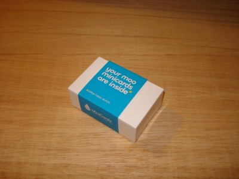
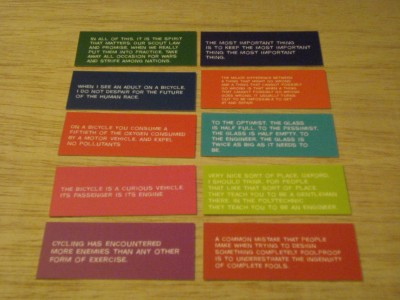
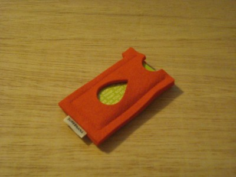

My Moo MiniCards arrived in the post this morning.

MiniCard Box

All 10 Designs

MiniCards in Supernana holder

I used the option on the Moo site to create cards with text instead of pictures on the color side.  I created 10 different cards with a selection of Engineering, Cycling, and a Scouting quote.  In no specific order the quotes are.

"Very nice sort of place Oxford, I should think, for people that like that sort of place.  They teach you to be a gentleman there.  In the Polytechnic they teach you to be an Engineer."

"To the optimist, the glass is half full.  To the pessimist, the glass is half empty.  To the Engineer the glass is twice as big as it needs to be."

"The most important thing is to keep the most important thing the most important thing"

"The major difference between a thing that might go wrong and a thing that cannot possibly go wrong is that when a thing that cannot possibly go wrong goes wrong.  It usually turns out to be impossible to get at and repair."

"A common mistake that people make when trying to design something completely foolproof is to underestimate the ingenuity of complete fools."

"When I see an adult on a bicycle, I do not dispair for the future of the human race."

"On a bicycle you consume a fifteth of the oxygen consumed by a motor vehicle, and expel no pollutants."

"The bicycle is a curious vehicle.  Its passenger is its engine."

"Cycling has encountered more enemies than any other form of exercise."

"In all of this, it is the spirit that matters.  Our Scout law and promise, when we really put them into practice, take away all occasion for wars and strife among nations."
