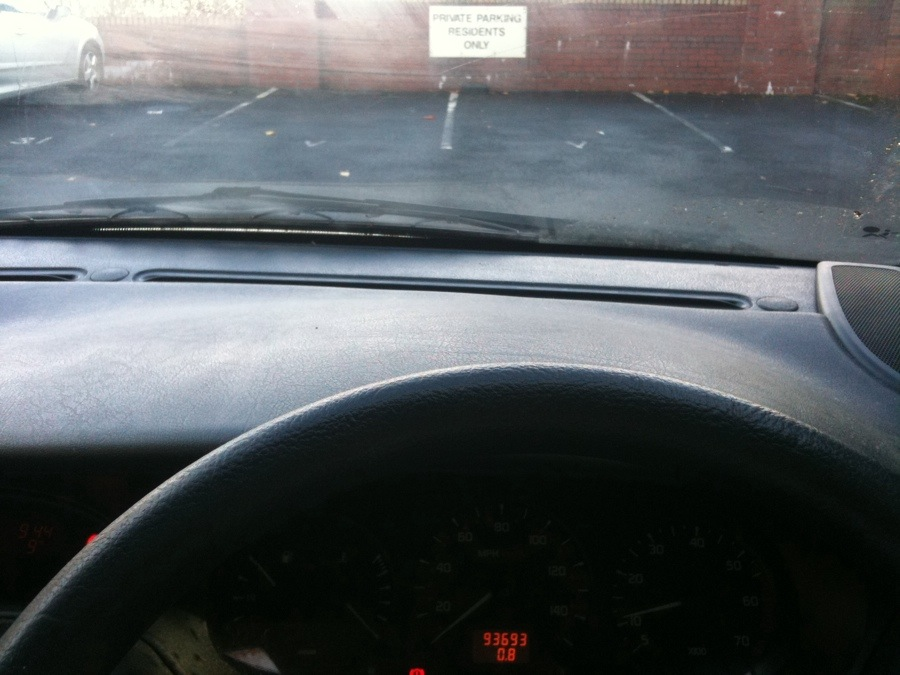

It's taken a while but my car has finally passed it's MOT and is back on the road.

After sitting at one garage for three weeks while they tried a number of things to solve the cars emissions issues, a short trip up the road to a place in Digbeth had the car through it's test in a couple of days.  Not sure how they managed it, but I have a test certificate and an emissions computer readout to attest that everything is good.

With Jamboree reunion camp coming up in November I was starting to worry how I might get to Kibblestone with the shopping.
