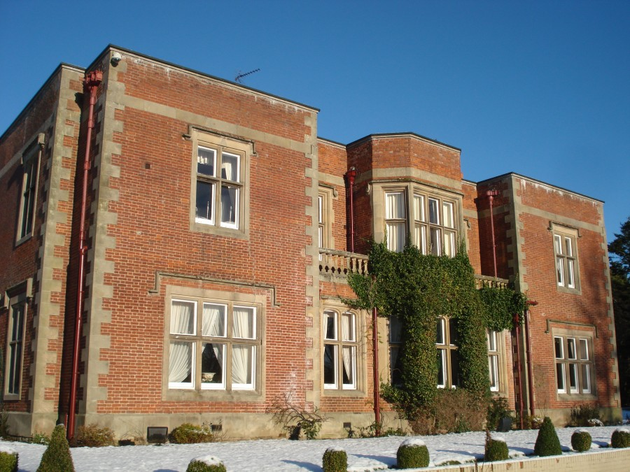
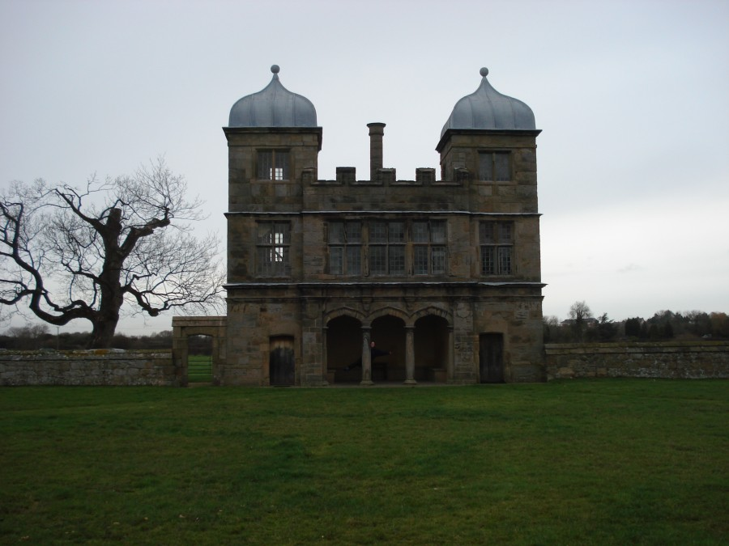
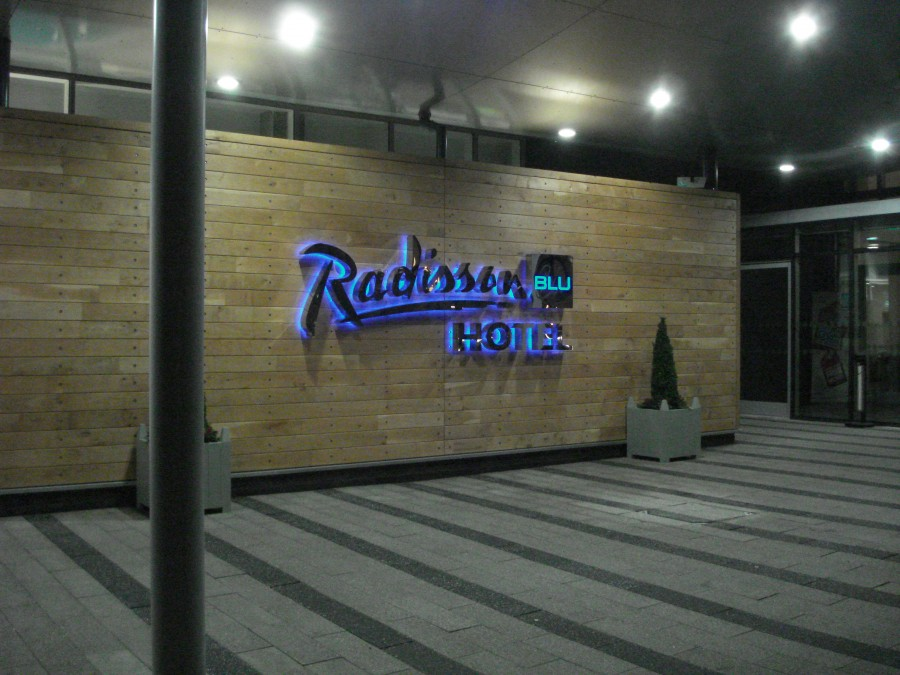
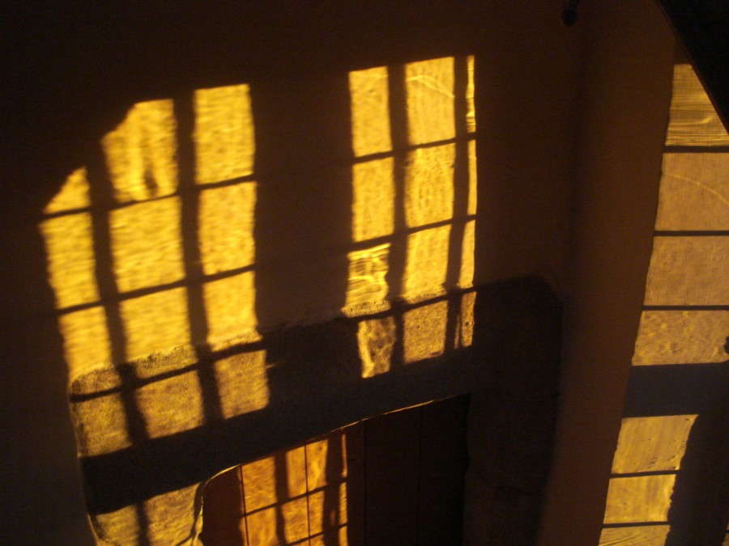

**Friday 16th December**

After leaving work an hour late due to issues with the launch of a service I have been working on, I arrived home to a cup of tea and preparations for our long awaited Christmas holiday. First stop was Bob's parents where we dropped off my infrequently used bread machine and some yeast so they could get started. Hugh being the consummate host rustled up some beers, much needed after the chaos of my working week. The next stop was to David and Sathyai's house where we where returning Grahams DSLR to him, I've borrowed it a couple of times in the hope of reaching a decision about purchasing one. Although I intend to buy one the model / lenses / price details elude me. Tea was consumed and we headed home to pack and prepare for our week away.

**Saturday 17th December**

The original intention was to leave much earlier than we did… in the end we left home around 11am heading into the holiday traffic with trepidation. The latter part of the journey being rather stop-start owing to the weather and volume of other motorists. We stopped at tebay services just before Carlisle on the M6, Bob described them as her favourite services, I can see why they are much lovelier than the regular type. We had a good look around in the shop and the farmers food shop but bought nothing and just used their toilets.

When we came off the motorway we travelled along the route of Hadrian's wall for what seemed to be a long time, turning off on to the road that would lead us to Otterburn was like driving on a rollercoaster track, except it was dark and we where following a man towing a trailer.

Arrived at [Otterburn Hall](http://www.otterburnhall.com) in the dark, but managed to park and carry our bags to reception, it was very icey underfoot exciting to look at, not so much for carrying bags down a slope. Thankfully we did not fall over. On checking in we booked our dinner for the night and the night after, owing to the time we arrived the only free slot for dinner that day was 9PM managed to snag the 6PM slot for the following day though.

Found our room in the Northumberland suite, it was a contemporary room, which means it was small and had a shower instead of a bath, but as the stay was a cheap deal on groupon I shouldn't complain. Unpacked some of our things and had a brisk walk around the hotel. Noticed their was a fitness suite but the door was locked, also realised it was very cold and retreated to the bar for a drink.

When we returned for dinner later that evening the lounge and restaurant was quite busy indeed, but after some waiting we managed to get seated and an excellent dinner was served bar some minor hiccups. I had Chicken Liver Parfait to start with Roast Beef as a main, and Orange and Cinnamon cheesecake as pudding. The wine was ok, but I suspect that was due to our habit of picking wines by the alcohol level.

**Sunday 18th December**

Decided to have a lie in as we where on holiday, apparently so did everybody else in the hotel.

Breakfast queue was a bit immense, waited in the lounge until we gave up hope and reminded the staff we'd not been served. Resturant manager was apologetic, food was very good as ever, I had toast, croissants with nuttella, Otterburn grill (Bacon, Sausage, potato cake, beans, mushrooms, fried bread, egg) Stephen the restaurant manager was in chatty mood and gave us lots of good tips on places to walk and how to avoid queuing at the restaurant.

We walked off the breakfast with a long walk around the hotel grounds. Visiting both their lakes, getting stuck in the woodlands and cracking all the snow and ice I could find. Had another look though the fitness centre door and decided to find out how to gain entry. We finished our walk in reception, handing over the litter we had collected on our walk and picking up a key card for the fitness centre.

Returning to our room, I headed off for a run on a treadmill, Bob decided to have a nap. I'm not sure I like treadmill's ran for 30 minutes, at a speed of 9.5 and a pace of 6.31 no indication of values of if it was metric or imperial measurements. Felt knackered and wobbly after though.

Headed back to the room and showered in what could be described as a slightly scary shower, the pressure was immense, wind was whistling past just outside the water streams. Decided to spend some time mucking about on the hotel internet, which was free with a cable connection. Watched the series Sirens on 4OD, based on the book Blood, Sweat and Tea which I'd just read.

Headed for dinner at the much more agreeable time of 6.30PM, decided to not have wine and had a peroni from the bar instead, Bob had some sort of purple J20 with a vodka, much nicer tasting that syrup based coca cola. As the hotel was quieter we got seated quite quickly and managed to order our food without prompting. I had Peppered Pineaple with Stilton Mouse to start, Wild Venison as a main and Raspberry meringue for dessert.

The food was excellent and after eating we headed into the lounge to find the after dinner mints and coffee. I nipped to the bar to rescue to glasses of port, and before long we had eaten more than our fair share of mints, finished our drinks and retired to our room. The hotel inspector was on the TV I pretended to sleep.

**Monday 19th December**

Woke early and went for a run in the fitness centre, leaving my love in bed. Overnight the card I was given stopped working it seems, however a helpful staff member broke in for me. Hammered the treadmill and had a go on the cross trainer, I have decided they are silly. I had a second bout with the shower of doom before we headed to the restaurant for breakfast.

As predicted the restaurant was quiet and we managed to get everything we wanted, I managed cereal, toast, pastries and an Otterburn Grill, this time with the addition of black pudding. Thank goodness for the running is all I can say.

Checked out and headed off for the second part of our holiday adventure.

After some driving and stopping to arrange collection of the keys to our Landmark, we arrived at the [Swarkstone Pavilion](http://www.landmarktrust.org.uk/BuildingDetails/Overview/118/Swarkestone_Pavilion). Some people might baulk at the prospect of staying in a ancient building where the bathroom is accessed by running across the roof, but we are not those people. Spent a night in, eating pizza from Tesco and watching movies on the laptop.

**Tuesday 20th December**

Visited [Calke Abbey](http://www.nationaltrust.org.uk/main/w-vh/w-visits/w-findaplace/w-calkeabbey/) and made use of our National Trust membership cards. In reality we looked around the shop and had dinner (Turkey and Ham pie) as well as the required (by law) cake. Returned to our pavilion hideaway and attempted to do a jigsaw, I am terrible at jigsaws, Bob is much better. If she had not been there I'd have given up, and also not been on holiday.

 

**Wednesday 21st December**

Had my very first spa day today at [Owl House](http://www.owlhousespa.co.uk/). I was terrified. In the end though it was rather lovely even if the one size fits all robe didn't quite fit. First treatment was a mud / steam bath which was shared with Bob, slightly disparaging that you had to wear swimwear in the private steam booth but the steam was lovely, the tropical rain at the end was not very rain like though but was quite tropical. We also had a foot treatment which was very good, they filed and polished and moisturised our achey feet, I managed to knock the plug out of the foot bath. Bob went off for a massage and I read an annoying interior decoration magazine. We spent a reasonable amount of time in the spa's hot tub, needless to say once we'd found the jet control button we almost spent all day there.

We had pre ordered lunch at the spa and it arrived in a picnic hamper, I had soup and Bob had a bacon and brie baguette with salad. Foodwise we also had hot chocolate and a surprise cupcake and glass of sparkling wine we hadn't noticed on the Groupon Voucher.

For dinner we headed to the [Raddison Blu](http://www.radissonblu.co.uk/hotel-eastmidlandsairport/runway) at East Midlands Airport, a hotel so new you could smell the paint drying (almost). Our Groupon (yes again) deal got us 2 courses of dinner, I had a lovely duo of pork and an apple and raspberry crumble with custard. The coffee was awful but they didn't charge us so that kind of made up for it.

**Thursday 22nd December**

Slept in till 10 putting plans to walk to todays exciting Groupon pub lunch to boot. [The Boot Inn](http://www.thebootinn.co.uk/) in Repton could have been so much better but taking 2 hours for 3 courses of slightly below average pub food just didn't seem right. Given we were there only customers you'd have though they might have paid attention a little bit more, but as the answer to why we couldn't get through on the phone\* became clear I realised that they just didn't care.

Amazing sunset that caused us both to run up to the roof to watch the brilliant orange light fade into the horizon.

\*We thought they might be really busy, turns out they don't answer the phone or check their messages even when it is really quiet, makes you wonder who they are avoiding.

**Friday 23rd December**

Time to go home, but only briefly before our next Christmas Holiday Adventure.
