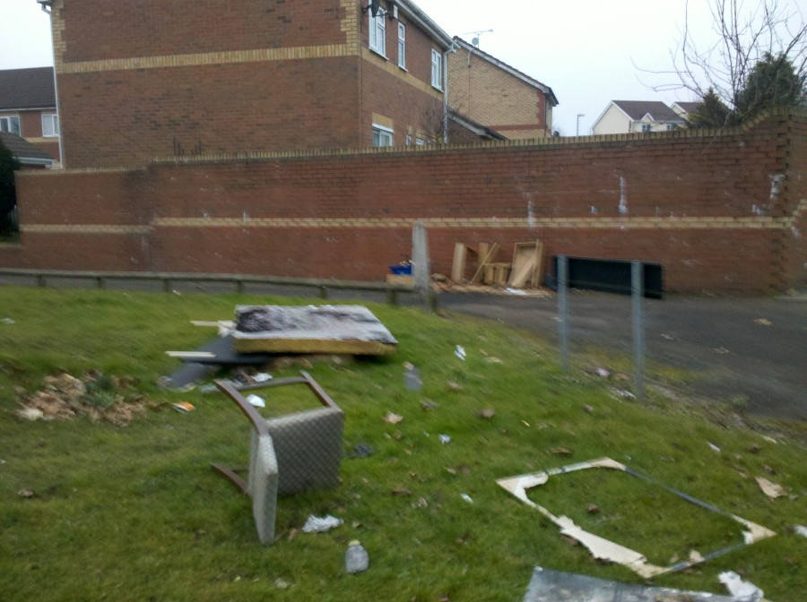
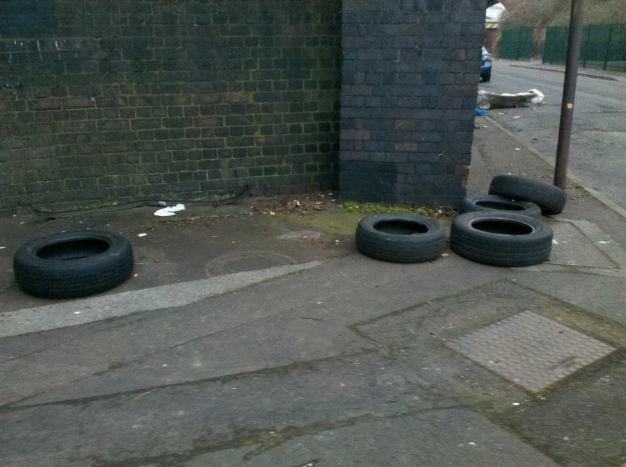
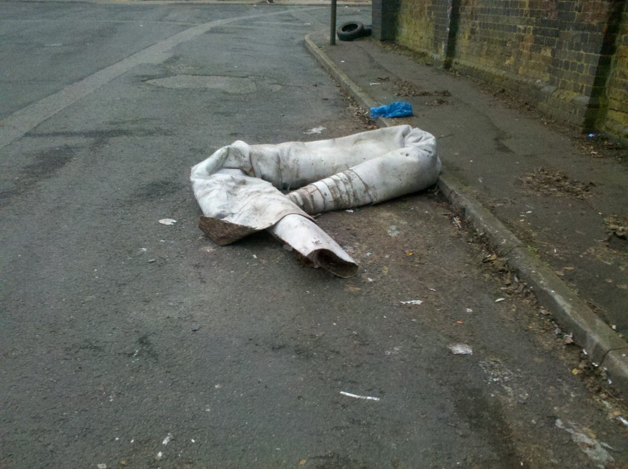
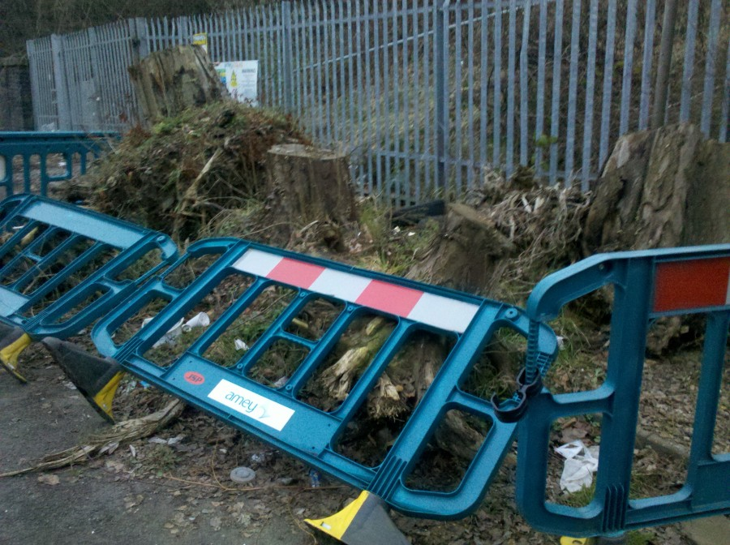

For some reason the area around my home seems to get Fly Tipped on a regular basis, and I often take the opportunity on my morning runs, and cycle commutes to report this via [Fix My Street](http://www.fixmystreet.com/). The first few times the council swiftly cleared up the mess, but of late requests sent on Fix My Street seem to be ignored, the tree stumps below have been there for three years.

   Apologies for the image quality I did take them with my phone.  This little selection was just on one 30 minute run. Clearly we've got a problem and the council is doing nothing about it.
