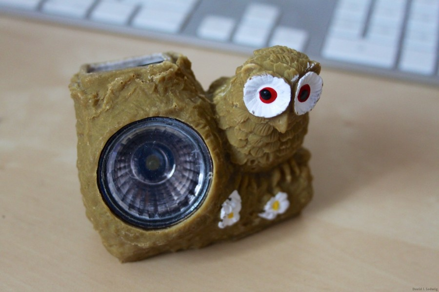

Sometimes your friends can ask you to some really really silly things, but you just can't help yourself and for some reason find your way to an empty Jamboree campsite with 10 other crazy folk for over a week of non-stop adventures.

For anyone who's never worked on a Jamboree, you basically pay for the privilege of working 28 hours at a stretch (certain circumstances apply), helping scouts, guides and their leaders have an amazing time, living on cake, tea and sympathy, doing everything from cleaning loos, to giving directions and hugs. If you didn't know your friends well at the start you will at the end.

During the camp we had a small LED night light which sat outside the tent of the person on night duty,

Somehow the owl of office managed to hide in my car.
