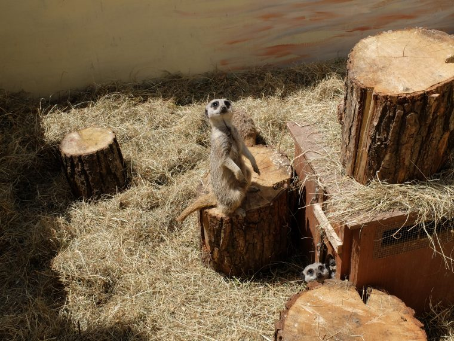
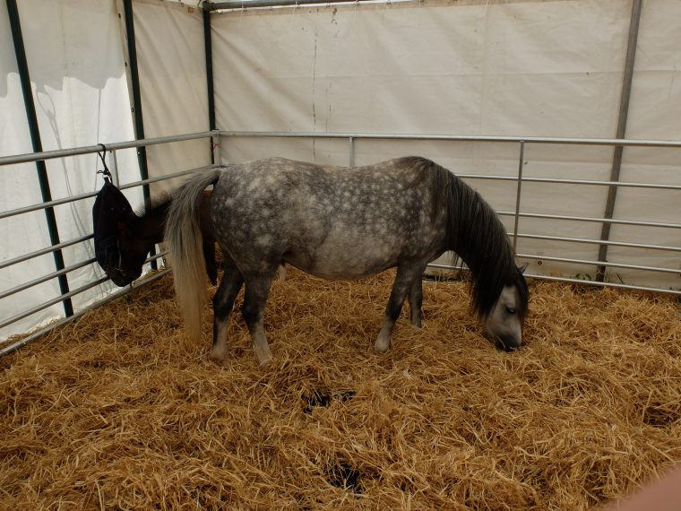
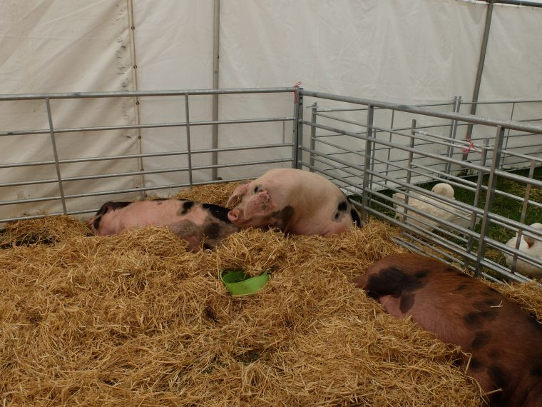
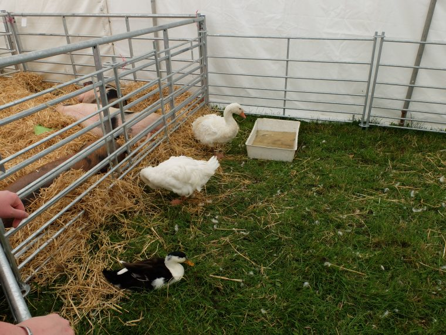
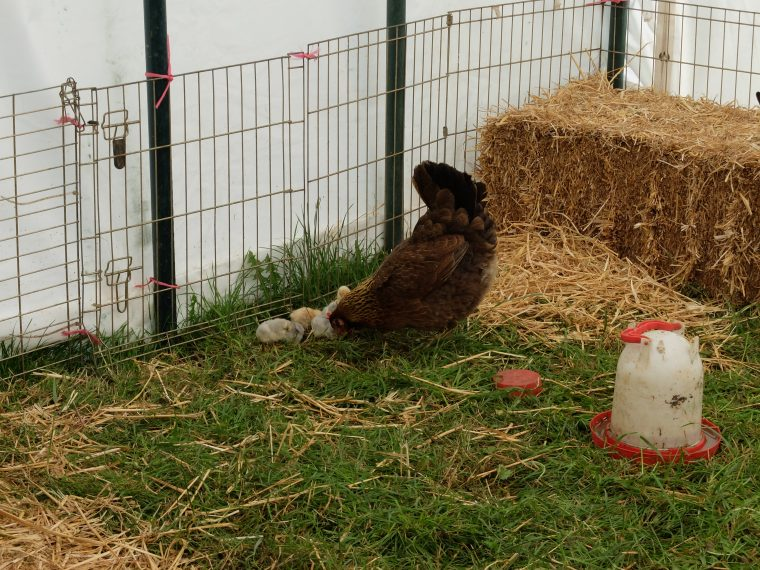
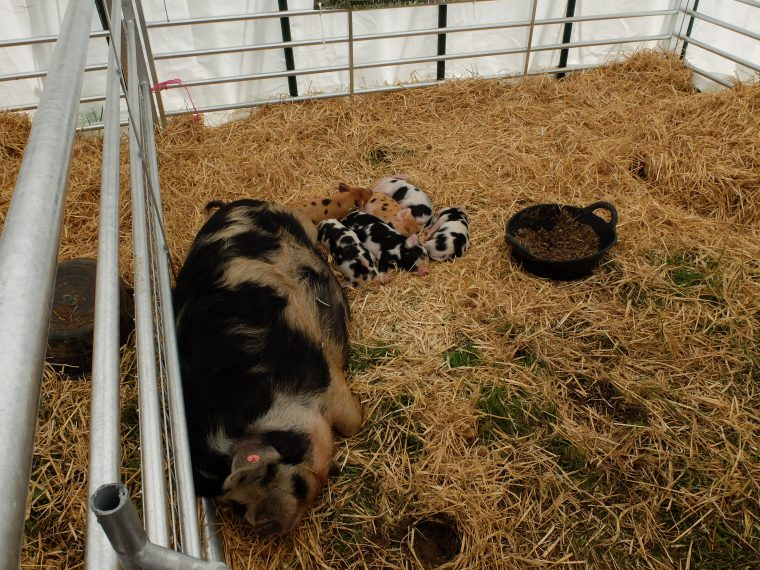
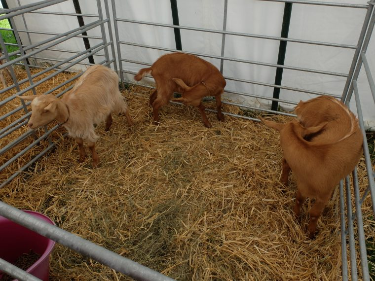
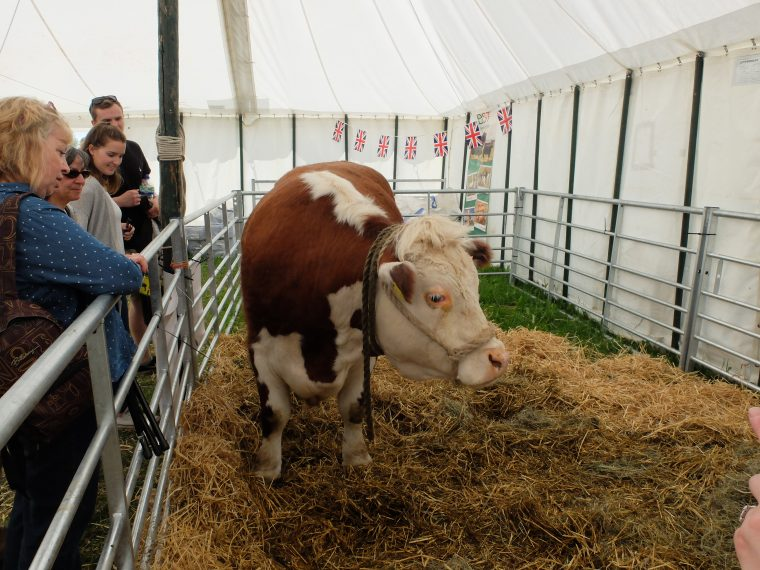

We've not managed to get to the Cotswold country show before as it's usually taking place when we are away elsewhere, but with a free Sunday for once we headed over to the Bathurst Estate to take in the sights. Understandably I spent the most time in the rare breeds tent.

Meercats enjoying the sunshine.

This ponies foal didn't want to come out from behind it's mum for me, the minute I raised the camera it scarpered to safety.

Incredibly lazy Gloucester Old Spots.

A small collection of ducks, alas I didn't get my camera out in the chicken and duck tent next door.

In pets corner a mother chicken tends to her chicks, I got told off by a human mother for getting in the way with my camera.

Yes even baby pigs are cute.

By the time we arrived the goats had simply had enough of people trying to fuss them and refused to come from the back of their enclosure.

This is Jock, quite possibly the most chilled out Hereford Bull ever. He's won awards, and even met the Queen and is quite happy getting stroked and patted by his visitors.
